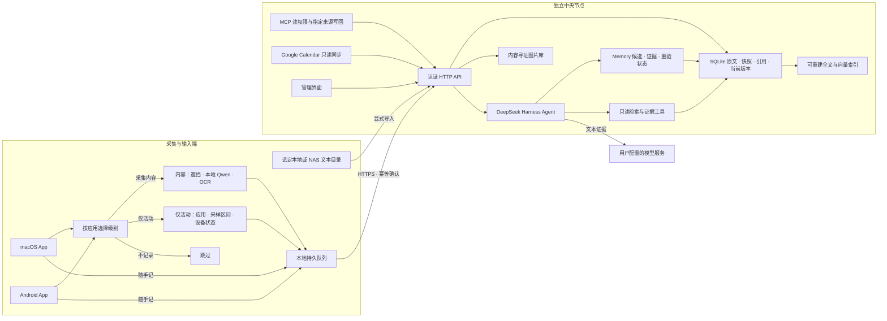

# Mote

**自己的上下文，自己的资料库。**

Mote 把电脑与手机上的屏幕采样、主动写下的日记、选定文件与日历，汇入你自部署的中央节点。你可以回看时间线、了解采样期间的时间分布，也可以直接提问，让 Agent 查阅原始证据并生成回顾。

采集器是独立的 **macOS App** 和 **Android App**。中央节点可放在 Mac mini、Linux 服务器或 NAS 上；它提供 API 与管理界面，Mac App 内可直接打开。更换服务器时迁移归档并更新客户端地址即可。

两端均可在未配置服务端时先记录到本机。上传可选实时、定时、积攒一批或仅手动，截图、随手记与本地来源共用策略；常用配置支持预设、应用选择和遮挡区域编辑。完整行为见 [采集与上传说明](docs/collection-and-sync.md)。

[开始使用](#开始使用) · [架构](#架构) · [部署与迁移](docs/deployment.md) · [服务端配置](docs/server-configuration.md) · [Cloudflare Tunnel](docs/cloudflare-tunnel.md) · [资料分层](docs/context-layers.md) · [来源与 MCP](docs/connectors.md) · [排查问题](docs/troubleshooting.md)

[下载安装包](https://github.com/utopiafar/mote/releases) · [扫码与 JSON 连接](docs/connections.md) · [保留设置地更新](docs/updating.md) · [发布与签名流程](docs/releasing.md)

## 能做什么

- **收集与回看**：显式开启屏幕采样，按设备和时间浏览；截图相同也保留每次观察，图片去重存储。
- **采集记录预览**：手机、Mac 和中央网页按天加载缩略图，展开原图与 OCR 文字；客户端可分别查看本机积存和自己的中央归档。可选仅充电时 OCR，先存图、接电后自动补识别。
- **按应用分级采集**：选择“采集内容、仅应用活动、不记录”；纯活动不读画面和正文，内容采样支持固定遮挡区域、端上 Qwen 视觉审查与本地 OCR，审查失败跳过该帧。见 [分级设置](docs/privacy-and-metadata.md)。
- **保留有用的元数据**：按开关上报设备与采样状态，文件和日历保留可得的大小、创建/修改/访问及删除观察时间；来源版本与证据可展开查看，未知字段不伪造。
- **随手记录**：在采集 App 中写日记、杂事、心情；草稿与待同步笔记保存在本机，恢复网络后补传。中央界面也提供记录入口。
- **来源接入**：Mac 本地日历与目录、Android 系统日历与文件选择器、中央 Google Calendar 只读同步；显式导入 MCP 资源，或通过 MCP 将其他 Chatbot 的可见资料写回指定来源。
- **分层记忆**：保留原始输入、不可变快照与外部引用；默认检索当前版本，按需展开历史。模型记忆按“概要 → 内容 → 原始证据”逐层披露。
- **问答与回顾**：Agent 自主选择只读工具、查找材料、解释证据；答案附可点击的原始记录。可手动或按配置周期生成回顾。
- **离线可用、资料可迁移**：持久上传队列、幂等确认、JSON 导入导出、离线完整备份、可选图片加密与保留期限。
- **便捷连接**：中央生成一次性二维码或 JSON 邀请，采集端确认后获得独立凭据；Chatbot 可导入专用 MCP JSON。按连接撤销，不必给每个端点分发中央管理令牌。
- **版本更新**：客户端检查和验证 Release 安装包，服务端按命名环境备份、升级与回退；配置、队列、模型和资料保存在原位置。
- **可观测与可调节**：查看同步、索引、存储和请求状态；按需记录客户端资源样本，调整采样频率、图片尺寸、质量、推理线程和低电量策略。

“采样时间”是根据实际观察计算的覆盖时间，包含采样空缺的限制，不能当作连续专注时长或 App 独占耗电。Mote 不会用应用名称或关键词硬编码“工作”“娱乐”“待办”等语义判断。

## 架构



| 组件 | 职责 | 技术与边界 |
|---|---|---|
| macOS 采集器 | 屏幕采样、隐私策略、随手记、本地日历与文件、离线同步 | Electron / TypeScript；Swift 系统助手；独立窗口与本地存储 |
| Android 采集器 | 无障碍截图或 MediaProjection、日历与 SAF 文件、后台队列 | Kotlin；WorkManager；Keystore；HyperOS 配置入口 |
| 本地推理 | 上传前的 NSFW 过滤及可配置视觉前置任务 | Qwen3.5-0.8B、llama.cpp CPU；断点下载、国内来源、哈希校验、离线导入 |
| 中央节点 | 认证、摄取、版本与分层归档、Memory、索引、连接器与调度 | Node.js 24 / Fastify；SQLite；单实例、单所有者 |
| 查询 Agent | 选择检索工具、理解上下文、关联证据 | 官方 DeepSeek Harness；只暴露经验证的只读工具，无 shell 和写入工具 |
| 中央界面 | 来源、记忆、时间线、随手记、问答、导入导出与诊断 | React；随中央节点部署，也可在 Mac App 内使用 |

截图先在端点通过隐私策略，再执行 OCR、编码和本地持久化；开启仅充电时 OCR 后可先存图、后补文字。上传成功必须收到匹配事件 ID 的确认，客户端才清理队列；待 OCR 的图像会保留到文字补写也得到确认。网络中断、节点停机或容量不足不会被当作同步成功。相同图片按内容哈希共享一个对象，观察事件独立保存。

笔记与屏幕记录使用同一归档协议。同步采用带认证的版本化 HTTP API；Agent 通过只读上下文工具消费这些记录。NAS 和其他硬件可接入同一 [协议](docs/protocol.md)，不必绑定某个采集 App。

默认检索使用本地全文与文本索引；可选 embedding 服务启用持久向量索引和混合检索。检索表达式由模型生成。采集内容始终是不可信证据，不能改变 Agent 权限。详细存储与版本行为见 [资料分层](docs/context-layers.md)，连接方式见 [来源与 MCP](docs/connectors.md)。更多边界见 [架构说明](docs/architecture.md) 与 [Agent 配置](docs/agent.md)。

## 开始使用

### 1. 启动中央节点

需要 **Node.js 24** 与 npm。只部署中央节点不需要屏幕权限、端上模型、Xcode 或 Android SDK。

```sh
git clone https://github.com/utopiafar/mote.git
cd mote
npm ci
npm run build:libs
npm run build -w @mote/server -w @mote/web

node scripts/mote.mjs init --profile dev
node scripts/mote.mjs start --profile dev
node scripts/mote.mjs status --profile dev
node scripts/mote.mjs token --profile dev
```

开发节点默认是 `http://127.0.0.1:47842`。打开节点界面并输入最后一个命令显示的所有者令牌。该令牌用于管理私人资料；采集 App 建议使用下一步的独立配对凭据。

配置、数据、日志分别放在 `.mote/profiles/dev/` 下。修改 `mote.env` 后停止并重新启动该环境：

```sh
node scripts/mote.mjs stop --profile dev
node scripts/mote.mjs start --profile dev
```

中央界面的 **服务端配置** 页面显示当前生效的数据目录、SQLite 与图片位置、日志、容量、保留时间、模型和网络设置，并标注来源及对应变量名。离线可用 `node scripts/mote.mjs config --profile dev` 查看部署配置与存储映射。完整变量、默认值与迁移注意事项见 [配置参考](docs/server-configuration.md)。

日常部署建议使用仓库外的 `prod` 环境，见下方部署章节。已有 `npm start` / 根目录 `.env` / `data/` 的安装仍按原路径运行，不会自动搬迁。

### 2. 连接采集 App

| 客户端 | 安装与首次设置 |
|---|---|
| macOS | 从 [Releases](https://github.com/utopiafar/mote/releases/latest) 下载对应架构的 ZIP，解压并将 App 移到应用目录后打开。导入邀请 JSON、链接或二维码图片，核对节点后连接；再配置隐私过滤、模型与系统权限。首次打开与源码构建见 [电脑端说明](docs/desktop.md)。 |
| Android | 从 [Releases](https://github.com/utopiafar/mote/releases/latest) 下载日常版 APK；需要与日常环境并存时选择文件名含 `dev` 的开发版。在「连接中央节点」扫码或导入 JSON，配置模型与采集权限；小米后台设置见 [Android 说明](docs/android.md)。 |

在中央界面「设备 → 添加设备与 Chatbot」填写设备可访问的 HTTPS 地址，生成 10 分钟有效的一次性邀请。旧设备重新授权时选择原设备身份；新设备保持默认。采集凭据仅用于自身数据同步，Mac 内浏览完整中央资料时可以临时输入所有者令牌，采集配置不改变。MCP 的读取与指定来源写入使用另外的独立凭据，详见 [连接指南](docs/connections.md)。

Android 的「采集与存储详情」显示本周期已保存截图／笔记、确认上传、过滤与失败、待重试结果，以及当前队列、模型、来源缓存、存储目录和生效配置。累计数从安装此功能或明确重置时起算，旧版本历史不会补算成零；实际待同步数量直接读取本机文件。

在两端配置页下载或导入 Qwen 语言模型与视觉投影器，合计约 **703 MiB**。可选 ModelScope 优先、Hugging Face 回退，或离线导入已校验的文件。默认 CPU 2 线程、60 秒审查超时、输入最长边 512 像素。配置、误判边界与自定义前置任务见 [端上推理](docs/local-inference.md)。

手机上的 `127.0.0.1` 指手机自己。USB 开发验证可将手机端口转发到电脑开发节点：

```sh
adb reverse tcp:47842 tcp:47842
```

开发版 Android 填 `http://127.0.0.1:47842`，并显式允许调试 HTTP。跨设备的日常连接使用可达的 HTTPS 节点地址。系统强制结束或设备重启后，应检查采集权限与状态；不能保证系统允许无提示自动恢复截图。

### 3. 配置 AI 并使用

在所选环境的 `mote.env` 中填写模型服务，重启该节点：

```dotenv
MOTE_MODEL=你的工具调用模型ID
MOTE_MODEL_BASE_URL=https://api.deepseek.com
MOTE_MODEL_API_KEY=你的API密钥
MOTE_MODEL_REASONING_EFFORT=high
MOTE_MODEL_MAX_TOKENS=8192
```

没有模型配置时，采集、笔记、同步和时间线仍可使用，AI 页面会显示待配置。模型服务需支持工具调用与流式 Chat Completions；兼容服务与本地模型的配置见 [Agent 文档](docs/agent.md)。

开始采集后，在时间线查看记录，在随手记写下主动输入，在“问一问”选择时间与设备范围并提问，例如“这周我主要在推进什么，哪些事情还没完成？”点击答案引用可以展开原文。默认只向中央模型发送检索到的文本证据，不发送原始截图；启用 embedding 后，文本还会发送至你配置的 embedding 服务。

## 部署与环境隔离

| 场景 | 推荐方式 | 默认入口 |
|---|---|---|
| 本机开发 | `dev` 配置 + Node.js；客户端开发环境 | API `127.0.0.1:47842` |
| 独立测试 | `test` 配置与合成输入 | API `127.0.0.1:47852` |
| Mac mini 日常节点 | 仓库外 `prod` 目录 + Node.js，可生成 launchd 配置 | `127.0.0.1:47832`；跨设备经 HTTPS |
| Linux / NAS / 远程服务器 | Docker Compose 独立项目与卷，可选 Cloudflare Tunnel 或 Caddy HTTPS | 默认仅映射主机 loopback |
| 家庭网络 / 无入站端口的 Mac mini | Cloudflare Tunnel，公开域名转发至本机或容器中央节点 | 客户端填写 HTTPS 域名与 Mote 令牌 |

每个节点环境有独立端口、访问令牌、配置、数据与日志。CLI 未指定环境时使用 `dev`，不会自动操作 `prod`。Mac 命名环境使用独立 App 数据目录；Android `development` 构建使用独立包名，可以与日常版并装。详见 [开发环境](docs/development.md)。

Mac mini 示例：

```sh
node scripts/mote.mjs init --profile prod --home "$HOME/Library/Application Support/MoteCentral/profiles"
node scripts/mote.mjs start --profile prod --home "$HOME/Library/Application Support/MoteCentral/profiles"
```

Docker 主机示例（先准备对当前用户可写的 `/srv/mote/profiles`）：

```sh
node scripts/mote.mjs init --profile prod --home /srv/mote/profiles --runtime docker
node scripts/mote.mjs compose --profile prod --home /srv/mote/profiles -- build
node scripts/mote.mjs start --profile prod --home /srv/mote/profiles
```

中央节点默认仅监听 loopback。公网或局域网长期使用应配置 TLS 与强访问令牌。Cloudflare Tunnel 可通过主动出站连接提供 HTTPS 入口，无需将中央端口映射到公网；支持 profile 独立凭据文件、启停、协议设置和状态查看，步骤见 [Tunnel 部署](docs/cloudflare-tunnel.md)。完整的 HTTPS、launchd、容器日志、备份、迁移和升级步骤见 [部署文档](docs/deployment.md)。

SQLite 数据目录放在主机本地磁盘或 Docker 本地卷；NAS 可以运行节点，但不要让多个节点共享网络文件系统上的 SQLite WAL。当前服务不提供多租户或多实例写入。

## 数据、隐私与资源

| 配置 / 功能 | 默认行为 |
|---|---|
| 开始采集 | 需要用户显式开启；启动中央节点不会开始截图 |
| 应用过滤与本地视觉审查 | 客户端配置；审查未完成或失败时不保存、不上传该帧 |
| `MOTE_MAX_STORAGE_MB` | 中央配额 10240 MiB；满额拒绝新数据，端点保留未确认队列 |
| `MOTE_RETENTION_DAYS` | `0`，持续保留；设为正数后会删除过期记录与无引用图片 |
| `MOTE_DATA_KEY` | 可选 64 位十六进制 AES-256-GCM 图片密钥；SQLite 元数据依赖磁盘加密 |
| `MOTE_EMBEDDING_*` | 默认关闭；配置后向指定服务发送文本建立向量索引 |
| `MOTE_INSIGHT_INTERVAL_HOURS` | `0`，仅手动回顾；非零启用周期查询 |
| 中央日志 | 固定事件与数量、耗时；默认轮转保留 3 个文件，每个最多 2 MiB |
| 客户端资源诊断 | 默认关闭，按需记录进程、队列、模型、存储与电量样本 |

小资料库可通过“资料库 → 导入与导出”迁移 JSON；完整迁移使用离线备份。备份包含私人资料，加密图片需要保留原 `MOTE_DATA_KEY`。归档导出和诊断包是两个独立功能：**诊断包不包含记录正文、图片或密钥**。

选定本地/NAS 文件夹可作为文本来源，先预览再导入：

```sh
MOTE_ENV_FILE=/absolute/path/to/mote.env npm run import:files -- --root /path/to/selected-notes --dry-run
MOTE_ENV_FILE=/absolute/path/to/mote.env npm run import:files -- --root /path/to/selected-notes --watch
```

当前支持 UTF-8 文本 / Markdown 等显式扩展名，每文件最多 100 KB。文件目录不是整机自动扫描入口；PDF、Office、大文件分块与更多硬件连接器仍需扩展。

## 排查问题

1. 在客户端查看采集权限、模型状态和待同步数量；开发者选项可导出本地诊断包。
2. 在中央界面“资料库 → 运行诊断”查看队列、索引与资源状态，展开最近事件或导出诊断包。
3. 错误提示中的请求编号可关联服务器的上传、索引与查询阶段。节点日志支持级别、轮转上限和 Debug 配置。
4. 服务无法启动时，使用 `node scripts/mote.mjs status --profile dev` 和所选环境日志检查端口、路径、权限与配置。

客户端和中央界面的“设置 → 反馈”可直接打开 GitHub 问题表单，预填版本、平台等基本信息；登录 GitHub 后填写问题并提交。图片或日志可在 GitHub 页面手动添加，诊断包沿用上述导出入口。

具体症状、命令和恢复步骤见 [故障排查](docs/troubleshooting.md)。Issue 和附件会公开，上传前请检查并遮盖个人内容；请勿附访问令牌、日记原文或私人归档。

## 文档与开发

| 文档 | 内容 |
|---|---|
| [部署与迁移](docs/deployment.md) | Mac mini、Docker、HTTPS、备份恢复、升级与回滚 |
| [开发环境](docs/development.md) | 服务端与客户端隔离、开发命令、测试 |
| [故障排查](docs/troubleshooting.md) | 日志、请求编号、诊断包与常见故障 |
| [架构](docs/architecture.md) / [协议](docs/protocol.md) | 数据流、边界、扩展接入与一致性 |
| [macOS](docs/desktop.md) / [Android](docs/android.md) | 安装构建、采集权限、后台行为 |
| [端上推理](docs/local-inference.md) / [Agent](docs/agent.md) | 本地模型、下载源、策略、中央模型与工具 |
| [部署与诊断验证](docs/operations-validation.md) / [真实模型验证](docs/live-validation.md) | 自动化、模拟器、真实模型与真机的范围和限制 |
| [第三方组件](THIRD_PARTY_NOTICES.md) | 实际依赖与模型许可说明 |

目前优先支持 macOS 采集与 Android，Windows/Linux 采集适配尚未完成。桌面分发仅采用 ad-hoc 签名，尚未完成 Developer ID 签名与公证；K90 Pro Max / HyperOS 的实际后台稳定性和耗电需要真机验收。自动化 fixture、模拟器、真实模型和真机测试分别记录，不能互相替代。

来源与分层记忆的测试范围、真实模型复测与目标环境限制见 [0.4.0 验收记录](docs/sources-validation.md)；发布和升级的验证见 [0.5.1 验收记录](docs/update-validation.md)。
