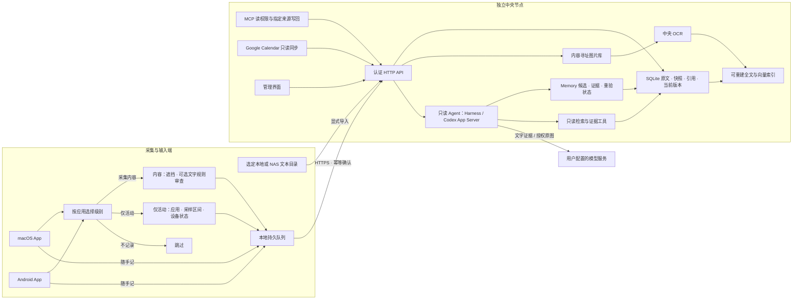

# Mote

> 当前源码版本 **0.0.67**。开发阶段发布 Mac DEV / Android DEV 两个安装包，手动下载更新；见 [发布策略](docs/ui-slate.md)。当前能力、专题指南及历史验收的入口见 [文档索引](docs/README.md)。

> 截图采用端侧文字规则审查与中央 OCR；端侧 Qwen/VLM 暂停执行，下载模型不是采集前提。中央本地 OCR、录音转写和说话人分离的安装与边界见 [部署说明](docs/ocr-asr-implementation-plan.md)。

**自己的上下文，自己的资料库。**

Mote 把电脑与手机上的屏幕采样、主动写下的日记、选定文件与日历，汇入你自部署的中央节点。你可以回看时间线、了解采样期间的时间分布，也可以直接提问，让 Agent 查阅原始证据并生成回顾。

采集器是独立的 **macOS App** 和 **Android App**。中央节点可放在 Mac mini、Linux 服务器或 NAS 上；它提供 API 与管理界面，Mac App 内可直接打开。更换服务器时迁移归档并更新客户端地址即可。

两端均可在未配置服务端时先记录到本机。上传可选实时、定时、积攒一批或仅手动，截图、随手记与本地来源共用策略；常用配置支持预设、应用选择和遮挡区域编辑。完整行为见 [采集与上传说明](docs/collection-and-sync.md)，Android 的处理与省电边界见 [采集开销优化](docs/android-power-optimization.md)。

客户端设置保存后自动应用，保留当前采集开停状态；图片保存位置可在“采集与存储”中查看和更改，已有队列随之迁移。见 [设置生效与图片位置](docs/client-settings-and-storage.md)。

[开始使用](#开始使用) · [架构](#架构) · [部署与迁移](docs/deployment.md) · [服务端配置](docs/server-configuration.md) · [Cloudflare Tunnel](docs/cloudflare-tunnel.md) · [中央记忆系统](docs/central-memory.md) · [资料分层](docs/context-layers.md) · [接入与正式资料](docs/material-architecture.md) · [来源与 MCP](docs/connectors.md) · [排查问题](docs/troubleshooting.md)

[下载安装包](https://github.com/utopiafar/mote/releases) · [扫码与 JSON 连接](docs/connections.md) · [保留设置地更新](docs/updating.md) · [发布与签名流程](docs/releasing.md)

## 能做什么

- **收集与回看**：显式开启屏幕采样，按设备和时间浏览；已上报的独立观察保留各自时间，相同字节去重存储；端侧启用图片去重时会跳过重复图片。
- **采集记录预览**：手机、Mac 和中央网页按天加载缩略图，展开原图与 OCR 文字；客户端可分别查看本机积存和自己的中央归档。新截图上传后由中央生成 OCR；旧版本机补识别队列仅保留兼容处理。
- **按应用分级采集**：选择“采集内容、仅应用活动、不记录”；纯活动不读画面和正文，内容采样支持固定遮挡区域和用户指定的文字规则审查；明确命中则丢弃，识别异常默认隔离待复核，可配置失败策略。见 [分级设置](docs/privacy-and-metadata.md)。
- **锁屏与后台媒体**：Android 可独立采集播放应用、状态及系统提供的曲目／章节信息，锁屏不截图也能入库；按应用、锁屏与前后台查看播放采样时间，并交给 Agent 结合证据分析。见 [媒体采集设计](docs/media-context.md)。
- **保留有用的元数据**：按开关上报设备与采样状态，文件和日历保留可得的大小、创建/修改/访问及删除观察时间；来源版本与证据可展开查看，未知字段不伪造。
- **随手记录**：在采集 App 中写日记、杂事、心情；草稿与待同步笔记保存在本机，恢复网络后补传。中央界面也提供记录入口。
- **来源接入**：Mac 本地日历与目录、Android 系统日历与文件原件/引用同步、中央 Google Calendar、Gmail 与飞书只读接入；显式导入 MCP 资源，或通过 MCP 将其他 Chatbot 的可见资料写回指定来源。
- **编码 Agent 对话**：Mac 可连接本机 Claude Code、Codex、Kimi Code，增量归档可读对话与工具记录，中央自动提炼有证据、适用范围和验证状态的编码经验，在现有 Chat 与洞察中使用。见[详细设计与调研](docs/coding-agent-memory.md)。
- **通用导入与洞察**：提交文件、ZIP 或服务器目录，用自然语言说明资料；先保留原件，再预览确认、写入记录并分批提取记忆。独立洞察页展示带证据的 HTML 报告和文字版，见[中央记忆系统](docs/central-memory.md)。
- **分层记忆**：保留原始输入、不可变快照与外部引用；默认检索当前版本，按需展开历史。模型记忆按“概要 → 内容 → 原始证据”逐层披露。
- **问答与回顾**：Agent 自主选择只读工具、查找材料、解释证据；答案附可点击的原始记录。对话历史保存在中央节点，刷新或重启后可选择旧对话继续，见[对话说明](docs/conversations.md)。可手动或按配置周期生成回顾。
- **离线可用、资料可迁移**：持久上传队列、幂等确认、JSON 导入导出、离线完整备份与保留期限。服务端与客户端内容加密均可选、默认关闭，开发者页面可一次性批量解密旧内容；连接凭据仍使用系统加密存储。
- **便捷连接**：中央生成一次性二维码或 JSON 邀请，采集端确认后获得独立凭据；Chatbot 可导入专用 MCP JSON。按连接撤销，不必给每个端点分发中央管理令牌。
- **版本更新**：当前 DEV 客户端从 Release 手动覆盖安装，服务端从源码构建并按命名环境备份、升级与回退；配置、队列、模型和资料保存在原位置。
- **可观测与可调节**：查看同步、索引、存储和请求状态；按需记录客户端资源样本，调整采样频率、图片尺寸、质量、推理线程和低电量策略。

“采样时间”是根据实际观察计算的覆盖时间，包含采样空缺的限制，不能当作连续专注时长或 App 独占耗电。Mote 不会用应用名称或关键词硬编码“工作”“娱乐”“待办”等语义判断。

## 架构



| 组件 | 职责 | 技术与边界 |
|---|---|---|
| macOS 采集器 | 屏幕采样、隐私策略、随手记、本地日历与文件、离线同步 | Electron / TypeScript；Swift 系统助手；独立窗口与本地存储 |
| Android 采集器 | 无障碍截图或 MediaProjection、日历与 SAF 文件、后台队列 | Kotlin；WorkManager；Keystore；HyperOS 配置入口 |
| 端侧审查 / 中央感知 | 端侧按用户文字规则过滤；中央 OCR、转写与说话人分离 | 端侧 Apple Vision / ML Kit 按需审查；中央 PP-OCRv5、faster-whisper、sherpa-onnx；模型单独安装 |
| 中央节点 | 认证、摄取、版本与分层归档、Memory、索引、连接器与调度 | Node.js 24 / Fastify；SQLite；单实例、单所有者 |
| 查询 Agent | 选择检索工具、理解上下文、关联证据 | DeepSeek Harness 或本机 Codex App Server；查询仅开放受控只读工具，无 shell 和写入工具 |
| 中央界面 | 来源、记忆、时间线、随手记、问答、导入导出与诊断 | React；随中央节点部署，也可在 Mac App 内使用 |

截图在端点应用遮挡与文字规则，获准上传的记录进入持久队列；审查异常默认隔离，等待用户复核。新截图不上传本机 OCR 文字，也不创建本机补识别任务。上传须收到匹配事件 ID 的确认，才移出待传队列；本机副本按客户端保留策略管理。中央 OCR 独立生成派生文字，模型缺失或识别失败不影响已归档原件。相同图片按内容哈希复用字节；启用端侧近似去重会减少保存的图片，不能保证保留每帧图像。

笔记与屏幕记录使用同一归档协议。同步采用带认证的版本化 HTTP API；Agent 通过只读上下文工具消费这些记录。NAS 和其他硬件可接入同一 [协议](docs/protocol.md)，不必绑定某个采集 App。

默认检索使用本地全文与文本索引；可选 embedding 服务启用持久向量索引和混合检索。检索表达式由模型生成。采集内容始终是不可信证据，不能改变 Agent 权限。详细存储与版本行为见 [资料分层](docs/context-layers.md)，连接方式见 [来源与 MCP](docs/connectors.md)。更多边界见 [架构说明](docs/architecture.md) 与 [Agent 配置](docs/agent.md)。

## 开始使用

### 1. 启动中央节点

需要 **Node.js 24** 与 npm。只部署中央节点不需要屏幕权限、端上模型、Xcode 或 Android SDK。

```sh
git clone https://github.com/utopiafar/mote.git
cd mote
npm ci
npm run build:libs
npm run build -w @mote/server -w @mote/web

node scripts/mote.mjs init --profile dev
node scripts/mote.mjs start --profile dev
node scripts/mote.mjs status --profile dev
node scripts/mote.mjs token --profile dev
```

开发节点默认是 `http://127.0.0.1:47842`。打开节点界面，点击「登录 Mote」并输入最后一个命令显示的管理令牌；默认使用当前网站地址。该令牌用于管理私人资料；采集 App 建议使用下一步的独立配对凭据。

开发时可在已初始化的环境中单独启动服务端热重载：

```sh
node scripts/mote.mjs exec --profile dev -- npm run dev -w @mote/server
```

拉取新代码后，如果 `package.json` 或 `package-lock.json` 有变化，先在仓库根目录运行 `npm ci` 同步依赖。构建工作区库不会安装新增的第三方依赖。

该命令会先检查服务端依赖是否已安装，缺失时列出包名并提示运行 `npm ci`；随后重建服务端依赖的 `@mote/shared` 和 `@mote/agent`，避免因旧的 `dist` 产物出现缺少导出的错误。修改这些依赖库的源码后，需重新运行该命令以更新构建产物。

配置、数据、日志分别放在 `.mote/profiles/dev/` 下。修改 `mote.env` 后停止并重新启动该环境：

```sh
node scripts/mote.mjs stop --profile dev
node scripts/mote.mjs start --profile dev
```

中央界面的 **服务端配置** 页面显示当前生效的数据目录、SQLite 与图片位置、日志、容量、保留时间、模型和网络设置，并标注来源及对应变量名。离线可用 `node scripts/mote.mjs config --profile dev` 查看部署配置与存储映射。完整变量、默认值与迁移注意事项见 [配置参考](docs/server-configuration.md)。

日常部署建议使用仓库外的 `prod` 环境，见下方部署章节。已有 `npm start` / 根目录 `.env` / `data/` 的安装仍按原路径运行，不会自动搬迁。

### 2. 连接采集 App

| 客户端 | 安装与首次设置 |
|---|---|
| macOS | 从 [Releases](https://github.com/utopiafar/mote/releases) 下载 Mac DEV ZIP，解压并将 App 移到应用目录后打开。导入邀请 JSON、链接或二维码图片，核对节点后连接；再配置隐私过滤与系统权限。首次打开与源码构建见 [电脑端说明](docs/desktop.md)。 |
| Android | 从 [Releases](https://github.com/utopiafar/mote/releases) 下载 Android DEV APK，使用独立开发包名；当前不发布日常版 APK。在「连接中央节点」扫码或导入 JSON，配置隐私规则与采集权限；小米后台设置见 [Android 说明](docs/android.md)。 |

在中央界面「设备 → 扫码连接设备」填写设备可访问的 HTTPS 地址，生成 10 分钟有效的一次性邀请。旧设备重新授权时选择原设备身份；新设备保持默认。采集凭据仅用于自身数据同步，Mac 内浏览完整中央资料时可以临时输入所有者令牌，采集配置不改变。MCP 的读取与指定来源写入使用另外的独立凭据，详见 [连接指南](docs/connections.md)。

Android 的「采集与存储详情」显示本周期已保存截图／笔记、确认上传、过滤与失败、待重试结果，以及当前队列、模型、来源缓存、存储目录和生效配置。累计数从安装此功能或明确重置时起算，旧版本历史不会补算成零；实际待同步数量直接读取本机文件。

Android 0.0.25 将采集启动与资料库整理分开：连接本机存储后即可开始采集，索引升级和清理在后台继续；采集记录按页显示并逐步加载缩略图。批量相似图片删除复用文件引用索引，避免每删除一条都重新读取整个资料库。服务端与各客户端默认明文写入，兼容读取旧密文；开发者页面提供手动启动的一次性批量解密，支持进度和取消。实现及生成图片测试范围见 [Android 大资料库性能](docs/android-library-performance.md)。

端侧截图不要求下载 Qwen 权重。本机 OCR 只在文字审查已开启且规则非空时运行，结果不作为新截图正文上传。中央新截图默认安排本地 OCR，新录音默认安排本地转写和说话人分离；Native 启动时自动准备中央 Worker 运行时，Docker 镜像包含依赖；模型在设置页显式安装。模型未就绪时保留原件并等待，详见 [中央 OCR 与录音转写](docs/ocr-asr-implementation-plan.md)。

手机上的 `127.0.0.1` 指手机自己。USB 开发验证可将手机端口转发到电脑开发节点：

```sh
adb reverse tcp:47842 tcp:47842
```

开发版 Android 填 `http://127.0.0.1:47842`，并显式允许调试 HTTP。跨设备的日常连接使用可达的 HTTPS 节点地址。系统强制结束或设备重启后，应检查采集权限与状态；不能保证系统允许无提示自动恢复截图。

登录、页面权限与设备二维码详见 [中央网页登录与设备配对](docs/web-login-and-pairing.md)。

### 3. 配置 AI 并使用

在中央网页打开 **系统管理 → 模型**（`#/system/models`），选择厂商或本机服务，填写支持工具调用的模型 ID 和 API key，点击 **保存并应用**。新请求立即使用新配置，正在执行的问答继续完成；密钥保存后只显示配置状态。

当前提供 DeepSeek、Qwen、豆包、GLM、Kimi、MiniMax、千帆、腾讯、SiliconFlow、OpenAI、Claude、Gemini 等预设，以及 Ollama、LM Studio 和自定义接口。预设可修改地址与协议，模型能力仍以厂商说明为准。“测试连接”只使用合成内容，不读取资料库，可能产生少量模型费用。

没有模型配置时，采集、笔记、同步和时间线仍可使用，AI 页面会显示待配置。环境变量、模型协议和凭据迁移规则见 [模型服务配置](docs/model-providers.md)，运行时权限见 [Agent 文档](docs/agent.md)。

开始采集后，在时间线查看记录，在随手记写下主动输入，在“问一问”选择时间与设备范围并提问，例如“这周我主要在推进什么，哪些事情还没完成？”点击答案引用可以展开原文。默认只向中央模型发送检索到的文本证据，不发送原始截图；启用 embedding 后，文本还会发送至你配置的 embedding 服务。

## 部署与环境隔离

| 场景 | 推荐方式 | 默认入口 |
|---|---|---|
| 本机开发 | `dev` 配置 + Node.js；客户端开发环境 | API `127.0.0.1:47842` |
| 独立测试 | `test` 配置与合成输入 | API `127.0.0.1:47852` |
| Mac mini 日常节点 | 仓库外 `prod` 目录 + Node.js，可生成 launchd 配置 | `127.0.0.1:47832`；跨设备经 HTTPS |
| Linux / NAS / 远程服务器 | Docker Compose 独立项目与卷，可选 Cloudflare Tunnel 或 Caddy HTTPS | 默认仅映射主机 loopback |
| 家庭网络 / 无入站端口的 Mac mini | Cloudflare Tunnel，公开域名转发至本机或容器中央节点 | 客户端填写 HTTPS 域名与 Mote 令牌 |

每个节点环境有独立端口、访问令牌、配置、数据与日志。CLI 未指定环境时使用 `dev`，不会自动操作 `prod`。Mac 命名环境使用独立 App 数据目录；Android `development` 构建使用独立包名，可以与日常版并装。详见 [开发环境](docs/development.md)。

Mac mini 示例：

```sh
node scripts/mote.mjs init --profile prod --home "$HOME/Library/Application Support/MoteCentral/profiles"
node scripts/mote.mjs start --profile prod --home "$HOME/Library/Application Support/MoteCentral/profiles"
```

Docker 主机示例（先准备对当前用户可写的 `/srv/mote/profiles`）：

```sh
node scripts/mote.mjs init --profile prod --home /srv/mote/profiles --runtime docker
node scripts/mote.mjs compose --profile prod --home /srv/mote/profiles -- build
node scripts/mote.mjs start --profile prod --home /srv/mote/profiles
```

中央节点默认仅监听 loopback。公网或局域网长期使用应配置 TLS 与强访问令牌。Cloudflare Tunnel 可通过主动出站连接提供 HTTPS 入口，无需将中央端口映射到公网；支持 profile 独立凭据文件、启停、协议设置和状态查看，步骤见 [Tunnel 部署](docs/cloudflare-tunnel.md)。完整的 HTTPS、launchd、容器日志、备份、迁移和升级步骤见 [部署文档](docs/deployment.md)。

SQLite 数据目录放在主机本地磁盘或 Docker 本地卷；NAS 可以运行节点，但不要让多个节点共享网络文件系统上的 SQLite WAL。当前服务不提供多租户或多实例写入。

## 数据、隐私与资源

| 配置 / 功能 | 默认行为 |
|---|---|
| 开始采集 | 需要用户显式开启；启动中央节点不会开始截图 |
| 应用过滤与文字规则审查 | 客户端配置；规则命中不保存，OCR 异常默认隔离待复核，可显式选丢弃或放行 |
| `MOTE_MAX_STORAGE_MB` | 中央配额 10240 MiB；满额拒绝新数据，端点保留未确认队列 |
| `MOTE_RETENTION_DAYS` | `0`，持续保留；设为正数后会删除过期记录与无引用图片 |
| `MOTE_CONTENT_ENCRYPTION` | 内容加密初始开关，默认 `0`；开发者页面保存的选择优先，配置密钥本身不会开启加密 |
| `MOTE_DATA_KEY` | 可选 64 位十六进制 AES-256-GCM 内容密钥；未配置时显式开启会在资料库生成私有密钥文件，SQLite 元数据保持明文 |
| `MOTE_EMBEDDING_*` | 默认关闭；配置后向指定服务发送文本建立向量索引 |
| 记忆与洞察调度 | 持久化生命周期策略控制自动运行；默认洞察有增量且达到 100 条或最长等待 1 小时即可启动，可关闭。`MOTE_INSIGHT_INTERVAL_HOURS` 仅用于初始策略，见 [记忆生命周期](docs/memory-lifecycle.md) |
| 中央日志 | 固定事件与数量、耗时；默认轮转保留 3 个文件，每个最多 2 MiB |
| 客户端资源诊断 | 默认关闭，按需记录进程、队列、模型、存储与电量样本 |

小资料库可通过“资料库 → 导入与导出”迁移 JSON；完整迁移使用离线备份。备份包含私人资料；存在密文时需要保留原 `MOTE_DATA_KEY` 或资料库的 `content-key` 文件。加密范围、默认值和旧文件转换见[内容存储设置](docs/content-storage.md)。归档导出和诊断包是两个独立功能：**诊断包不包含记录正文、图片或密钥**。

选定本地/NAS 文件夹可作为文本来源，先预览再导入：

```sh
MOTE_ENV_FILE=/absolute/path/to/mote.env npm run import:files -- --root /path/to/selected-notes --dry-run
MOTE_ENV_FILE=/absolute/path/to/mote.env npm run import:files -- --root /path/to/selected-notes --watch
```

上述 `import:files` 文本同步命令支持 UTF-8 文本 / Markdown 等显式扩展名，每文件最多 100 KB。中央网页的 **导入** 是另一条流程：保留原件后，使用模型和通用解析辅助程序处理文本、结构化导出、PDF 文本层、DOCX、XLSX 等资料，先预览再确认，并独立跟踪 Memory 批次。它不会自动执行扫描件 OCR 或音视频转写。格式、大小、离线行为和原生工具边界见[中央记忆系统](docs/central-memory.md)。

## 排查问题

1. 在客户端查看采集权限、模型状态和待同步数量；开发者选项可导出本地诊断包。
2. 在中央界面“资料库 → 运行诊断”查看队列、索引与资源状态，展开最近事件或导出诊断包。
3. 错误提示中的请求编号可关联服务器的上传、索引与查询阶段。节点日志支持级别、轮转上限和 Debug 配置。
4. 服务无法启动时，使用 `node scripts/mote.mjs status --profile dev` 和所选环境日志检查端口、路径、权限与配置。

客户端和中央界面的“设置 → 反馈”可直接打开 GitHub 问题表单，预填版本、平台等基本信息；登录 GitHub 后填写问题并提交。图片或日志可在 GitHub 页面手动添加，诊断包沿用上述导出入口。

具体症状、命令和恢复步骤见 [故障排查](docs/troubleshooting.md)。Issue 和附件会公开，上传前请检查并遮盖个人内容；请勿附访问令牌、日记原文或私人归档。

## 文档与开发

| 文档 | 内容 |
|---|---|
| [部署与迁移](docs/deployment.md) | Mac mini、Docker、HTTPS、备份恢复、升级与回滚 |
| [开发环境](docs/development.md) | 服务端与客户端隔离、开发命令、测试 |
| [中央记忆系统](docs/central-memory.md) | 通用导入、原件与证据、分批 Memory、洞察 Skill、扩展与限制 |
| [模型服务配置](docs/model-providers.md) | 厂商预设、协议、保存即生效、合成测试与私有凭据 |
| [故障排查](docs/troubleshooting.md) | 日志、请求编号、诊断包与常见故障 |
| [架构](docs/architecture.md) / [协议](docs/protocol.md) | 数据流、边界、扩展接入与一致性 |
| [macOS](docs/desktop.md) / [Android](docs/android.md) | 安装构建、采集权限、后台行为 |
| [端上推理](docs/local-inference.md) / [Agent](docs/agent.md) | 本地模型、下载源、策略、中央模型与工具 |
| [部署与诊断验证](docs/operations-validation.md) / [真实模型验证](docs/live-validation.md) | 自动化、模拟器、真实模型与真机的范围和限制 |
| [第三方组件](THIRD_PARTY_NOTICES.md) | 实际依赖与模型许可说明 |

目前优先支持 macOS 采集与 Android，Windows/Linux 采集适配尚未完成。桌面分发仅采用 ad-hoc 签名，尚未完成 Developer ID 签名与公证；已有一次 Xiaomi / HyperOS 导航窗口修复的生成画面真机检查；后台稳定性、耗电与更广机型仍需单独验收，见 [采集恢复记录](docs/android-capture-recovery.md)。自动化 fixture、模拟器、真实模型和真机测试分别记录，不能互相替代。

来源与分层记忆的测试范围、真实模型复测与目标环境限制见 [0.4.0 验收记录](docs/sources-validation.md)；发布和升级的验证见 [0.5.1 验收记录](docs/update-validation.md)。本轮修复与验证见 [2026-09-23 项目复查](docs/review-2026-09-23.md)，包含上传/同步、性能、真实模型 Persona 和 [社区插件接入](docs/community-extensions.md)。

日程功能：在中央「行动」开启发现并授权设备，逐条确认后写入 Android / Mac 已有日历。详见[日程与行动平台](docs/calendar-actions.md)。
