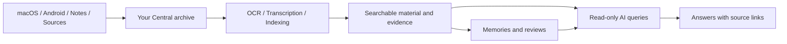

# Mote

**Your context. Your archive.**

Mote is an AI-native personal context collector and archive you host yourself. Bring together selected screen history, notes, files, calendars, and coding conversations from your computer and phone. Revisit what happened, ask questions, and follow answers back to the original evidence.

**English** · [简体中文](README.zh-CN.md)

[Quick start](#quick-start) · [Download apps](https://github.com/utopiafar/mote/releases) · [Documentation](docs/README.md) · [Report an issue](https://github.com/utopiafar/mote/issues)

## What you can do

- **Find something you saw.** Browse collected records by date, device, or app, and open the original image or text.
- **Keep your own account of the day.** Write quick notes on your phone, Mac, or the web. Client apps keep offline notes and queue them for later sync.
- **Bring scattered context together.** Add selected files and calendars, connect Gmail or Feishu/Lark, or archive local Claude Code, Codex, and Kimi Code conversations from your Mac.
- **Ask questions with evidence.** Ask about your work or revisit a decision. Mote retrieves relevant material and links its answers to the records it read.
- **Build memory over time.** Turn collected material into evidence-backed memories and reviews, while keeping originals available to inspect.
- **Use your archive with other AI tools.** Connect compatible chatbots through MCP with separate, scoped credentials.

For example, ask: “What did I work on this week?”, “Where did I see that deployment advice?”, or “What did I decide last time, and why?” Answers depend on the material you have collected and the model you configure.

## Quick start

Mote has two parts: **Central**, your archive and web interface, and optional **macOS / Android apps** that collect and sync context. Central can run on your Mac, a Linux server, or a NAS. You can try it with a note before enabling screen collection.

> **Development preview:** Central, macOS, and Android have separate releases. Current downloads are DEV builds and use manual updates. If you already use Mote, read the [upgrade guide](docs/updating.md) first: older archive formats are rejected rather than migrated automatically.

### 1. Start your archive

Install **Node.js 24** and npm, then run:

```sh
git clone https://github.com/utopiafar/mote.git
cd mote
npm ci
npm run build:central

node scripts/mote.mjs init --profile dev
node scripts/mote.mjs start --profile dev
node scripts/mote.mjs status --profile dev
```

Open [http://127.0.0.1:47842](http://127.0.0.1:47842). To sign in, select **Sign in to Mote** and enter the owner token shown by:

```sh
node scripts/mote.mjs token --profile dev
```

This creates a local trial environment, with configuration, data, and logs under `.mote/profiles/dev/`. Keep the token private: it grants full archive access. To stop this environment, run `node scripts/mote.mjs stop --profile dev`.

Central prepares its local OCR and audio worker runtime in the background. Those workers need **Python 3.9+** and network access for their first installation; audio processing also needs **FFmpeg**. Install OCR/transcription models explicitly in settings when you need them. Originals remain archived while processing waits for its runtime or models. See the [media setup guide](docs/ocr-asr-implementation-plan.md).

For a daily archive, use a profile outside the checkout. The [deployment guide](docs/deployment.md) covers Mac mini, Docker, startup services, backups, and migration; [Cloudflare Tunnel](docs/cloudflare-tunnel.md) covers an HTTPS address for other devices.

### 2. Add your first context

Start with **Record** in the web interface: save a short note, then find it in **Library**. You can also use Library's import tools to add selected material, inspect the preview, and confirm it.

To collect from your devices, download the matching app from [Releases](https://github.com/utopiafar/mote/releases):

| Device | Install | Connect |
| --- | --- | --- |
| macOS 13.3+ | Download the Mac DEV ZIP for your architecture, unzip, and move the app to Applications. | Import an invitation as JSON, text, or a QR image. See the [Mac guide](docs/desktop.md) for first-open and permission steps. |
| Android 10+ | Install the Android DEV APK. | Scan the invitation QR code or import JSON. See the [Android guide](docs/android.md) for permissions and background settings. |

In Central, open **Collection & devices → Connect device**, enter a server address that the device can reach, and generate an invitation. On the device, import it, verify the address, and confirm. Invitations expire after 10 minutes and can be used once. Each app receives its own revocable credential with full owner access; only pair devices you trust.

A phone's `127.0.0.1` points to the phone itself. Cross-device use needs a reachable **HTTPS** address and a strong access token; generating a QR code does not create a tunnel. See [connection setup](docs/connections.md).

Choose which apps and content to record, configure privacy filters, grant the required system permissions, and explicitly start collection. You can collect locally before connecting Central, and choose real-time, scheduled, batched, or manual uploads. See [collection and sync](docs/collection-and-sync.md).

### 3. Ask your first question

In Central's settings, open **Model providers**, add a provider preset, and save your connection and model. Under **Modules and models**, assign it to Chat; assign models to Memory, reviews, or import when you use those features. Use **Test connection** to check the setup with synthetic content; provider charges may apply.

Open **Ask** and try a question about your note or collected records. Follow a citation to inspect the original evidence. Notes, collection, sync, and browsing work without an AI provider; AI features wait for model configuration.

Presets include hosted providers, local services such as Ollama and LM Studio, and a local Codex runtime. Model and tool-calling compatibility depends on your chosen service. See [model configuration](docs/model-providers.md).

## Your data and control

- **You choose what to collect.** Collection starts explicitly on each device. Per-app rules let you collect content, keep activity only, or record nothing. Masks and optional text-based privacy rules apply on the device before upload.
- **You choose where it lives.** Central stores the archive on your infrastructure. Client content is stored in app-private directories; Central content encryption is optional and off by default. It does not encrypt all SQLite metadata.
- **You choose the AI service.** Retrieved text is sent to the configured model for AI requests. Original screenshot disclosure requires separate authorization. Optional embeddings send text to the embedding service you configure; self-hosting the archive does not make remote AI requests local.
- **You control retention and connections.** Set retention, export your archive, make offline backups, and revoke individual connections. Central retains data indefinitely by default, subject to its storage quota.

See [privacy controls](docs/privacy-and-metadata.md), [content storage](docs/content-storage.md), and [backup and recovery](docs/deployment.md). Sampled activity shows coverage during observations, rather than continuous focus time.

## How it works


```mermaid
flowchart LR
  Inputs[macOS / Android / Notes / Sources] --> Archive[Your Central archive]
  Archive --> Processing[OCR / Transcription / Indexing]
  Processing --> Evidence[Searchable material and evidence]
  Evidence --> Ask[Read-only AI queries]
  Evidence --> Memory[Memories and reviews]
  Memory --> Ask
  Ask --> UI[Answers with source links]
```

The apps collect independently and keep persistent offline queues. Central preserves originals and source versions, prepares searchable material, and builds memories in the background. Queries can read available material without waiting for memory extraction. Models choose retrieval tools and interpret evidence; captured content is treated as untrusted evidence, and query agents receive only read-only context tools.

The implementation uses Electron/TypeScript with Swift helpers on macOS, Kotlin on Android, and Node.js/Fastify, SQLite, and React for Central. Central is a single-owner archive with one writer instance. Read the [architecture](docs/architecture.md) and [protocol](docs/protocol.md) for the technical boundaries.

## Guides and support

Detailed guides are currently primarily in Chinese. Both READMEs cover the same getting-started path.

| I want to… | Guide |
| --- | --- |
| Deploy, back up, or update Central | [Deployment](docs/deployment.md) · [Updates](docs/updating.md) · [Server settings](docs/server-configuration.md) |
| Set up collection on my devices | [macOS](docs/desktop.md) · [Android](docs/android.md) · [Collection and sync](docs/collection-and-sync.md) |
| Bring in files, calendars, or other apps | [Sources and MCP](docs/connectors.md) · [Import and memory](docs/central-memory.md) · [Coding conversations](docs/coding-agent-memory.md) |
| Understand memory and processing | [Memory lifecycle](docs/memory-lifecycle.md) · [Local OCR and transcription](docs/ocr-asr-implementation-plan.md) |
| Diagnose a problem | [Troubleshooting](docs/troubleshooting.md) · [Documentation index](docs/README.md) |

Current collectors support macOS and Android; Windows/Linux screen collection is not implemented. Mac DEV apps use ad-hoc signing and are not notarized. Android background behavior and battery use vary by device; fixture, emulator, physical-device, and live-model checks are documented separately.

For bugs, use [GitHub Issues](https://github.com/utopiafar/mote/issues) or **Settings → Feedback** in the app. Include the component version, platform, and reproduction steps. Issues are public: check attachments for personal content and never include access tokens or private archives.

For contributions, start with the [development guide](docs/development.md) and [project working rules](AGENTS.md). For documentation-only changes, check formatting, grammar, links, and rendering. Run `npm run check:affected` for code, configuration, dependency, or runtime changes, add checks for the affected user journeys as described in the development guide, and use generated fixtures for capture tests. Dependency and model license details are in [third-party notices](THIRD_PARTY_NOTICES.md).
