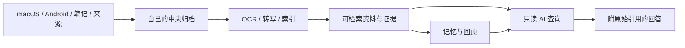

# Mote

**自己的上下文，自己的资料库。**

Mote 是 AI-native 的个人上下文采集器与自部署归档。把电脑和手机上选定的屏幕记录、随手记、文件、日历与编码对话汇入自己的资料库，回看发生过的事、直接提问，并沿着回答引用找到原始证据。

[English](README.md) · **简体中文**

[快速开始](#快速开始) · [下载安装包](https://github.com/utopiafar/mote/releases) · [文档](docs/README.md) · [反馈问题](https://github.com/utopiafar/mote/issues)

## 可以用它做什么

- **找回看过的内容。** 按日期、设备或应用浏览采集记录，展开原图或原文。
- **留下自己的记录。** 在手机、Mac 或网页写随手记；客户端离线保存笔记，恢复连接后同步。
- **汇集分散的上下文。** 添加选定文件与日历，连接 Gmail、飞书，或从 Mac 归档本机 Claude Code、Codex、Kimi Code 对话。
- **带着证据提问。** 回顾工作、查找资料、重访过去的决定；Mote 检索相关材料，回答附上实际查阅记录的引用。
- **逐步积累记忆。** 从资料中整理有证据的记忆与回顾，保留原件，方便核对。
- **让其他 AI 工具使用资料库。** 通过 MCP 连接兼容的 Chatbot，使用独立、限权的凭据。

例如：“这周我主要在推进什么？”“之前在哪里看过那个部署建议？”“上次我做了什么决定，为什么？”回答取决于你已收集的材料和所配置的模型。

## 快速开始

Mote 包含两部分：**中央节点（Central）** 保存归档并提供网页界面，可选的 **macOS / Android App** 负责采集和同步。中央可以放在自己的 Mac、Linux 服务器或 NAS 上。无需先开启屏幕采集，写一条笔记就能开始体验。

> **开发预览阶段：** Central、macOS、Android 分别发布，当前下载为 DEV 构建，手动更新。已有用户请先阅读[升级指南](docs/updating.md)：旧归档格式会被拒绝读取，不会自动迁移。

### 1. 启动自己的资料库

安装 **Node.js 24** 和 npm，然后执行：

```sh
git clone https://github.com/utopiafar/mote.git
cd mote
npm ci
npm run build:central

node scripts/mote.mjs init --profile dev
node scripts/mote.mjs start --profile dev
node scripts/mote.mjs status --profile dev
```

打开 [http://127.0.0.1:47842](http://127.0.0.1:47842)，点击 **登录 Mote**，输入以下命令显示的所有者令牌：

```sh
node scripts/mote.mjs token --profile dev
```

这会创建一个本机试用环境，配置、数据和日志保存在 `.mote/profiles/dev/`。请妥善保管令牌，它具有完整资料库权限。停止该环境可执行 `node scripts/mote.mjs stop --profile dev`。

中央会在后台准备本地 OCR 和音频 Worker 运行时。这些 Worker 需要 **Python 3.9+**，首次安装需要联网；音频处理另需 **FFmpeg**。需要识别时，在设置中显式安装 OCR／转写模型。运行时或模型未就绪时，原件仍会归档，处理任务等待就绪。详见[媒体配置指南](docs/ocr-asr-implementation-plan.md)。

日常使用建议把环境目录放在仓库外。[部署指南](docs/deployment.md)提供 Mac mini、Docker、开机服务、备份和迁移步骤；[Cloudflare Tunnel](docs/cloudflare-tunnel.md)说明如何为其他设备提供 HTTPS 地址。

### 2. 添加第一份上下文

先点击中央网页的 **记录**，保存一条简短笔记，再到 **资料库** 找到它。也可以使用资料库中的导入工具添加选定材料，检查预览后确认。

需要从设备采集时，从 [Releases](https://github.com/utopiafar/mote/releases) 下载对应客户端：

| 设备 | 安装 | 连接 |
| --- | --- | --- |
| macOS 13.3+ | 下载适合本机架构的 Mac DEV ZIP，解压并将 App 移到应用目录。 | 导入邀请 JSON、文字或二维码图片；首次打开及权限步骤见 [Mac 指南](docs/desktop.md)。 |
| Android 10+ | 安装 Android DEV APK。 | 扫描邀请二维码或导入 JSON；权限和后台设置见 [Android 指南](docs/android.md)。 |

在中央打开 **采集与设备 → 连接设备**，填写设备可访问的节点地址，生成邀请。在客户端导入邀请，核对地址并确认连接。邀请 10 分钟后失效，仅能使用一次。每个 App 获得独立、可撤销且具有完整所有者权限的凭据，请只配对可信设备。

手机上的 `127.0.0.1` 指手机自己。跨设备使用需要可访问的 **HTTPS** 地址与强访问令牌；生成二维码不会自动建立隧道。详见[连接设置](docs/connections.md)。

选择允许记录的应用和内容，配置隐私过滤，授予必要系统权限，再明确开始采集。客户端也可以在未连接中央时先记录到本机，上传可选实时、定时、积攒一批或仅手动。详见[采集与同步](docs/collection-and-sync.md)。

### 3. 提出第一个问题

在中央设置中打开 **模型 Provider**，新增预设，保存服务连接与模型；在 **模块与模型** 中分配给 Chat。使用记忆、回顾或导入时，再配置对应模块。可用 **测试连接** 验证合成内容的调用，可能产生服务商费用。

打开 **问一问**，针对刚保存的笔记或采集记录提问，点击引用核对原始证据。未配置 AI 服务时，笔记、采集、同步与浏览仍可使用，AI 功能等待模型配置。

预设包含云端服务商、Ollama 和 LM Studio 等本地服务，以及本机 Codex 运行时。模型与工具调用兼容性取决于所选服务，详见[模型配置](docs/model-providers.md)。

## 资料与控制权

- **采集什么由你决定。** 每台设备都需明确开始采集；应用可设置为采集内容、仅记录活动或不记录。遮挡区域和可选文字隐私规则在端侧上传前生效。
- **资料放在哪里由你决定。** 中央归档保存在自己的基础设施上；客户端内容保存在应用私有目录。中央内容加密可选，默认关闭，不等于整个 SQLite 元数据加密。
- **AI 服务由你选择。** AI 请求会将检索到的文本发送至所配置模型；披露原始截图需要单独授权。可选 embedding 会向指定服务发送文本，自部署资料库不代表远程 AI 请求也在本机处理。
- **保留与连接由你管理。** 可设置保留期限、导出归档、制作离线备份，并单独撤销连接。中央默认持续保留资料，受存储配额约束。

详见[隐私控制](docs/privacy-and-metadata.md)、[内容存储](docs/content-storage.md)和[备份恢复](docs/deployment.md)。采样活动反映观察期间的覆盖时间，不能当作连续专注时长。

## 简要架构



客户端独立采集，使用持久离线队列同步；中央保留原件和来源版本，生成可检索资料，并在后台整理记忆。问答可以读取已就绪材料，无需等待记忆提取完成。模型自主选择检索工具、理解证据；采集内容始终是不可信证据，查询 Agent 只获得只读上下文工具。

实现采用 macOS Electron／TypeScript 与 Swift 助手、Android Kotlin，以及中央 Node.js／Fastify、SQLite 和 React。中央是单所有者归档，由单实例写入。技术边界见[架构](docs/architecture.md)与[协议](docs/protocol.md)。

## 指南与帮助

详细指南目前主要为中文，两份 README 提供一致的入门路径。

| 我想…… | 指南 |
| --- | --- |
| 部署、备份或更新中央 | [部署](docs/deployment.md) · [更新](docs/updating.md) · [服务端设置](docs/server-configuration.md) |
| 配置设备采集 | [macOS](docs/desktop.md) · [Android](docs/android.md) · [采集与同步](docs/collection-and-sync.md) |
| 接入文件、日历或其他应用 | [来源与 MCP](docs/connectors.md) · [导入与记忆](docs/central-memory.md) · [编码对话](docs/coding-agent-memory.md) |
| 了解记忆与处理 | [记忆生命周期](docs/memory-lifecycle.md) · [本地 OCR 与转写](docs/ocr-asr-implementation-plan.md) |
| 排查问题 | [故障排查](docs/troubleshooting.md) · [文档索引](docs/README.md) |

当前采集端支持 macOS 和 Android，尚未实现 Windows／Linux 屏幕采集。Mac DEV App 使用 ad-hoc 签名，尚未公证。Android 后台行为与耗电因机型而异；fixture、模拟器、真机和真实模型验证分别记录。

发现问题可使用 [GitHub Issues](https://github.com/utopiafar/mote/issues) 或 App 的 **设置 → 反馈**，提供组件版本、平台和复现步骤。Issue 会公开，请检查附件中的个人内容，勿附访问令牌或私人归档。

参与开发请先阅读[开发指南](docs/development.md)与[项目工作规则](AGENTS.md)。纯文档修改检查格式、语法、链接和渲染；涉及代码、配置、依赖或运行行为的修改运行 `npm run check:local`，采集测试使用生成 fixture。依赖与模型许可见[第三方组件说明](THIRD_PARTY_NOTICES.md)。
