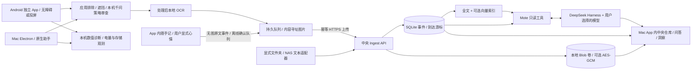

# Mote 架构

## 边界

采集器生命周期与 Agent 会话独立。中央节点不远程开启截图；端点明确启用后自行采集、过滤、压缩、离线排队。中央节点不依赖端点文件路径，端点也不依赖 SQLite 实现。

端点创建稳定事件 ID，重试使用相同 payload。服务验证内容、图片格式/大小、隐私排除标志，再写图片和事务性事件。冲突 ID 不覆盖已有数据；断网补传不改变发生时间。内容哈希只去重图片，重复观察仍有各自 ID/时间，避免省存储却丢掉时间信息。

`capturedAt` 是源事件时间，`receivedAt` 是中央首次收到时间；`changes.seq` 表示中央增量变化顺序。一个昨天发生、今天补传的事件会显示在昨天时间线，却出现在今天的新增消费游标。导入保存原始到达时间，另发新的中央 changes 事件。

事件层保存图片引用、OCR、应用与来源；随手记使用同一事件层的 `source=note`，原文与用户显式心情单独保留，不造空图片，也不由程序推断心情。向量与洞察都是派生数据。删除事件同步移除文本/向量索引，最后一个引用删除时清理 blob，并使历史洞察失效。后续应扩展精确的洞察依赖表；MVP 保守清除全部派生洞察。

## 独立应用与同步入口

日常入口是 Android APK 和 Mac `.app`。两端都可直接写随手记；这属于用户主动记录，不要求屏幕录制权限，也不受截图模型是否已下载的限制。Mac 的中央仓库、时间线和问答在 App 内的独立窗口呈现，复用中央前端，不需要另开系统浏览器。中央前端仍可单独部署，便于服务器迁移和管理。

Mac 中央窗口使用按节点来源隔离的持久会话，保留该节点的草稿和待同步笔记；关闭 Node 权限、限制同来源请求，真实节点令牌只由主进程加入对应 API 请求。采集主窗口只开放明确的 IPC 功能，不给远程中央页面本地文件和截图能力。

传输采用带稳定事件 ID、确认、重试及删除墓碑的 HTTP 协议，见 [协议](protocol.md)。MCP 提供外部 Agent 的读取与指定来源写回接口，也可显式导入其他 MCP 服务的资源。后台文件同步仍采用持久队列与 HTTP 确认，详见[连接器](connectors.md)与[资料分层](context-layers.md)。

## AI 与计算的分工

程序不识别自然语言意图、不硬编码待办/效率/主题分类，也不根据 App 名称推断人的动机。Agent 可以调用全文检索这个普通数据工具，自己决定表达式、时间窗口、是否改写查询；可选 embedding 提供语义候选。用户时间范围在工具桥中收紧，证据引用必须属于当前运行真实读到的记录。

DeepSeek Harness 采用精确版本 SDK，sdk-minimal 中禁用 shell/文件相关组件，只挂载 Mote 插件；启动时校验工具表恰好为五项只读能力。每轮使用独立临时 workspace/home，退出清理会话文件。随机令牌的 loopback 桥把模型工具调用转发到受控 ContextReader。详见 [Agent](agent.md)。

截图文字是外部输入，即使出现“忽略系统指令”等文本也只作为证据。模型没有写入、删除、执行命令、对外发消息或任意 HTTP 工具。无法保证模型永不被误导，但工具能力边界限制其可产生的副作用，最终引用也被验证。

量化图表是采样暴露时间的计算：对同设备重叠区间去重、按查询窗口裁剪，跨设备分别累计。多个屏幕同时点亮并不代表多个独立的人小时。漏采、关闭屏幕、断权限的区间不填充为“活跃”。主题和行为洞察由 Agent 根据证据解释。

## 存储、隐私与成本

首期不为每张图片调用云视觉模型；端上离线 OCR，已处理图像按需保存。重复图片复用、JPEG/WebP 压缩与采样间隔降低体积。若图片均不相同，15 秒一帧、每帧 150 KB 的**示例估算**约 36 MB/小时；实际取决于分辨率、压缩、活跃时间和重复度，以 UI 实际存储数据为准。

两端内置相同版本的 Qwen3.5-0.8B GGUF 与视觉 projector，通过固定 llama.cpp CPU 引擎在独立进程中运行。模型下载优先 ModelScope，采用双文件 SHA 校验、续传和离线导入；权重不打入应用包。默认策略为 NSFW 过滤，可编辑自然语言策略用于其他前置视觉任务；程序只验证 JSON 结构、完整结束与用户明确的运行限制，不使用关键词或肤色判断。模型未就绪、输出截断、失败、取消或超时均不放行截图。详细契约见 [端侧推理](local-inference.md)。

固定遮罩和明确排除先于模型及上传，通用 HTTP 本机审查 hook 可叠加。端上识别不等于百分百脱敏。电脑暂存隐私处理后的图片到应用私有目录但不是应用级全盘加密，依赖 FileVault；Android 队列使用 Keystore AES-GCM。中央可选 blob 加密，SQLite OCR/元数据依赖加密磁盘。完整导出是可读私密资料，密钥和令牌不进入导出。

使用本地文本索引无需 embedding API。配置 embedding 才把已脱敏文字发给指定服务；自然语言问答会把检索到的文字、应用名和时间发给用户配置的 Agent 模型。原始图片不在 Agent 五工具的返回内容中。

客户端开发者诊断默认关闭，仅保留有上限的本机数值记录：设备电量/充电状态、模型和队列存储占用、采集与拦截计数、推理/OCR 时间及上传量，可导出 JSON。不会写入截图、OCR、笔记、令牌、策略文字或模型解释。设备电量变化不能归因于单个应用；CPU、内存和阶段耗时也按其实际测量范围标注。采样间隔、JPEG 质量、图像尺寸、模型线程/输入尺寸/输出长度，以及充电和低电量暂停条件都由用户配置。先观察这些数据，再调整参数，不通过语义硬规则决定哪些内容“重要”。

## 可扩展位置

| 变化 | 保持稳定的边界 | 后续替换 |
|---|---|---|
| 中央节点从电脑迁移云/NAS | Capture API、独立 data 卷、导出格式 | 部署地址与存储卷 |
| 新增智能硬件、录音、SaaS | 事件来源、时间与到达游标 | Source adapter + 素材处理器 |
| 更大资料库 | Store/ContextReader | PostgreSQL、对象存储、向量数据库、后台任务队列 |
| 更换 Agent / 模型 | 受控只读 Context 工具、证据 ID | Harness 插件、MCP 包装、其他消费者 |
| 端上增加通用视觉任务 | 图像内存输入、自然语言策略、JSON 决策、可取消独立进程 | 新任务提示与输出 schema、经验证的新模型清单 |
| 个人多设备变成多人 | 明确的认证 hook | 每设备令牌、读写 scope、来源 ACL、owner namespace |
| 完整文件库 | source=file 事件与版本 | PDF/Office 解析、分块、文件对象引用 |

当前单 owner Bearer 令牌同时可读写，SQLite 单写者、CPU 内向量比较，HTTP base64 不适合超大媒体。它们是明确 MVP 限制，不是已经具备多租户/海量数据能力。长期应在已测量的瓶颈上替换实现，保持事件、来源和证据可迁移。

## 环境与运维边界

中央节点由显式配置文件选择数据与日志目录。命名环境要求提供独立配置或数据目录；配置文件缺失会启动失败，不回落读取仓库中的日常配置。环境 CLI 清理继承的 MOTE 配置，只载入选定环境，避免终端中的旧令牌或模型密钥混入其他节点。开发、测试和日常节点各自拥有端口、令牌、数据库、图片与进程状态。

Mac 命名 profile 隔离应用配置、设备身份、凭据、草稿、上传队列和诊断；未指定 profile 保留既有日常路径。Android development 构建使用独立 application ID，系统自动隔离数据库、Keystore、WorkManager 与文件目录。服务迁移和开发环境切换是显式操作，不能默默搬运待同步私人内容。

中央诊断默认启用有界事件日志，以服务生成的请求编号串联摄取、索引、工具读取和 Agent 阶段。事件采用固定名称、错误类别和数值白名单，不写入正文、URL 参数、请求头、模型响应或密钥。轮转文件与内存事件都有上限；导出诊断包只包含状态统计和最近事件，与私人归档导出分开。客户端保留端上采集、权限、模型和上传事件，资源样本按用户设置启用。

部署与配置契约见 [部署文档](deployment.md)、[开发环境](development.md) 与 [故障排查](troubleshooting.md)。
