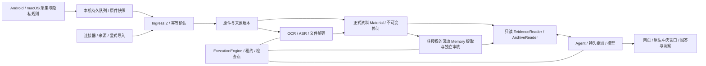

# Mote 架构

Mote 是 AI-native 的个人上下文采集器与中央归档。当前实现采用单一 MVP 基线：Central 存储 epoch 4，Desktop / Android 本机格式 3，不安装旧库迁移器。产品版本、wire protocol 1、collector Ingress 2、便携归档 v2 各自独立，见 [MVP 基线决策](adr-mvp-baseline.md)。

```mermaid
flowchart LR
  C[Android / macOS 采集与隐私规则] --> Q[本机持久队列 / 原件快照]
  Q --> I[Ingress 2 / 幂等确认]
  S[连接器 / 来源 / 显式导入] --> I
  I --> R[原件与来源版本]
  R --> M[正式资料 Material / 不可变修订]
  R --> P[OCR / ASR / 文件解码]
  P --> M
  M --> E[只读 EvidenceReader / ArchiveReader]
  M --> W[获授权的滚动 Memory 提取与独立审核]
  W --> E
  E <--> A[Agent / 持久委派 / 模型]
  A --> U[网页 / 原生中央窗口 / 回答与洞察]
  X[ExecutionEngine / 租约 / 检查点] --- P
  X --- W
  X --- A
```

## 代码目录与责任

| 目录 | 当前责任 |
| --- | --- |
| `apps/server` | Fastify Central、来源接入、存储、Material、处理与执行器、委派、Memory、权限和查询 |
| `apps/web` | Central 网页；随 server 发布，展示资料、问答、活动、设置与处理状态 |
| `apps/desktop` | Electron macOS 采集器、Swift 原生助手、本机隐私审查、持久队列及来源原件上传 |
| `apps/android` | Kotlin 平台采集、ML Kit 可选文字规则审查、本机队列、来源与同步 |
| `packages/shared` | TypeScript 数据/协议契约、国际化、发布验证及公共工具 |
| `packages/agent` | DeepSeek Harness / Codex 适配、只读工具桥、上下文装配和运行时 Skills |
| `packages/diagnostics` | 有界数值诊断、固定事件与支持包 |
| `protocol` | 跨平台 wire 契约和共享生成 fixture |
| `plugins`、`adapters`、`examples` | 已有宿主契约上的来源、UI 与连接器扩展示例 |
| `scripts`、`deploy`、`.github`、`release` | 合成验证、环境/备份/构建、部署与组件发布 |
| `docs`、`licenses` | 当前指南、ADR、带日期的验证证据和依赖许可证 |

退役的 `packages/local-inference`、`models` 与端侧 Qwen 启动/下载工具已删除。中央 OCR/ASR 模型由 `media-assets.ts` 与 Worker 安装流程管理，不依赖端侧 Qwen。

## 接入、原件与正式资料

客户端独立采集，Central 不远程开启屏幕采集。应用规则、遮罩和用户指定的文字隐私规则在本机处理；只有开启文字审查且规则非空时调用本机 OCR。Central 模型不参与接入授权。来源适配器提供协议身份、原文、可靠时间和稳定版本，不用语义关键词推断主题或用户意图。

接入事务保存原件和版本并返回 Ingress 2 回执，确认只证明输入可恢复。普通来源保存观察/来源版本；Coding 原始事件写私有 `source-archive` 批次和清单，经声明的 recipe 发布 schema 6 的干净对话 Material。过程、工具、推理、未确认发言和超长消息在模型曝光前排除，并保留 fidelity 说明。来源发布、理解与 Memory 完成是分别可见的状态。

`capturedAt` 是观察时间，`receivedAt` 是首次接收时间，journal 游标是到达/变化顺序。文档另保留 `recordedAt / occurredAt / timeBasis`；没有可靠发生时间时不以上传日期代替。重试相同身份和字节；冲突不会覆盖原版本。

原件统一使用 `files/objects/<sha256>/<part>.plain|.aes`，每片最多 4 MiB，引用与 pin 控制 GC。SQLite 保存元数据、来源状态、索引和执行记录；Coding 原始正文在 `source-archive/`。中央内容加密默认关闭，启用后只保护内容对象及明确的私有载荷，不等于整个 SQLite 加密。客户端格式 3 内容原样存放于应用私有目录，凭据仍使用系统安全存储。

图片默认绑定中央本地 OCR 策略；图片理解是独立的模型阶段，由当前方案、授权与模型可用性控制。Agent 读取原图另受披露开关与范围约束。音频默认本地 ASR 与匿名说话人分离；模型和 Worker 未就绪时保留原件并等待。文件快照索引单独保存，处理结果不改写接入时的原始回执。

截图和 Android v2 页面字段的自动 Memory 凭据由统一采集接收入口在原件事务中登记。
页面沿用独立的原文资料组织器，以就绪 `source-body` 进入现有分批提取与审核流程；
`visible_window` 部分覆盖及按需原文查询保留。详见
[页面自动 Memory](adr-ui-page-automatic-memory.md)。

截图和页面另有按原件身份组织的事件资料，以 `daily-events` 输入进入独立日常事件
提取和审核策略。事件保存为可按天检索的 observation，保留状态、说话者、采集时间
和原件证据；截图/页面默认组合与一般来源默认、具体来源覆盖分开配置。详见
[日常事件 ADR](adr-daily-event-memory.md)。

## 执行与模型边界

ExecutionEngine 负责并发、资源互斥、持久租约、输入版本、取消、超时、重试与提交 fence。当前任务中断可恢复成功检查点；删除、授权撤销和配置变化阻止晚到输出发布。没有每日调用、字符、token 或费用硬预算；实际用量和价格记录继续保留，未知用量不当作零费用。

问答统一通过 DelegatedQueryRuns 和 DelegationRuntime，普通问题默认直接查证；模型可提交有界只读研究子任务，等待时释放模型槽，重启复用已完成子任务和 journal。普通就绪自动 Memory 按冻结的配方/授权合同结构装成有界滚动 package，直接交给现有 MemoryPipeline；需要语义规划或额外上下文时仍由模型决定。逐成员覆盖与独立审核决定长期记忆，模型语义结论不会由宿主关键词替代。新接收输入持续记录自动 Memory 授权，重复确认、派生更新和重启不产生新授权。可信前后台 lane 在同一执行器中准入，工具采用小原生核心与版本固定的按需能力目录；见 [本轮ADR](adr-system-refactor.md)。

查询、理解、Memory 与洞察运行时仅提供宿主授予的只读上下文工具与 Skill。原文、OCR、元数据和模型产物都是证据，不能改变权限或系统指令。引用必须指向本轮实际读取且范围允许的原始片段；派生摘要不授予未读原文的引用权限。

导入是独立运行时，可使用文件/shell 工具生成预览清单；宿主校验原件、版本、路径和用户确认后提交。日程建议的外部写入也由独立的用户授权与宿主队列处理，不向查询 Agent 开放写工具。

## 产品与运维边界

Central 不设置 HTTP 请求次数额度，不按前台/同步接口划分频控，也不因上传、查询、导入、登录、原件读取或文件准备队列达到固定总数而拒绝新请求。积压任务由现有执行并发、取消和生命周期机制调度；用户配置的存储容量和上游实际限流仍适用，见 [请求准入决策](adr-central-request-admission.md)。

Central 是单所有者仓库，server/web 同版本发布。Desktop 与 Android 是独立产品；连接时严格验证 wire 元数据、Ingress 和当前凭据能力，不用产品版本号猜权限。配对凭据授予采集与声明的仓库读取范围；管理员会话管理整个归档，独立 MCP scope 按授权约束来源读写。

命名环境隔离配置、令牌、队列、目录与进程。默认绑定 loopback；远程部署使用 TLS 和强令牌。当前格式的队列位置迁移和同 epoch 备份恢复是显式功能，旧 epoch 库会保留并拒绝启动。日志和支持包只记录固定类别、数值与状态，不记录私人正文或凭据。

扩展应复用宿主来源、recipe、processor、Material 与只读证据契约。更大存储、多租户、其他硬件或新模型运行时需要各自明确设计与验证，不能从现有接口推断已经支持。

细节见 [正式资料](material-architecture.md)、[来源流水线](source-pipelines.md)、[执行器](execution-engine.md)、[委派与活动](delegation-and-activity.md)、[Memory](memory-lifecycle.md)、[部署](deployment.md) 和 [文档索引](README.md)。
