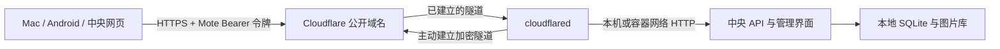

# Cloudflare Tunnel 部署

Cloudflare Tunnel 让中央节点主动连接 Cloudflare，再将公开 HTTPS 域名的请求转发到中央服务。适合家庭 Mac mini、NAS 或没有公网入站端口的服务器；中央 HTTP 端口仍保留在 loopback 或 Docker 内部网络。需要自己的 Cloudflare 账号、域名和远程管理的 Tunnel，见 [官方入门](https://developers.cloudflare.com/tunnel/get-started/)。

Mote 管理每个环境的 connector 配置、私有凭据文件与本地进程，不自动创建 Cloudflare 账号、DNS 或路由。Tunnel token 和 Mote 访问令牌是不同凭据：前者让 connector 连上 Cloudflare，后者授权客户端访问你的资料库。

## 路由结构



| 部署方式 | Cloudflare Published application route 的 Service URL |
|---|---|
| Docker Compose sidecar | `http://mote:47832` |
| 同一台 Mac / Linux 上的原生中央节点 | `http://127.0.0.1:<profile端口>`，prod 默认 47832 |

Docker sidecar 里的 `127.0.0.1` 指 cloudflared 自己，不能作为中央 origin。公开地址应为 `https://mote.example.com`，不带 `/api`、访问令牌或其它路径；Mote token 单独填入客户端。

## 1. 准备 Tunnel 与私有 token 文件

在 Cloudflare 控制台的 Tunnels 中创建远程管理的 Tunnel，添加一个公开应用路由，将自己的域名指向上表中的 Service URL。按照官方页面获取该 Tunnel 的 connector token。Mote 使用 `--token-file`，要求 cloudflared **2025.4.0 或更新版本**；此参数见 [官方运行参数](https://developers.cloudflare.com/tunnel/reference/run-parameters/)。

在部署机器的私有目录中，用编辑器把 token 单独保存为一行文件，例如 `/srv/mote/private/tunnel-token`，然后设置权限：

```sh
chmod 600 /srv/mote/private/tunnel-token
```

macOS 可用自己的用户目录替代 `/srv/mote`。不要把 token 粘贴进命令参数、截图、工单、Git 或公开 Compose 文件。CLI 要求源文件归当前部署用户所有、权限 0600，且不是符号链接；启用时复制到所选 profile 的 `secrets/cloudflared-token`。

## 2. Docker：与中央节点一起管理

需要在 Docker 所在机器运行 CLI。按 [中央部署指南](deployment.md#linux--nas-docker) 初始化环境、构建中央镜像；之后启用 Tunnel：

```sh
node scripts/mote.mjs tunnel --enable --profile prod --home /srv/mote/profiles \
  --token-file /srv/mote/private/tunnel-token \
  --public-url https://mote.example.com
node scripts/mote.mjs start --profile prod --home /srv/mote/profiles
node scripts/mote.mjs status --profile prod --home /srv/mote/profiles
node scripts/mote.mjs config --profile prod --home /srv/mote/profiles
```

`start` 先等待中央健康，再启动使用固定版本镜像的 cloudflared sidecar。每个 profile 有独立 Compose project、网络、token 文件和数据卷。sidecar 无宿主发布端口、无 Docker socket，凭据只挂载给 connector，中央容器不获得 Tunnel token。镜像首次使用需要拉取；后续镜像升级由项目显式调整固定版本。

Docker Desktop（Mac mini）和本机 Linux Docker Engine 均走此流程。远程 SSH/TCP Docker context 不会自动把本机 token 文件搬到另一台机器；应把整个部署放在 Docker 主机本地执行。文件 secret 使用与宿主文件匹配的用户身份；不支持的用户命名空间配置会明确报错，不通过放宽文件权限来绕过。

关闭此环境的 Tunnel：

```sh
node scripts/mote.mjs tunnel --disable --profile prod --home /srv/mote/profiles
```

Docker 禁用会停止并移除本 profile 的 cloudflared sidecar，包括残留容器；中央资料库、数据卷和私有 token 文件保留。启用/关闭入口配置后，重启中央使「服务端配置」页面中的部署声明与新配置一致。`stop` 停止该环境 Compose 服务；`start` 按当前启用状态恢复。不要同时为同一域名配置互相冲突的 Caddy 与 Tunnel 路由。

## 3. Mac mini / Linux：原生 connector

先按 [官方下载说明](https://developers.cloudflare.com/tunnel/downloads/) 安装适合本机架构的 cloudflared。确认绝对可执行文件路径，例如 Apple Silicon Homebrew 安装通常是 `/opt/homebrew/bin/cloudflared`，以本机实际安装为准。原生中央不需要改为监听所有网卡。

```sh
node scripts/mote.mjs tunnel --enable --profile prod \
  --home "$HOME/Library/Application Support/MoteCentral/profiles" \
  --binary /opt/homebrew/bin/cloudflared \
  --token-file /absolute/private/tunnel-token \
  --public-url https://mote.example.com
node scripts/mote.mjs start --profile prod \
  --home "$HOME/Library/Application Support/MoteCentral/profiles"
node scripts/mote.mjs tunnel-run --profile prod \
  --home "$HOME/Library/Application Support/MoteCentral/profiles"
```

`tunnel-run` 是前台 connector 监督入口，独立于中央进程；Ctrl-C 停止本次 connector。长期运行需要进程管理器接管该命令。运行器只向 cloudflared 提供必要环境变量，不继承中央模型 key 或 shell 中的 `TUNNEL_TOKEN`，并显式指定空配置文件，防止默认配置干扰所选环境。

macOS 可生成独立于中央服务的 LaunchAgent：

```sh
node scripts/mote.mjs tunnel-launchd --profile prod \
  --home "$HOME/Library/Application Support/MoteCentral/profiles"
```

命令返回 `generated` 与 `label`，只生成 plist，不安装。确认 Node 可执行路径、仓库和 profile 路径后，按 [launchd 安装步骤](deployment.md#生成与安装-launchd-配置) 对这个 plist 执行 `plutil -lint` 和 `launchctl bootstrap`。它是登录用户服务；Linux 可用用户自己的进程管理器监督同一个 `tunnel-run` 命令。由管理器接管前先停止手工运行的 connector。

`tunnel --disable` 会停止具有可验证进程标记的本环境原生 connector。重新启用后，手工环境需重开 `tunnel-run`；使用 LaunchAgent 时先 bootout 再 bootstrap 该 connector job。更新协议或 token 后同样检查并重启 connector；中央服务与 connector 的管理器各自独立。

只使用 Mote 的 `tunnel-run` 管理这一 connector，不要同时手工执行 cloudflared 或安装另一个管理同一 token 的系统服务。Mote 的本地禁用操作不等于在 Cloudflare 账号里撤销 token，也不能停止部署在其它机器上的 connector。

## 协议、配置与凭据更新

默认协议 `auto` 优先尝试 QUIC，UDP 不可用时回退 HTTP/2。网络限制 UDP 时可以显式选择 HTTP/2。Docker 示例：

```sh
node scripts/mote.mjs tunnel --enable --profile prod --home /srv/mote/profiles --protocol http2
node scripts/mote.mjs start --profile prod --home /srv/mote/profiles
```

原生环境同样使用 `tunnel --enable --protocol http2` 修改设置，然后重新运行 `tunnel-run` 或由该命令的进程管理器接管重启；中央 `start` 本身不启动原生 connector。

支持 `auto`、`http2`、`quic`。服务端需要能主动访问 Cloudflare 的连接端口 7844；QUIC 使用 UDP、HTTP/2 使用 TCP，参考 [官方配置](https://developers.cloudflare.com/tunnel/configuration/)。Tunnel 不解决部署机器本身无法访问 Cloudflare 网络的问题。

轮换 token 时，先在 Cloudflare 更新凭据，再把新 token 保存到新的私有文件，用同样的 `tunnel --enable --token-file <新文件>` 命令应用并重启 connector。Docker 会移除旧 connector，使其重新打开新凭据文件；不能仅覆盖一个被旧容器持续挂载的文件就认为轮换完成。Cloudflare 已有连接的失效行为见 [官方 token 轮换说明](https://developers.cloudflare.com/tunnel/reference/tunnel-tokens/)。

部署配置文件与元数据的完整来源、存储位置、日志及模型设置见 [服务端配置参考](server-configuration.md)。`MOTE_PUBLIC_URL` 只是客户端入口的声明，修改它不会替你更改 Cloudflare 路由。

## 排错与入口限制

按下面顺序检查，避免将「进程启动了」误认为整个链路已经可用：

1. 本机 `status` 的中央健康检查成功，确认正确 profile 和端口。
2. Cloudflare 控制台显示 connector 已连接，再核对公开路由的 Service URL。connector Healthy 也不能证明 origin 可用，见 [官方可观测性说明](https://developers.cloudflare.com/tunnel/observability/)。
3. 浏览器打开公开域名并使用 Mote token 登录，检查「服务端配置」与资料库。
4. Mac / Android 使用同一个 HTTPS URL 和 Mote token，发送一条测试笔记，确认时间线出现该笔记。

| 现象 | 定位方式 |
|---|---|
| 本机中央健康失败 | 先处理配置、端口、数据目录权限，不用重建 Tunnel |
| connector 未连接 | 检查 token 文件、cloudflared 版本、网络与 7844；必要时选 http2 |
| 公网 502 | 核对 origin 协议、主机和端口，Docker 应使用 `http://mote:47832` |
| 公网 401 | 检查客户端 Mote token；这不是 Tunnel token |
| 被重定向到 Cloudflare Access 登录页 | 交互式 Access 策略会拦住机器客户端；当前采集器没有 Access service-token 配置，须使用与客户端兼容的入口策略 |
| AI 查询 524 | 代理先结束等待；检查中央诊断中该请求是否完成，缩短单次范围或调整模型输出/推理配置 |
| 归档导入 413 | 入口或中央请求体限制；大型归档走离线备份/恢复 |

Cloudflare 当前默认代理读取超时为 125 秒，接近较长 Agent 请求的运行时间；服务本身可用也可能出现 524。入口上传大小还受套餐与配置限制，例如 Free/Pro 的 100 MB；提高 `MOTE_MAX_EXPORT_MB` 不能突破代理限制。详见 [连接限制](https://developers.cloudflare.com/fundamentals/reference/connection-limits/) 与 [413 说明](https://developers.cloudflare.com/support/troubleshooting/http-status-codes/4xx-client-error/error-413/)。

Mote API 返回 `Cache-Control: no-store`。不要给私人 `/api/*` 配置强制缓存规则。Cloudflare 在 HTTPS 入口终止 TLS，因此接入该服务也意味着流量经由它处理；这不是绕开第三方的端到端加密连接。

cloudflared 不跟随 Mote 的 debug 开关；其 debug 可能记录包括凭据在内的请求 headers。集成运行器抑制原始 connector 输出，Docker connector 不持久化原始 stdout；使用进程状态、Cloudflare 控制台与中央安全诊断定位。Mote 的状态输出将隧道连接标记为 `not-checked`，进程存在不代表公网可达。不要将 `docker inspect` / `compose config` 的完整输出公开分享，因为中央容器的其它环境凭据仍可能出现在其中。

## 验证边界

自动化使用合成 token 和临时 profile，测试参数、文件权限、环境隔离、配置脱敏、启停及失败恢复。Docker connector 镜像与 Compose 生命周期在 Linux CI 验证；测试不能替代真实 Cloudflare 账号、域名路由与所在网络的连通性验收。没有配置用户 Tunnel 凭据时，项目不会声称已经建立公网连接。

本轮实际执行的测试、官方二进制校验和 Linux CI 结果见 [0.3.1 验证记录](tunnel-validation.md)。
