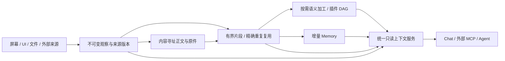

# 通用上下文架构 · 0.0.54

Mote 的核心是个人上下文采集与中央归档：接受多种来源，保存可核验的原始证据，按需加工，再向 Agent 提供有界、只读的上下文。截图、UI 正文、文件、随手记、日历与编码记录都是来源；应用名称、窗口和时间仅作明确的组织边界，不用于猜测意图、任务或重要性。

## 数据与处理链路

| 对象 | 保存内容 | 失效与删除 |
| --- | --- | --- |
| 观察 `context_observations` | 原始记录 ID、明确来源、观察时间、分组与正文引用 | 每次观察独立存在；重复不抹去时间 |
| 内容 `context_contents` / 既有 blob 卷 | SHA-256 寻址的正文或二进制 | 仅无任何观察、产物引用时回收 |
| 产物 `context_artifacts` | 类型、成员、代表原文、时间范围、处理器与版本、配置指纹、修订、生成时间 | 输入变化、删除、来源被替代会清除相关产物 |
| 持久工作流 | DAG 步骤、输入版本、依赖、租约、尝试次数、结果引用 | 校验输入及提交凭据后原子提交 |
| 记忆 | 现有分层 Memory、原文引句与证据指纹 | 继续使用现有精确证据校验和失效机制 |

`CaptureRecord` 目前仍作为采集协议和检索投影；原始 JSON 保留正文，内容对象是新的通用加工层。本版没有宣称正文物理存储已完全去重，也没有强行改成分布式存储。逻辑配额与 SQLite 索引、WAL、磁盘占用分别统计。

屏幕和 UI 观察按设备、来源、应用、窗口、显式 sourceId 和固定五分钟桶组织。每个片段最多 100 个观察、12,000 个 UTF-16 字符，准确相同的文字保留一次，并保留全部成员和时间。不同数字、修改和不同原文不会被近似去重抹除。长原文保留并标记片段不完整，查询回到原始证据继续读取。此处是确定性去重，不把窗口桶称为人的语义任务；语义解释由模型完成。

同桶超过 1,000 条的异常回放标记 `group_member_limit`，不反复占用加工线程；原文检索继续可用，`blockedGroups` 明确报告。原始组成员改变后重新评估。新到成员会立即使该组及其下游旧产物失效。乱序到达重新按观察时间组织。

## 批量写入、传输和 OCR

- 来源批量 upsert 最多 500 条、32 MiB，图片解码等准备在事务前完成；来源版本、当前头和观察在同一个事务内提交。冲突、撤销、暂停或容量不足不返回成功确认。单来源写入串行，避免同一版本竞争。
- 采集端的最多 100 条 batch / bundle 保留逐条确认语义：外层事务配合成员 savepoint，合法项成功，冲突项单独返回错误。重试仍使用原 ID，删除墓碑防止旧队列复活资料。
- 新安装默认打包同步，100 条或 1 分钟满足一项即发送；桌面每包目标 4 MiB，单条合法大记录仍可独立发送。Android 沿用现有有界打包通道。已有用户明确保存的同步设置保留。采样频率不被此次升级强制修改。
- OCR 按图像内容、处理器版本与提供方修订复用结果；同一批并发遇到同图只执行一次。OCR 和显式图像语义分别准入；慢语义请求不会挡住后来 OCR。图像语义缓存包含观察上下文，不能把相同图片在不同时间的语义无条件复用。
- 只有有效文本变化才重新建立索引、使 embedding 和 Memory 失效；同一 OCR 的重复元数据提交不触发整条链重跑。

## 插件与可靠工作流

Cordis 管注册和生命周期。部署模块可通过 `ctx.moteContextProcessors.register()` 注册 `id`、`version`、`lane` 和 `process()`；返回的注销函数应通过插件生命周期清理。宿主管输入版本、事务、预算、重试和取消。既有文件处理器继续运行，通过同一模块入口注册新上下文处理器；没有假装所有历史队列都已迁到新表。

新契约支持多输入、多产物、显式产物修订依赖和 DAG；工作流最多 32 步，每步含祖先在内最多 100 条原文。处理器收到证据、上游产物、配置和 AbortSignal，不获得查询 Agent 的写权限。安装的服务端插件本身仍属于可信代码，Cordis 不是恶意插件沙箱。

四类队列 `extract / aggregate / semantic / memory` 独立并发和每日调用、输入字符预算。默认 semantic / memory 各 100 次、1,200,000 字符/UTC 日，extract / aggregate 各 10,000 次、120,000,000 字符；可设调用数为 0 暂停准入。预算在调用前预留，失败不退还；超出当天预算推迟到下一 UTC 日，单项超过全天字符预算则显式阻塞。字符不是 token，最终模型使用量单独记账。旧文件与 Memory 生命周期使用各自已有的准入设置，不能把新队列预算误当成全站统一花费上限。

每次执行最多 120 秒，租约 130 秒，瞬时错误指数退避，最多 4 次。永久失败不自动重试；处理器或版本缺失阻塞。重启恢复过期租约，取消/超时/删除/版本变化均不能让晚到结果重新写入。多个产物与成功状态同事务提交。外部调用是至少一次语义，崩溃后的重试可能重复收费；提交去重不等于远端只调用一次。

所有者 API：

| API | 用途 |
| --- | --- |
| `GET /api/processing` | 队列、处理器、配额、用量与归档覆盖 |
| `PUT /api/processing/settings` | 提交完整四队列策略 |
| `POST /api/processing/workflows` | `{steps:[{name,processor,inputs,dependsOn,artifactInputs,config}]}` |
| `POST /api/processing/:id/retry` / `cancel` | 显式重试与取消 |
| `GET /api/context/segments` | 卡片或按 `id` 展开；支持范围、分页和字符预算 |
| `GET /api/sources/:id/catalog` | 目录统计，或按 `parent` 分页列出文件 |

内置 `mote.segment-understanding` 接受完整当前片段：`config.artifactId`、该片段所有成员 `inputs`。宿主加入模型配置修订及产物修订，模型使用 Memory 模块所选配置、只读原文和明确引用；没有配置模型不会秘密改用其他服务。本轮真实验证仅使用本地 Codex App Server 的 `gpt-5.6-luna`。

语义加工保持按需调度，避免无条件对每次观察收费。日常 Memory 则消费就绪片段的代表原文，保留精确引句；替代原始变更流后，迁移一次性重置旧流游标，已有记忆保留。模型配置、Memory 周期与最小增量仍由用户控制。

## NAS 与分层检索

完整归档、仅文本索引、外部引用三个策略沿用既有来源契约。新增持久目录投影，从 URI 的字面路径建目录统计，分页稳定、同名文件不遗漏，并报告 catalog/full/lightweight 等覆盖。目录发现不读正文、不调用模型，也不打开 URI。

桌面扫描保存可恢复检查点，批内仅记录变化项用于回滚，避免每 256 个文件复制整个十万条目录。目录列表在一轮内复用，新轮次重新枚举。元数据未变就不重新读正文，watcher 路径可优先处理；完整兜底 reconciliation 仍为 O(N)，NAS 网络延迟和权限会影响耗时。`reference` 不代表已实现任意远端 MCP 的持续挂载和自动按需回源。目录模型摘要、页面结构差分、跨应用语义任务聚类和更多动作插件留在现有扩展契约上，不在本版自动开启。

Agent 按相关 Memory → 片段卡片 → 原始证据展开；最近材料或精确检索允许直接回原文。Chat 和 MCP 复用 `EvidenceArchive`，MCP 新增 `mote_segments`、`mote_file_catalog`。片段卡片默认 400 字正文、三个代表引用，总预算 12,000 字符；展开默认 24,000 字符预算。范围只允许披露完整落在授权范围内的片段。发现成员 ID 不赋予原文引用权限，必须真实读取 evidence。

向量候选限最近 4,096 条符合条件的已嵌入记录，返回扫描范围与部分覆盖；词法全文检索继续提供全库回退。这是 MVP 对 CPU/内存的可预测限制，不能承诺旧资料向量召回率。未来可在同一查询服务下接 ANN 后端。

## 性能与升级边界

配额从逐次全库 SUM 改为事务性增量账本，已知归档表按 schema 变化纳入；回滚同步回滚字节计数。FTS 按 SQLite rowid 更新/删除，避免单条更新扫描倒排索引。详细规模、质量探针、异常矩阵与估算见 [验证报告](context-architecture-validation.md)。

先备份并升级中央，再升级客户端。数据库启动建立新投影、FTS rowid 和待加工组；已有大库的首次构建可能较慢，原始资料不删除。MVP 不保证旧二进制直接读取新数据库，回退使用升级前备份。查询 Agent 保持只读，外部动作继续走独立授权和现有日历执行通道。
