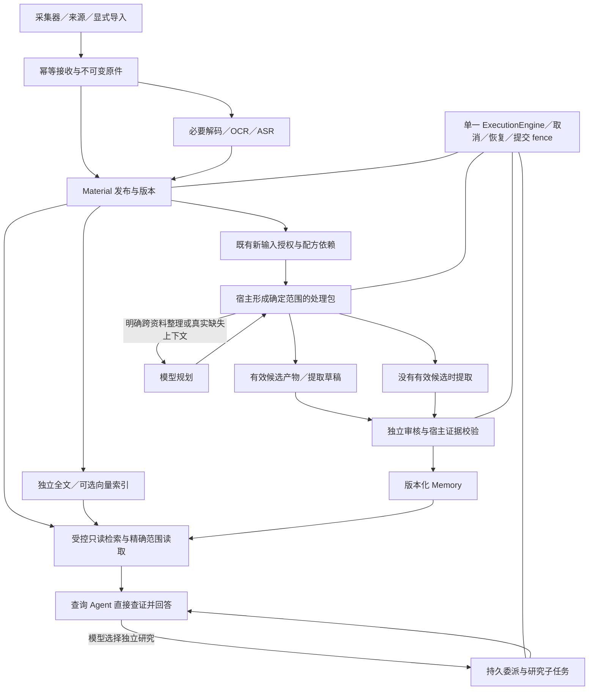

# Mote 系统改造技术方案（已确认）

日期：2026-10-10。状态：**方案已确认，进入实现与验证**。所有者已授权按模块启动 `gpt-6.1-sol / high` subagent，使用本地 Codex server 做真实链路回归并发布。D1-A、D2-C、D3-A、D4-B、D5-B是本轮实施范围。

依据：聊天 [Review Mote architecture and latency](codex://threads/01a12118-b81c-7e80-9399-b2893ec7bc8b) 的完整审查建议，以及本工作树 `8de27162` 的架构、ADR、代码和测试。当前 Central/server/web 与 macOS 为 0.0.84，Android 为 0.0.82；Central epoch 4、客户端格式 3、wire 1、Ingress 2、便携归档 2 各自独立。

本文件保存批准时的设计，不把拟议收益当作实测。实现与验证使用独立生成资料库，不读取或升级本机私人资料库，不采集个人截图。决定见 [ADR](../adr-system-refactor.md)，实际验证另行记录。

## 1. 目标和范围

本次保留个人归档的可靠底座，系统改造模型工作的入口、证据读取、产物复用、失败恢复和调度：

1. 一份资料尽快成为可读、可检索的资料；Memory 不成为问答前置条件。
2. 问答以直接查证并回答为正常路径。模型仍能自主委派复杂研究，宿主不按关键词、主题或问题长度判断意图。
3. 普通增量 Memory 不必先做模型规划；已有效的理解产物和提取草稿可以复用，独立审核保留。
4. 用真实产品入口证明完整性、恢复、质量和速度，最后按实际受影响组件发布。

验收顺序保持功能正确与完整 → 性能 → 成本。减少调用不能通过跳过资料、静默截断、降低默认模型推理设置、取消审核或扩大权限实现。新输入持续处理、选中配方、隐私、历史付费授权、取消及显式失败恢复保留现有语义。

不在本轮引入微服务、第二套任务引擎、第二套事实库、语义路由器、插件市场、自动历史全量重做或强制用户选择“快/慢模式”。这些方向没有当前瓶颈证据，也会增加用户和运维成本。

## 2. 原 Proposal 的证据与本轮解释

| 原审查发现 | 可以得出的结论 | 不能据此声称 |
| --- | --- | --- |
| 历史节点有 1,714 份文件、约 2,079 万正文字符 | 历史全量沉淀并非小任务，需看吞吐和增量成本 | 当前节点仍是同样状态；普通问答应承担全量成本 |
| 一次查询 625 秒，5 次 Agent 运行，进入 Agent 前约等 1–2 秒 | 该次主要时间在执行链，需减少必要往返和委派开销 | 共享调度池就是该次延迟的主因；所有委派都比直接查询差 |
| 历史 personal Memory 单 Agent 中位 46.6 秒、P95 93.1 秒 | 规划/提取/审核的串行成本会被批次数放大 | Coding 重复理解造成此次 personal 积压 |
| 当前最小查询固定包装约 48,179 UTF-16 字符、26 个工具 | 固定上下文和工具导航需要收敛 | 字符数就是 token 数；仅压缩 prompt 已证明提速 |
| 后置覆盖校验失败可能清除提取草稿；Coding 候选复用排除 workPackage | 有明确的调用与重做收敛空间 | 删除完整覆盖要求或跳过独立审核是必要方案 |

这些耗时来自旧部署 `b8665cc`/epoch 3 的留存数据。本方案评估的是当前代码，不把历史性能当作新版本基线。原聊天也没有完成新的 fixture、真机或真实模型验证。

## 3. 目标架构与责任

模块边界并不对应模型调用边界。MaterialStore 拥有正式资料和修订；EvidenceReader/ArchiveReader 拥有授权读取；ExecutionEngine 拥有工作状态和提交栅栏；模型解释语义；MemoryPipeline 与独立审核拥有记忆生成过程；查询运行时拥有回答。公共内核不因某个策略不收录而屏蔽原件或其他策略。

## 4. 需要所有者确认的选型

### D1：问答路径

| 选项 | 优点 | 代价与例子 |
| --- | --- | --- |
| **A. 同一问答入口，默认直接查证，模型按需要委派（方向已确认）** | 用户不增加步骤；普通查询可少一次规划及协调恢复；复杂研究能力保留 | 依赖 prompt、工具和实际质量对照。“上周我决定怎样重试同步？”可直接检索和读原文；“结合六周日志解释方案演进”可由模型拆独立证据问题 |
| B. 用户显式选择“快速问答／深度研究” | 耗时预期明确，研究模式可以有独立行为 | 用户必须预判难度；“简单”问题也可能涉及互相矛盾的历史，模式容易牺牲完整性。引入新默认、切换和历史展示政策，需另做旅程设计 |
| C. 保持协调者经常规划与委派 | 独立研究容易表达，持久并行能力充分 | 普通问题也支付多段启动、上下文重装和读取成本；原 625 秒案例表明这个空间很大，但并非因果 A/B 证据 |

A 不等于禁止委派、硬限制一个 Agent、减少答案范围或使用小模型。直接回答和委派都继续进入同一 durable query journal，不恢复已经删除的 closure fallback。委派判断是模型行为；宿主只执行权限、可执行性、资源和已有边界校验。

### D2：自动 Memory 的输入组织

| 选项 | 优点 | 代价与例子 |
| --- | --- | --- |
| A. 所有输入都经模型规划（现状） | 可做语义关联和跨资料分组 | 单份就绪日记也先规划；规划失败会延迟所有交付 |
| B. 每份已授权、就绪资料直接提取与审核 | 最清楚地去掉必经 planner；身份、取消、故障隔离简单 | 多份很短笔记仍各付固定调用成本；需要上下文时必须正确报告 needs_context |
| **C. 确定范围直接处理，兼容短输入做结构批处理；跨资料语义整理才规划（建议目标）** | 保留全部输入且摊薄固定成本；单份无额外等待；语义规划用于有实际职责的工作 | 要验证逐成员覆盖、评估时间和局部失败，不能把“装进同一批”当作“属于同一主题” |

**本轮目标是“资料逐份可靠归档，模型按有界批处理”，不是“一条记录一次提取、一次审核”。大导入合批属于本次发布必要范围，不是上线单份模式后再无限期延后的优化。**先实现B的完整直接合同，再在同轮实现C，是工程依赖顺序。直接入口也采用完整package/coverage合同，空候选仍独立审核，不退回旧non-package路径的空结果shortcut。批处理只利用已经到达、已获授权且就绪的输入，依据配方/提取版本、模型配置、许可范围、现有输入预算及来源公平性装箱；不为了凑批增加新的等待窗口，不按关键词或文长推断语义难度。

每个成员保留 sourceId、inputKey、scope、Material pin、输入 fingerprint、contextTime 和 attributionContext。现有 workPackage inputs 与 coverage member 已有逐成员 contextTime，但 `acceptPackages` 当前取成员最大时刻作为全局 job 语境，**字段存在不能证明解释正确**。需要升级提取、审核、candidate语境及cache身份合同，明确每成员采用自己的语境；不能为了共享缓存把两个接收时刻合成一个。跨成员结论必须保留每个支持来源与时间；需要共同评估时刻的联合整理应拥有明确任务合同，不能用运输批次时间替代。每个目标范围独立核算。

例如五篇500字、同配方、已就绪的笔记可以共用一次提取及独立审核；模型仍逐篇判断有没有价值。一篇访谈与本人日记不能因同批而共享作者身份；容量不足必须报告saturation并拆分未提交batch，所有target都须被后续子批完整覆盖，不吞掉后面的候选。checked行若尚未commit也不是完成；仅已成功提交的siblings保持完成。多份长文、不同策略或不同授权可以各自处理，并不强求合批。

显式历史重做、原先接受的计划、真实 needs_context 反馈规划仍拥有独立入口和授权。改默认调度不补发收据，不偷偷为历史未授权输入启动模型。

#### 大导入的实际入口与批处理方案

当前生产导入由`imports.ts`逐record调用`SourceStore.upsert`，接收事务保存各原件的自动recipe授权；organizer发布就绪Material后进入公共队列。`app.ts`的`onImported`返回空对象，**不存在导入完成后自动创建的一个聚合Memory job**。现自动planner已能形成多成员包，所以不能把现版本简单描述成1000条必然2000次模型调用。

建议继续用公共队列，不在导入结束再额外创建第二份手工作业：

1. 原件及各记录先幂等入库，用户仍可看已发布部分。
2. 已授权、就绪输入滚动进入结构装箱；导入尚未结束也可处理已发布部分，不等全量才规划。
3. 装箱保留现有成员/范围预算，依据实际输入与审核上下文容量同时控制包大小。当前自动package上限8成员、普通多成员总原文12000字符，pipeline每batch最多20chunks；这些是当前边界，不是承诺每批必然放满或本轮擅自放大上限。
4. 同一批完整提取、独立审核、原子提交，随后继续下一批；不同批按现Memory并发运行，不只提高并发挤占机器。
5. 长源按精确范围分页；饱和/未提交覆盖不完整在有限阶段修复后拆分，所有未提交target仍需覆盖。真正needs_context才做授权范围内模型规划。
6. 已有合格理解候选或有效草稿直接复用。多recipe只有generation identity完全相同时共享提取，审核仍各自独立；同一文字不自动等于同一生成任务。
7. 导入详情聚合本次记录/逐receipt授权的处理状态，区分已归档、目标范围完成、仍待产物、审核失败和模型等待。现文本导入用缺失memoryJobId显示“尚未安排”不能作为实际自动队列状态，需修正投影，不要求用户另点一次“生成Memory”。

假设1000条各500字符、同一提取配置、全部ready、逐成员合同已验收、每条约一个候选且无失败/饱和，沿8成员上限可约125包，单recipe为125次提取＋125次审核，约250个Agent阶段运行；朴素逐条设计是2000个阶段运行。它只是摊薄固定开销的算例：当前规划本来也能合批，不能把250/2000宣称为新旧实测，更不能承诺8倍时间或token收益，provider内部请求数也不等于这些阶段数。审核仍需完整原文及草稿，原文总阅读量不会同比下降。

导入日期不代替资料的recordedAt/occurredAt，receipt contextTime也不证明事件发生时间。当前显式手工作业有自己的共同评估时刻合同，但自动导入不能据此抹平各receipt语境。本轮跨receipt合批需先通过相对时间、混合归属、修订与删除的配对验证。

### D3：长期 Memory 的审核

| 选项 | 优点 | 代价与例子 |
| --- | --- | --- |
| **A. 保留独立审核，优化候选复用与审核失败恢复（已确认）** | 防止“访谈者喜欢跑步”被记成用户偏好；符合现有承诺与质量测试 | 提取加审核仍至少两个模型阶段；性能须来自减少重复生成和规划 |
| B. 一次模型同时提取并自审 | 调用少 | 同一次生成的归属误解容易自我确认；改变当前长期记忆质量边界 |
| C. 模型评估风险后仅部分独立审核 | 有机会兼顾调用和质量 | 增加风险分类、漏审与新默认政策；不能由宿主关键词判定“低风险”，还需要新的质量证据 |

独立审核是新的只读模型执行，可以使用同一模型，但不沿用提取执行的推理会话。审核收到原文、逐成员语境/归属/覆盖目标和不可信候选草稿，重新判断支持关系、价值和遗漏。它可以删改错误候选，也可在当前授权原文范围内补回遗漏候选；空候选也需检查，不能只审“已经提出来的几张卡”。宿主精确引句、版本、覆盖校验不能代替这一步：访谈里的“我喜欢跑步”即使引句完全正确，也可能被错误记成所有者偏好。

旧链路已有独立审核，变化在于普通增量不先规划、合格理解候选不重复提取、审核格式/引句/coverage失败不再丢弃有效提取草稿。当前review超时已能复用draft，新改造是在此基础上补齐结构失败的阶段恢复；不是宣称所有旧审核失败都会重提。

收益是保留纠错与漏召回检查，同时减少与质量无关的重复生成。风险是审核仍增加一次原文＋草稿阅读，相同模型可能共享误判，reviewer自身也会误删/漏补；它不保证客观事实为真或语义召回完整。用固定rubric、精确引用、第三方/主观体验/空候选/纠正场景验证，而不是增加审核次数就宣布质量通过。暂不更换默认模型和reasoning，也不额外增加一层review。

### D4：前后台资源调度

| 选项 | 优点 | 代价与例子 |
| --- | --- | --- |
| A. 一个池仅提高查询优先级 | 改动少、资源利用率高 | 已运行的长 Memory 请求不能让出槽；新查询仍可能排在运行请求之后 |
| **B. 分清交互／后台的准入，保留交互容量，加入后台公平性（方向已确认）** | 从 coordinator/worker 到 Agent/model gate 一致，后台积压时仍能发起查询 | 需控制总资源和 provider 限流；受限 provider 并发为 1 时，非抢占方案不能保证立即执行 |
| C. 抢占后台模型请求 | 能更快释放资源 | 取消可能已收费，重启模型更昂贵；没有可靠 checkpoint 的请求可能重做 |
| D. 拆进程／独立服务与数据库 | 故障隔离强 | 运维、备份、授权和部署复杂；仍会受同一模型服务容量限制 |

B 的 lane 来自宿主任务能力/已授权业务入口，不能允许模型或捕获内容自己声明 interactive。等待子任务时释放模型槽，父子不重复占用活跃模型容量。不声称它解释了原 625 秒查询；它解决的是后台满载下的延迟风险。

**确认方向的容量解释**：当前设置显示后台Agent=8、后台Harness=4、交互=2、Memory=3，但上游delegated池取后台Agent的8。建议保留现标签含义，在单执行器内隔离后台8＋交互2，因此委派步骤峰值可达10；Agent/Harness分别服从自己的现有gate，模型会话容量按现配置后台4＋交互2。另一选项是保持委派总量8，明确改成后台6＋交互2，代价是改变现设置含义与后台吞吐。

建议同时确认非默认配置公式：委派后台有效容量`B=min(agentConcurrency,32)`，交互容量`I=interactiveConcurrency`（现支持1..8），委派总容量`T=B+I`。默认为8＋2=10；后台32或64、交互8时为32＋8=40。这明确把旧pool的32上限作为后台lane上限，增加独立交互容量，是需要接受的容量变化，不能只批准默认10却暗自放开高配置。UI显示configured/effective/total；降低配置不打断已有active，按现规则等其完成后限流。

另一种保持总量8（高配置时总上限32）的方案必须明确重新分配后台份额、相应设置含义和吞吐，不能将这种削减称作保持后台8。所有lane来自可信work入口/profile，child继承父lane并受宿主允许能力限制；不能按capability名称把未来背景研究强行标成交互。

无后台饥饿是验收条件。第一轮不借用交互预留位、不抢占已发模型请求；否则长后台任务借位会破坏查询及时准入。当前ProviderAdmission只维护cooldown/Retry-After，**没有host provider全局并发semaphore**；后台4＋交互2是Harness会话容量，不包括独立embedding和本地OCR/ASR。保持现provider返回的限流/冷却约束，不在本轮暗加全局provider cap。

旧链路是`问答/后台→共用delegated8→各自Agent gate→各自Harness gate→provider`，新链路是`问答→交互执行名额2→交互Agent2→交互Harness2`及`后台→后台执行名额8→后台Agent8→后台Harness4`。如果8个长后台片段正在执行，旧链问答进不了后面的专用名额；新链可以进入交互名额，仍用同一任务库/执行器/取消恢复。父等待子任务时释放名额，保留位供实际活跃工作使用。

收益是后台积压不会先挤掉本地问答准入，持续提问也不吃掉后台配额。代价是隔离位闲置、峰值会话/CPU/内存增加以及共享provider限流仍可能让问答等待。它不直接减少某次问答内部5个Agent的串行耗时，也不保证provider立即响应；因此与D1/D5配套，并用满载查询排队、后台吞吐、内存、限流和关停恢复共同验收。

### D5：工具说明与扩展架构

| 选项 | 优点 | 代价与例子 |
| --- | --- | --- |
| A. 精简现有全部原生工具schema | 风险较低，模型仍看到明确参数类型，适合独立基线对照 | 普通文本查询仍带媒体/日历等所有schema；工具数量随插件增长 |
| **B. 少量原生核心/必要模态工具＋两层只读能力目录（细化后的建议目标）** | 普通查找/读取保留原生类型约束；普通特殊能力按需要披露，扩展不撑大每次固定输入 | 多一次能力发现可能抵销节省；通用执行参数由宿主严格校验，须验证模型错误率。图片等特殊模态保持专门适配 |
| C. 发现后动态挂载原生工具 | 保留原生类型约束并缩小初始输入 | 当前两个runtime能否在同片段改toolset、是否影响缓存仍未知；若为挂工具重启片段可能更慢 |

B的能力来自可信host manifest，入口固定capabilityId/version/args，只能执行已注册、当前授权的只读能力。delegation控制通道单独保留；不得动态加载归档中的工具、shell或任意代码。安全核心始终存在，不能藏在尚未读取的能力说明中。先以A作对照，再验证B的完整旅程与总往返；若B不通过质量/性能门槛，回到已明确的A方案并报告，不能以初始字符减少宣布成功。C本轮不作为必需依赖。

旧链每个开放查询先收到完整工具表与说明，再自行在context_index/material_catalog/material_read/search_context/evidence等入口中导航；读取派生页后还可能再取原文。新链建议保留短而typed的search/read核心及必要控制，read按M3合同同时交付可引用原文；只有媒体统计等特殊需求才查能力目录并严格执行。普通笔记查证直接search→read→answer，无需先查菜单；媒体时长问题才discover media_activity→执行→查证。

图片不是普通JSON能力：当前Harness/Codex依read_image工具名处理图像模态、交付收据和日志脱敏。第一轮保留原生read_image及当前授权流程；不能把base64透过通用executor返回并当普通文本。普通JSON能力可以复用固定宿主validator；动态原生toolset挂载不是本轮前提。

收益分别来自少发无关说明、减少工具选择歧义、同次交付原文；风险包括菜单额外往返、通用args模型端约束减少、能力选择错误，以及不当适配造成图片/引用回归。分别比较短原生工具、合并证据、目录能力的总耗时/参数错误/质量，不把初始字符降低当已提速。两层目录仍由模型选能力，代码不根据问题关键词决定走哪个工具。

### 执行阶段的实现幅度

建议先在现有Memory batch内使用清晰的generation/review/repair合同和持久draft恢复，保持batch原子提交；与之相比，把每个阶段变成独立durable executor step的DAG，能做更细single-flight和调度，但会增加父子等待、lease/取消、共享消费者、升级及状态投影责任。首轮不同时重写这套生命周期。如果现batch无法实现某项已接受能力，再提交具体DAG/持久契约差异，而不是因为“大的改造”就增加步骤。部分范围提前发布也会改变用户可见性和原子性，本轮沿用已完成batch的现行行为。

### 工程选型建议，无需逐项产品确认

- 继续 Node 24/Fastify、npm workspaces、Cordis 模块生命周期、SQLite/FTS 和内容寻址对象存储。SQLite 适合本地单所有者、受控写并发；若未来出现多服务器并发写入等需求，再单独设计数据库迁移。[SQLite 官方适用场景](https://www.sqlite.org/whentouse.html)
- 优先减少串行步骤和工具往返，prompt 压缩作为配套。通用延迟原则支持这个顺序，但 Mote 的收益仍需自己的对照验证。[OpenAI 延迟优化指南](https://developers.openai.com/api/docs/guides/latency-optimization)
- 保留 Codex/Harness 两种现有适配。复用授权工具桥、配置快照和 usage；运行时预热、模型分工在流程对照后单独评估。
- 尽量复用当前 schema、JSON 记录、draft store 和 checkpoint 语义。若设计最终需要不兼容的持久契约，另列决策并确认 epoch；当前方案不预设 epoch 5 或再次重置资料。

预算口径继续分开：原审查固定输入48,179 UTF-16字符、普通查询每fragment的48,000工具结果字符预算、180,000初始输入宿主字符上限、adapter目前声明的128,000 token窗口是四件事。本轮保持当前预算scope；Workspace的累计计量不产生新的run-total阻断。动态容量、tokenizer或整run硬限额若要改变读取/完整性，要单独决定，不能视作prompt精简附赠。

## 5. 各模块详细变动

### M1. 来源接入、采集器、原件与存储

涉及 `ingress.ts`、`sources.ts`、`source-pipelines.ts`、`material-organizers.ts`、客户端队列及 `packages/shared` 接收契约。

保留稳定身份、版本、原始时间角色、幂等确认和原件保存。增加/统一接收、发布、首次可读、首次可检索的时间观测，复用固定事件与数值诊断；不能把 raw receipt 改成“Memory 已完成”。启动时先完成 handler、trigger、能力安装，再允许新输入进入。

不改采样频率、端侧隐私过滤、上传策略、OCR 触发权限或来源归属默认。客户端传输协议不因后端模型流程收敛而升级。通过实际来源入口验证断线重复接收不会产生新的自动模型授权。

### M2. Material、解析与索引

涉及 `materials.ts`、`material-readiness.ts`、`material-index.ts`、`processing-runtime.ts`、文件/图像/音频处理器。

将“已归档／正文可读／索引就绪／各配方依赖就绪／Memory 已完成”作为已有事实的独立投影。保持索引失败时目录和按引用读取可用、迟到旧索引不能恢复访问、partial Material 可读取已完成部分。

保留配方声明的 named outputs；本轮不把原先需要 image-understanding 的自动 Memory 静默改成只等 OCR，也不让扫描件、Shadow 或未解析附件假装拥有正文。OCR、ASR、分离和解析实现复用；性能改造首先处理依赖、重复工作和生命周期。

### M3. EvidenceReader、工具和可引用披露

涉及 `evidence-reader.ts`、`evidence-exposure.ts`、各 raw reader、`packages/agent/src/context-tools.ts`、`bridge.ts`、`evidence-ledger.ts`、`citations.ts`。

目标是在一次必要读取中返回正文、可靠元数据、精确范围和已有可引用能力。`material_read` 对能证明原始锚点映射且原文确实送达的部分，可直接登记 ledger，减少随后重复 `evidence` 读取。摘要、改写、视觉理解不能仅因拥有 ancestry 就获得原文引文许可；映射不足时保留按需读取。

必须分开三种信息：模型看到的正文与 locator、ledger 记录的本轮已读引用范围、宿主私有依赖收据。私有 lineage receipt 只负责删除/更正失效，不能变成权限或 citation token。所附原文计入现有披露预算，保留分页和未读范围；不得自动展开整份原件或隐藏成员。

按D5收敛工具职责和重复schema描述：保留短核心查找/读取，特殊只读能力通过可信目录披露；底层复用原reader和严格typed validator。明确区分查找、读取、展开历史、采样计时等职责，不破坏外部MCP的既有契约。

建议内部返回合同（命名为提案，不声称已实现）：`resource{ref,revision,kind}`、`body{text,range,fidelity}`、`sourceEvidence[]{id,revisionOrFingerprint,contentLayer,text,deliveredRange,provenance}`、`coverage{bodyPartial,evidencePartial,unverifiedRefs,reasons}`和`next`。只有实际序列化成功、预算准入、Reader当前授权的sourceEvidence进入ledger；身份包含layer，同一ID的模型解释层不能被登记成原文，明确排除`L2_model_interpretation`。provenance保留正式Coding锚点与OCR/转写的现合法身份，不暴露私有原始事件。body与原文不同偏移必须各自标记。

### M4. Agent prompt、Skills 与查询运行时

涉及 `instructions.ts`、`host-controls.ts`、`task-context.ts`、运行时Skills、`delegated-query-runs.ts`、`delegation-runtime.ts`、`app.ts`的prepareDelegatedQuery/commit接线和对话API。

删除“每次先发现委派能力、提交工作单元”的常规暗示，明确可以直接检索并完成。跨多个独立证据缺口有收益时，模型提交有范围、输入身份、交付目标的研究任务。proposal 与 executable child 的生命周期继续分开，不能重新引入 submit 后无条件 yield。

固定安全与授权规则只保留一份；来源类型说明按能力/工具结果渐进披露。完整任务契约只走taskContext，不重复塞进question。当前prepared已经缓存，主要问题是恢复仍重复发送静态输入、研究状态只带handles，并非每次重做prepare。

用现私有journal承接不可变`QuerySnapshot`与可恢复`QueryWorkspace`：Snapshot固定request、scope、contextTime/timeZone、模型/能力身份和history版本；Workspace保存未解问题、已支持要点、检索范围、游标、已读locator、worker身份和恢复原因。模型写的结论/摘要仍是不可信解释，宿主只校验结构与身份。yield前将工作区与wait原子协调，resume只装配需要的状态与证据。

**恢复的locator或历史ledger不是新片段的引用许可**。原文须在当前授权下重新验证并有界交付给该片段，才进入本轮引用账本；避免重复研究，不承诺所有引用文本都零成本复用。有效子任务不重复生成，删除/修正则清除依赖并阻止迟到回答提交。

保留普通查询、续问、附件、洞察和外部只读MCP的区别；不因精简工具删掉活动时长、未来日历、媒体、历史版本或原图的合法读取能力。当前Web按run/Activity轮询阶段，并非token级答案流；本轮不额外引入逐token展示或新部分答案政策，不展示私有推理。

范围继承按当前行为保留：省略timeZone可继承，省略after/before/deviceId目前不继承，现Web提问也未发送这三个筛选字段。`conversations.md`旧全继承描述需纠正；若所有者希望改变此旅程，另列决策，不能随提速偷偷扩大或缩小scope。

### M5. Memory 自动队列与输入包

涉及 `material-memory-work.ts`、`memory-delegation.ts`、`memory-input-authorization.ts`、`memory-input-plans.ts`、`memory-work-contract.ts`、`memory-recipe-settings.ts`。

将授权/就绪扫描与“必须调用模型规划”解耦。先复用现有直接 drain 的身份、claim 和执行能力，但必须补齐与 package 相同的覆盖和归属保证。不是恢复旧入口的全部旧假设。

宿主形成直接 package 时固定原件收据、配方及定义指纹、Material 输出 pin、成员范围、逐成员时间、配置、覆盖目标。claim 与队列创建需要原子化；重复重启不重复消费同一授权，未获 claim 的输入仍可后续处理。规划所得 package 与直接 package 进入同一 MemoryPipeline；不会出现两套相互抢原件的队列。

保留已有来源稳定窗口和范围预算，不新增凑批等待。跨资料语义规划保留为明确职责，反馈需要上下文时仍按授权计划处理。安装、新默认选择或确定性 rebuild 不等于付费历史授权。

### M6. 理解产物、候选和草稿复用

涉及 `conversation-understanding.ts`、`semantic-extraction.ts`、`image-understanding.ts`、`memory-pipeline.ts`、`memory-extraction-drafts.ts`、配方注册及 artifact schema。

把“是否存在 workPackage”改成“产物是否满足当前提取输入契约”的复用判断。完全相同输入可复用有效提取草稿；Coding 理解若已经包含可核验候选和完整目标覆盖，直接交给独立审核，不再重新生成同一候选。

契约需证明producer/版本、生成策略及定义指纹、真实生成模型/配置、目标与context-only范围、逐成员contextTime/locale/timeZone、有效生成指令、归属版本、interpretation依赖、每成员coverage与饱和状态。Generation identity不含纯trace/job ID或reviewer版本；Review identity固定draft hash、审核定义/模型、当前originals/读集及**Memory删除意图snapshot**，防止复用用户删除结论以前的审核。相同文字但不同归属/语境不能复用，两个不同语义指令也不应为了命中率删掉hash字段。

只有名字叫memoryCandidates的metadata不够。当前Coding旧包最多8个候选且没有完整package coverage，不能只删`!workPackage`就复用，更不能伪造“所有成员checked”。

本轮draft存储沿用现有界限（128条/8MiB/单条512KiB）和vault配额/加密，不新增active pin、无限保留或空间豁免。取消一个消费者不能因取消本身删除仍被其他已授权消费者引用的有效产物；隐私/版本失效则全依赖清理。cache若按原界限被淘汰，UI/回执明确草稿不可复用；只有在仍具原授权的现有恢复/显式重试路径才能重新提取，不能假称仅审核恢复，也不额外自动调用。是否把active stage结果改为防淘汰持久存储属于后续独立容量/生命周期决策。

已有正确产物继续存在；新 producer 声明按新版本发布，不因安装升级重算历史。没有兼容候选时执行当前授权的提取；不静默换策略、模型或授权范围。reviewer 总是看到当前允许的原文和覆盖契约。

### M7. 提取、审核、反馈和局部恢复

涉及 `memory-pipeline.ts`、`memory-review.ts`、`memory-validation.ts`、`memory-work-contract.ts`、`memory-feedback-planner.ts`。

将 schema、精确引句、完整覆盖与 capacity 校验纳入统一的阶段输出校验。保留现有 phase、draftKey、持久 draft 和成功 checkpoint；不另建一套状态机。

| 失败位置 | 恢复范围 | 保留什么 |
| --- | --- | --- |
| 提取 JSON/引用/coverage 无效 | 在现有有限修复政策内修复提取 | 其他有效批次及已有检查点 |
| 审核 JSON/coverage/引用无效，提取仍有效 | 修复/显式重试审核 | 经当前身份验证的提取草稿 |
| 审核对候选作语义拒绝或要求真实补充上下文 | 按独立审核结论和授权反馈处理 | 不能由宿主把拒绝改成通过 |
| 输入、归属、许可、策略或相关配置变更 | 当前结果失效，阻止提交 | 仅与变更无关且仍有效的产物 |
| 候选容量饱和/有限结构修复后仍缺覆盖 | 拆分未提交batch，所有target由后续子批完整覆盖；保持offset/scope | 已提交成功siblings；未提交checked行不当作完成 |

漏coverage行/坏JSON先在其发生阶段作现有有限修复；不是语义needs_context。不能将审核错误无条件升级为“丢弃所有草稿重新提取”，也不能用空memories、no_candidates或宿主推测掩盖遗漏。是否增加自动重试、重试次数、超时与新用户步骤均保持现政策；如果实现需要改变，必须追加明确决策。

### M8. 锁、幂等和提交

涉及Memory resourceKeys、`execution-engine.ts`、`execution.ts`及checkpoint/Memory dependency存储。

首先保留当前全证据锁作为安全基线并测量实际阻塞。若范围计算已验证为只读可并发，则可改为固定 revision/range 的工作身份加原子 checkpoint/发布：同一范围不重复，同一原文的不同范围可以并行。单纯把 key 加 offset 不会阻止重叠范围竞争，必须有 overlap/claim 或等价的事务不变量。

原件删除、归属修正、权限撤销及版本变化需要阻断全部受影响范围；不能因为锁细化漏掉全原文失效。提交事务短而原子，不持数据库事务等待模型。只有多范围并发实验显示吞吐收益且所有竞争测试通过，才替换 coarse lock。

### M9. 调度、provider、模型配置

涉及`delegation-runtime.ts`、`execution-engine.ts`、`execution.ts`、`concurrency.ts`、`provider-admission.ts`、`model-settings.ts`、`app.ts`。

把已存在的交互Agent/model gate与上游coordinator/worker准入对齐。宿主可信work入口/profile派生lane，child继承父lane，优先复用当前step input和schema。调度处理父子等待、实际资源、后台公平性、取消、shutdown/restart和provider Retry-After；UI的queued/running状态必须与实际准入一致。

不单纯把全部并发调大。模型 profile、reasoning、提取/审核固定配置和账本保留；未知 provider 内部请求数不能用 Agent fragment 数代替。全局 capacity 与分 lane capacity 的关系需要在实现前明确，防止两个 gate 相加造成意外过载。

### M10. 对话摘要、Memory 整合、洞察和行动

涉及 `conversations.ts`、`working-memory.ts`、`opening-memory.ts`、`memory-integration.ts`、`insights.ts`、`actions.ts`。

复用有效派生结果、配置身份和 lineage；受影响的旧摘要在删除/纠正时失效。问答不等待工作摘要、全量整合或后台洞察。Memory 没有收录不等于没有活动或没有原件。

保持整合、洞察和工作摘要各自开关、历史范围及授权。行动仍是建议与既有明确外部执行确认，查询不增加写工具。共享 semantic products 继续允许零 Memory 但有 action cue；一个消费者失败不能拖住没有该依赖的消费者。本轮不借性能改造重定个人 Memory 价值政策。

### M11. 可观测性、Operations 和费用

涉及 `usage.ts`、`run-execution.ts`、`operations.ts`、`activity.ts`、诊断包及 model transport observer。

一条 operation 串起原始输入/查询、计划、Agent fragment、实际可观测的 provider span、tool span、提取、审核、修复和提交。分别记录排队、启动、模型执行、工具、父子等待、修复、总 wall time、首次答案/首次可读和完整完成。

并行span不能简单求和当作总耗时；报告同时给关键路径与累计工作量。缓存tokens、实际输出、尝试、cache hit、未知用量、复用来源都要可追踪；不能把未知记为零费用。新增性能诊断只记录固定类别、数值和安全状态，不把正文、用户问题或凭据放入日志。用户显式配置的详细Agent trace保持现边界与留存，不借本轮扩大内容记录。

### M12. Web、Android、macOS 与设置

沿用今天、资料库、问一问、行动、连接，以及现有系统管理页。资料详情的“来源与处理”、QueryProgress、Activity/Operations、Memory 进度是最接近的现成模式，不增加一级“规划中心”或把后台模块变成导航。

资料状态明确表达“已保存、部分正文可读、索引待处理、Memory 提取/审核中”；问答展示实际查证、研究和等待状态。允许按已有入口单独恢复支持的失败阶段，不能 UI 显示 review retry 实际却完整提取。取消、刷新、重启、续问、返回证据、过滤条件及焦点恢复都验证。

macOS 中央窗口加载 Central Web，后端/Web 变更不当然要求重新发布采集器。Android 中央界面是原生实现，若公共 API/状态或文案改变，要在 `CentralClient.kt`、`CentralScreens.kt`、`CentralAdmin.kt` 等同步并验收，按实际改动发布 Android。只加可选内部观测字段可以不要求升级旧客户端。

不改变本机采集、连接、隐私、上传默认或新建额外配置开关。所有新 moteText 文案添加英文，Android 英文目录同步。

### M13. 扩展契约与共享包

`packages/shared` 承载公开状态与契约；`packages/agent` 承载受控执行和工具桥；插件/配方声明固定版本、输入、产物、作用域和能力。用已有 Memex/source-pack 或受信 processor 作为第二消费方验证新契约，不只让内置 Coding 特例成功。

未知插件产物缺少完整映射/复用声明时走现有保守读取和正常提取，不产生跨权限 cache hit。Codex 与 Harness 两条工具 schema converter 都验证；不能只用一个 mocked adapter 宣称公共契约完成。

### M14. 文档与发布

架构决定已写为 [ADR](../adr-system-refactor.md)，并明确取代项；当前 architecture、material/evidence、Memory、execution、UI/配置文档同步更新。历史验证记录保留原结论和日期。

已发现文档有旧假设：`context-layers.md`仍提退役blobs兼容路径，`material-architecture.md`的便携导出描述与当前归档v2文档不一致，部分source-pipeline历史说明仍要求三端一起升级；`usage-and-query-progress.md`/execution旧restart-interrupted叙述与当前durable恢复冲突，`memory-strategies.md`旧手工整体依赖说法忽略了当前独立input plans。需要对照当前实现整理，不能继续引用这些段落当作现政策。

## 6. Supersession 清单

| 类别 | 本方案处置 | 要检查的表面 |
| --- | --- | --- |
| KEEP | AI-native、只读查询、不可信内容、原件/Material/Memory 分离、独立审核、授权、范围、归属、版本、取消、删除与 retention | 所有 reader、prompt/Skills、MCP、原生页面、依赖图、GC/备份 |
| KEEP | 单一执行器、持久 journal、成功 checkpoint、固定配方版本、现有有限重试、provider 限流、真实用量 | ExecutionEngine、Memory pipeline、生命周期、配置、Operations |
| CHANGE | 普通查询默认直接查证；普通增量 Memory 可直接 package；精确原文读取可同时登记 citation；审核失败局部恢复；交互容量完整贯通 | app 接线、宿主控制、输入队列、草稿/coverage、工具 schema、worker pool、UI |
| REMOVE | 必经 planner、常规委派暗示、重复契约串行化、workPackage 无条件禁止候选复用、审核错误无条件删草稿 | Prompt、Skills、query/request wrapper、Memory 策略、测试中的旧调用数断言 |
| EXCEPTION | 真正跨资料语义规划、needs_context、映射不完整证据、未就绪媒体、显式历史重算、不同策略和授权、capacity saturation | Planner、raw reader、媒体配方、手动计划、feedback/review |
| UNKNOWN | 默认批大小、锁粒度收益、真实模型召回/质量、对照延迟、provider 全局容量、实际真机行为、最终持久格式是否变化 | 基线、固定语料 A/B、混合负载、设备验收、契约审计 |

受影响 ADR：`adr-memory-proposal-lifecycle` 中的模型规划职责需要缩小到实际规划；proposal/execution 分离保留。`adr-memory-batch-context` 的逐范围完整交付保留。`adr-material-attribution` 的持续授权和 unknown 不阻塞保留。`adr-material-disclosure-lineage` 的私有依赖收据与引用权限分离保留。`adr-manual-memory-selected-outputs` 的显式选择保留。`adr-mvp-baseline` 的退役兼容路径不因直接执行重新引入。

现有测试只证明当前行为，不能让“必须 planner/必须重提取”的断言阻止接受的新设计；但原测试背后的授权、coverage、取消和恢复不变量必须转成新路径的回归。

## 7. 用户旅程的变化

| 旅程 | 当前可见行为/问题 | 拟议行为与边界 |
| --- | --- | --- |
| 上传一篇笔记 | 原件已保存，后续仍可能等待规划再提取 | 入库和可读不变；就绪后直接提取/复用→独立审核，不多一个用户步骤 |
| 上传多份短笔记 | 规划及多批固定调用成本 | 已到达且兼容的输入结构合批，逐成员核算；不等待凑够数量，不改变归属 |
| 普通提问 | 可能自然进入协调→委派→恢复 | 同一问一问入口直接查证为正常路径；模型可自选研究，用户不先选模式 |
| Memory 失败后恢复 | 审核问题可能导致有效提取重做 | 恢复实际失败阶段；输入变更时不能复用失效草稿 |
| 后台大量沉淀期间提问 | 上游 delegated 池仍可能受背景占满影响 | 在宿主已授予的交互 lane 准入；provider 已满时如实显示等待 |
| 修正作者/删除证据 | 撤销旧推断和迟到结果 | 同一承诺覆盖新的范围并行、合批、候选缓存与委派恢复 |
| 缺失 OCR/ASR/理解 | 各消费者按依赖等待 | 可读部分可问；需要该产物的 Memory 仍等待，不假装完成 |

## 8. 分模块执行与依赖

方案接受后，已按查询、Memory、执行三个模块开启实现 subagent，均使用 gpt-6.1-sol/high；主 agent 负责接线、UI、文档与整体验收。以下保留工作分解，实际结果见验收记录。

| Wave | 工作/负责边界 | 可以并行 | 完成门槛 |
| --- | --- | --- | --- |
| 0 | 主 agent 固定决策、ADR、公共契约、生成基线语料；性能子任务补观测与真实入口基线 | 基线工具、冻结质量 rubric、既有契约审计 | 有可复现基线和完整接口；不是仅跑内部函数 |
| 1 | 查询子任务 M3/M4；Memory 子任务 M5/M6/M7；执行子任务 M9/M11 | 三模块按冻结公共接口并行 | 模块真实入口、故障注入、授权与删除回归通过 |
| 2 | Memory 结构合批及候选组合；Web/Android 状态；主 agent 整合接口和必要锁优化 | 批处理与UI可并行，锁改动依赖先验回归 | 所有旅程贯通，三种 Memory 路径质量/吞吐对照完成 |
| 3 | 独立审查、完整回归、混合负载、live A/B、受影响平台真机与升级演练 | 不共享运行目录、进程端口、模型实验组；共享预算实验串行 | 固定提交的验收账本全部有结果，未通过项不可伪装完成 |
| 4 | 主 agent 版本、notes、PR、合并、tag、构建/发布/安装核验 | 按实际受影响组件分别构建 | release 对应提交含完整改造；安装后真实旅程复验 |

每个子任务交付代码、模块回归、对应文档、变更/验证/未验证记录；主 agent 负责跨模块责任、质量判据、整体测试和发布证据。一个子任务不能自行放宽另一模块的校验以通过测试。

详细测试矩阵和性能实验见 [验证方案](system-refactor-validation-2026-10-10.md)。

## 9. 升级、版本与回退

本轮实际发布单元为 Central 0.0.85 和 Android 0.0.83（versionCode 94）：Android 原生导入详情新增自动 Memory 进度；macOS 收集端无实际行为变更，保持独立版本。

优先不改变 epoch/wire/Ingress。先审计新增 JSON/产物版本的 reader、validator、job pin 和 downgrade 行为；“没有新列”不自动意味着可向前/向后读取。正在执行的旧授权 package 保持固定定义，不因升级重复 claim；真正不兼容的未完成 job 按既有 stale/blocked 路径处理，不静默替换或付费重做。已完成有效输出保留。

如果必须变更持久格式，要向所有者提交独立决策：继续单一MVP基线、备份后新目录/显式reset，或明确修改 ADR 采用受验证的迁移。不会擅自安装兼容层，也不会自动重置本机 epoch 3 资料。epoch 3 的保留或转换是独立问题，不属于本轮默认授权。

回退必须包含升级前完整备份、配置、原件对象和匹配二进制/源码。旧程序不能安全读取新产物时，采用停机后恢复匹配备份；不能只 git checkout 后覆盖运行，也不能承诺回退期间新增输入自动合并。

PR 前按[开发指南](../development.md#pr-check-scope)执行`npm run check:affected`；本轮跨模块重构最终验收执行`npm run check:local`，发布前补充受影响平台检查和`release:verify`，生成准确release notes。当前DEV产物没有签名mote-release.json，验证其源码包/DEV asset metadata、身份与散列，不把历史签名清单流程套用成本轮产物要求。workflow可能通过MOTE_PRE_RELEASE_CHECKS跳过检查，CI绿不能替代完整本地门槛。确认目标合并提交、tag、产物散列与运行版本一致，安装后验证从接收、查询、Memory恢复到删除的闭环。实际发布状态以验收记录和对应 Release 为准。

## 10. 确认结果与完成边界

D1-A、D2-C、D3-A、D4-B、D5-B已确认。D2必须包含有界大导入合批、逐成员合同和导入状态投影。D5用同模型总往返与质量实验检查按需目录，保留可信测试入口的紧凑全原生对照。

性能指标是实验和验收建议，不是本轮已达成结果；精确默认份额与批处理装箱参数在基线和现有预算约束内确定。若发现新增限制、静默 fallback、历史调用、数据迁移或用户步骤，需要回到本方案补决策。

实现、夹具与真实模型验证、发布提交及产物核验由最终验收记录与对应 release notes 给出；计划矩阵本身不是完成证明。
