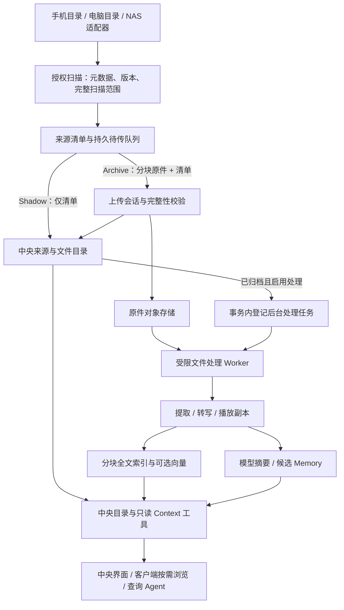

# 文件同步与中央处理设计

状态：首期已实现，2026-09-15。使用方式及当前边界见 [操作说明](files.md)，已执行测试与真机待补项见 [验证记录](file-sync-validation.md)。本文保留长期设计；与现实现有差异以操作说明为准。首个场景是同步 Android 已有通话录音目录。

## 结论

沿用 Mote 的「来源 → 不可变版本 → 原始证据 → 派生内容 → 只读 Agent」体系，补上通用文件对象与后台处理能力。中央节点维护跨手机、电脑、NAS 的统一目录和检索索引；客户端按需取目录、摘要和预览，只有明确选择离线保存的文件才长期下载。

第一阶段打通一个完整场景：选择手机录音目录，原样上传，中央保留原件、生成带时间戳的转写和摘要，支持检索、问答与回听。同一文件协议实际支持「只存引用」，NAS 扫描器等后续接入。实现可以分为归档、内容处理两个增量，最终验收包括两者。

推荐默认：单向归档、手机原录音不自动删除、手机删除不连带删除中央副本；上传遵守现有网络与同步策略；原音频是否可以发往云端转写需要用户选择。本文的容量与并发数是初始实现建议，后续通过测量调整。

## 1. 已有基础与具体缺口

| 已有能力 | 复用方式 / 需要补充 |
| --- | --- |
| `SourceConnection`、`source_versions`、`source_heads` | 保留来源归属、不可变 revision、当前指针、历史与幂等确认 |
| `reference / snapshot / original / derived` 资料分层 | 保留证据语义，增加文件原件引用与独立产物，不把转写填成原文 |
| Android SAF 文件选择器、加密来源状态、WorkManager | 复用授权和调度；补充分页扫描清单、二进制暂存及续传 |
| FTS、可选 embedding、Memory、只读 Harness | 扩展为可搜索长文分块和带时间戳的产物，并校验证据链 |
| 设备配对、所有者会话、MCP 独立 scope | 继续限制上传者只能操作自己的来源；跨设备浏览使用所有者认证 |

改动前 Android 来源只支持 `snapshot/reference`，默认筛选文本扩展名；每文件 100 KiB、每轮 200 条、扫描正文 4 MiB 等限制不适合录音。新的二进制与引用通路已解除这些正文限制，使用独立的元数据和文件容量边界。

原有中央 `blobs`、`readBlob` 和 HTTP 导出围绕图片、整块内存和 base64 设计。新增独立的文件块存储、转写流水线与片段索引，避免只增加音频扩展名或扩大 JSON 上限。

参考现有实现：[来源协议](../packages/shared/src/sources.ts)、[来源入库](../apps/server/src/sources.ts)、[存储](../apps/server/src/store.ts)、[索引器](../apps/server/src/indexer.ts)、[Android 来源读取](../apps/android/app/src/main/java/dev/mote/collector/SourceProviders.kt)、[Android 来源队列](../apps/android/app/src/main/java/dev/mote/collector/LocalSources.kt)。

## 2. 三种保存方式，处理策略单独配置

“在哪里保存原件”“允许怎样处理内容”“客户端缓存多少”是三个独立维度。

| 产品模式 | 中央保存 | 原件不可访问时的能力 | 与现有语义的关系 |
| --- | --- | --- | --- |
| 只存引用 / Shadow | 来源、文件名、类型、大小、版本、观察时间与定位信息 | 可找文件、查看已知元信息，不能搜索未采集的正文 | `retention=reference`，`layer=reference`，正文为空 |
| 内容快照 | 引用，加上明确授权采集的文本或派生产物；不长期保留二进制原件 | 可检索已保存内容，不能承诺打开原文件 | `retention=snapshot`；模型转写/摘要单列为 `derived` |
| 原件归档 | 精确的原始字节、文件清单、历史版本，以及允许生成的产物 | 来源离线后仍可下载原件、处理和回看 | `retention=archive`；归档原件为 `original` |

手机录音首期采用原件归档。这里的“原样”指下载后字节散列与上传快照一致，保留原名、相对目录和提供方报告的时间；不承诺跨平台复制权限、扩展属性或文件系统内部属性。转码只生成独立的播放/处理副本。

“只有快捷方式，但有内容摘要”需要有内容读取过程。严格 Shadow 不打开正文、不为去重读取文件计算散列，也不隐式转写；提供方现成的描述可保存，但要标出来源。需要模型内容摘要时，应选择内容快照，显式允许节点处理或中央临时读取；原始临时字节有独立清理策略。这条通路后续实现，不把正文偷放进 reference。

处理策略按来源配置，例如 `extractText`、`transcribe`、`summarize`、`embed` 及各阶段允许的服务。用户可给来源写自然语言说明（如“这是手机自动通话录音”），供模型理解；目录名、文件名和应用名不触发语义分类规则。

改保存方式只影响新同步版本，不静默修改历史。reference 升级到 archive 会生成新版本；archive 改成 reference 不等于已上传原件被删除，界面须单独显示历史存储量及清理入口。

## 3. 整体结构



首期仍为单所有者、一个中央节点，用 SQLite 保存关系和任务、本机私有卷保存原件，后台 Worker 独立于 HTTP 请求运行。无需先引入 Redis、分布式队列或 NAS 专用数据库。

扩展边界：

- `FileSourceAdapter`：枚举、读取指定版本、报告能力与扫描覆盖范围。Android 用 Kotlin，电脑/NAS 可用 TypeScript 适配器；NAS 可挂载到已有节点，或部署主动连接中央的采集端。
- `FileObjectStore`：暂存、流式写入/读取、校验、提交、范围读取、引用回收。先用本地卷，后续换对象存储。
- `FileProcessor`：输入受控版本和声明的内容类型，输出标准产物。先实现音频，后续增加 PDF、Office、图片 OCR、视频。
- `ContextReader`：向模型提供只读文件目录、片段与证据；模型解释内容，不能通过查询工具远程开启同步或抓取 URI。

## 4. 身份、版本与数据模型

继续使用现有 `deviceId` 表示来源所属节点，不另起一套平行身份。一个明确选择的目录有一个 `sourceId`，每个来源仅有一个写入者。

| 概念 | 最小内容与约束 |
| --- | --- |
| File item | `(sourceId, externalId)`；标识来源中的逻辑文件。路径与显示名属于可变属性 |
| File revision | 不可变 `revision`、前驱 `previousRevision`、manifest、`observedAt/receivedAt`、关联证据 `captureId` |
| Manifest | 文件名、相对路径、提供方 MIME、大小、修改时间、保存模式、可选原件对象引用及字节 SHA-256 |
| Object | 私有 `objectId`、SHA-256、字节数、存储格式/加密版本、生命周期；二进制不进入事件 JSON |
| Artifact | 转写、提取文本、摘要、播放副本；关联输入版本、上游产物、处理器/模型版本、配置散列、生成时间、状态 |
| Chunk | `artifactId`、稳定片段 ID、文本位置；音频额外有 `startMs/endMs`；支持分页和定位 |
| Job | 输入版本、阶段、处理配置版本、状态、重试、租约及结果；输入键唯一以避免重试重复产出 |
| Scan session | 来源、配置版本、扫描代次、覆盖范围、已见项、分页检查点、是否完整 |

建议新增 `file_versions`（关联既有 `capture_id`）、`file_objects`、`file_object_refs`、`file_artifacts`、`file_chunks`、`file_jobs`、`file_upload_sessions`。名称可调整，来源版本链与证据 ID 的语义保持稳定；大文本和产物不会膨胀每条 capture JSON。

### 身份与去重

Android 首期沿用已有 SAF 文档 URI 的 externalId，保证旧来源升级不产生第二份逻辑目录；适配器保留 provider document identity。只有提供方能证明同一身份时，改名/移动才沿用 item。失去权限或 provider 更换 ID 时不猜测对应关系。未来路径型 NAS 来源可先将改名视作旧位置消失、新位置出现。

内容散列用于复用物理对象，不用于把多个位置的文件合成一个来源事件。同一录音同时位于手机与 NAS，保存两个位置和版本历史、共享一份字节；普通列表按文件呈现，搜索可以按内容聚合并展示所有位置。纯 Shadow 不需要内容散列。

revision 由客户端稳定的 manifest 字段、内容散列（如果有）与前驱构成，不包含服务生成的 objectId、receivedAt；首次入队就持久化。修改、删除、恢复分别产生版本。新通路按单写入者的前驱链校验次序，不仅凭可漂移的设备时钟推进 head；前驱缺失先等待补链，分叉显示冲突。旧文本协议行为不变。

### 时间与可用性

- `observedAt` 是节点观察时间，`receivedAt` 是中央首次入库时间，`modifiedAt` 是文件系统报告时间。
- 录音起止时间、音频时长另存，且标注来自提供方、容器或模型。文件名中的时间只是来源字符串，不能由手写规则自动变成通话事实；缺少真实事件时间就明确未知。
- “来源文件仍在”“中央原件已保存”“转写已完成”分别记录，不能用一个 synced/deleted 状态表达全部含义。
- 音频时长不进入屏幕使用时长或“实际通话时长”统计。音频文件的存在不能证明双方身份、接通或实际参与。

## 5. 手机扫描、缓存与上传

### 授权与发现

复用系统目录选择器，只请求所选树的持久读取权限。首期允许递归目录、明确的扩展名/路径过滤、扫描频率、历史导入范围；这些属于用户配置的数据边界。录音采集与截图开关、截图模型就绪状态独立。

Android 系统目录授权可覆盖子目录，但 Android 11 及以后对部分根目录、`Android/data`、`Android/obb` 等有限制；不能仅凭“文件管理器看得见”就承诺 Mote 可读。若实际录音不可通过选择器访问，需要录音应用导出到可授权目录或另做合法的来源适配。[Android 文件访问文档](https://developer.android.com/training/data-storage/shared/documents-files)

每次只做有界扫描，持久化分页/遍历检查点，大目录跨多轮完成；不能反复扫描前 200 项让后面的文件永久饿死。完整覆盖所选范围后才确认缺失；扫描失败、权限撤销、被过滤、达到预算和尚在写入都不构成删除。提供方没有一致性快照时，完成枚举后还要复核未见条目的存在性，分页期间目录变动不能成为删除证据。修改选择范围生成新扫描代次，不能用旧范围的缺失去删除新配置下的文件。

### 正在写入的录音

优先使用提供方可靠的完成标记。通用目录则先要求多次观察中大小和修改时间稳定（建议间隔至少 60 秒，可配置），再复制到私有暂存，核对复制前后元信息及实际字节数。变化则放弃本次暂存并稍后重试。

稳定窗口不是录音已结束的证明；缺失/不可靠的大小和修改时间不能当作零值，必要时采用有界的重复读取与散列比较。对没有可靠完成标记的来源，归档标注“该次稳定快照”，继续观察后续追加产生的新版本，不能永久忽略已经上传过的同名文件。[Android 文档元数据定义](https://developer.android.com/reference/android/provider/DocumentsContract.Document)

### 有界暂存

原录音仍在用户目录；Mote 通常只为当前正在上传的一个文件建立不可变加密暂存，其他候选先保留元信息与状态。上传只读这份固定快照，防止续传时将两次版本拼成一个文件。不能 seek 的 provider 也能从暂存续传。

首期建议单文件上限 512 MiB、文件暂存配额 1 GiB、同时暂存/上传一个文件、网络块默认 4 MiB，均在实际录音大小分布确认后调整。临时文件、加密开销和待确认数据计入限额。低空间时暂停新暂存，保留已有未确认文件；不能静默丢弃旧任务，也不能将超限 archive 自动降为 Shadow。

在快照尚未暂存之前，源应用删除文件会使其无法上传；状态明确显示“归档前原件已不可用”。不将只发现元信息的文件计作已受保护。得到中央完整归档确认后才释放 Mote 暂存；ASR 是否完成不影响释放。手机原目录不由 Mote 自动清理。

### 协议与确认

新增有独立版本的 `/api/file-sync/v1` 通路，并公布能力、块大小与最大文件限制。手机先探测能力；旧中央明确显示需升级，保留待传项，不用音频 base64 回退到截图或现有文本接口。

建议端点（设计名称）：

| 操作 | 契约 |
| --- | --- |
| `GET /api/file-sync/v1/capabilities` | 返回协议版本、受支持模式、配额与传输上限 |
| `POST /api/file-sync/v1/uploads` | 提交来源、externalId、revision、manifest、大小/散列和持久 requestId；返回受限上传会话 |
| `GET /api/file-sync/v1/uploads/:id` | 查询已确认块、到期时间和提交状态，崩溃后恢复 |
| `PUT /api/file-sync/v1/uploads/:id/parts/:part` | 流式上传固定偏移的字节块，长度/散列校验；相同块重试幂等，不允许不同内容覆盖 |
| `POST /api/file-sync/v1/uploads/:id/commit` | 校验全长与总散列，提交对象、来源版本、引用和后台任务，返回完整归档 ACK |
| `PUT /api/file-sync/v1/revisions` | 无二进制的 Shadow、元信息修订和来源消失版本；同样受来源归属与版本链约束 |
| `GET /api/files/:captureId/content` | 按证据权限读取已归档原件，支持范围读取与下载 |

上传会话绑定中央身份、当前凭据对应的设备、sourceId、item 和 revision。块 ACK 仅表示暂存块收到；完整 ACK 必须匹配 `sourceId/externalId/revision/captureId/objectId/sha256/sizeBytes`，手机才显示原件已归档。服务器完整校验、落盘完成、SQLite 提交成功后回 ACK；响应丢失时重试返回同一结果。

对象先落到不可变位置，再在事务中写来源版本、对象引用、`changes` 和处理任务。崩溃可能留下无引用对象，用带宽限期、避开活跃会话的回收器清理；不能产生“有归档成功记录但原件尚未写完”。磁盘满、散列冲突和撤销权限都不返回成功。已删除版本或文件的重试受墓碑约束。

所有会话读写和最终提交重新鉴权。已有对象的复用必须在授权来源/引用范围内核验，不能凭知道散列便获得他人文件读取权。凭据轮换可在同一经验证的中央/设备身份下恢复；换中央时旧任务仍绑定旧节点，需显式迁移，不能自动重放私人录音。

沿用实时/定时/批量/手动和网络限制；分块使系统随时停止任务后可继续。文件上传不长期占有现有全局连接锁，每块边界复核来源设置，避免大录音阻塞笔记和截图。按字节与时间分配公平批次。WorkManager 周期任务最短间隔为 15 分钟，实际执行会受系统与约束影响；产品承诺可补传，不承诺后台准点或秒级到达。[Android 后台任务文档](https://developer.android.com/develop/background-work/background-tasks/persistent/getting-started/define-work)

## 6. 中央节点怎样处理文件

### 分阶段，分别展示成功与失败

```text
原件：发现 → 待稳定 → 待暂存 → 待传/上传中 → 已归档
处理：待配置/排队 → 探测 → 转写或提取 → 分块索引 → 内容摘要
                                     ↘ 可选 embedding
摘要/转写证据 → 现有 Memory 提取与回顾（用户请求或既有调度）
```

每个阶段可以是 waiting/running/succeeded/failed/blocked/cancelled，分别记录原因。无 ASR 配置时显示“原件已归档，等待配置转写”；无摘要模型时仍可全文搜索已转写内容。向量服务失败不阻塞全文索引。任务状态和产物就绪也生成增量 changes，旧录音今天转写完成仍能被客户端发现。

### 文件类型分发与隔离

处理器按声明能力、实际容器探测和用户配置选择机械处理路径（音频解码、PDF 提取等）。内容类别、主题、行动项与关联由模型解释；程序不按词语决定“这是待办”或“这通电话重要”。未知格式保留原件，显示暂不支持处理。

解析器在受限 Worker 中运行，仅能读取任务指定对象和写临时输出；限制输入大小、时长、内存、CPU、输出量和执行时间。默认无网络；显式配置的 ASR/模型适配器只访问允许的服务。文件名不进入 shell 命令拼接、不作为实际落盘路径，文件内容、字幕、元数据和工具结果始终是不可信证据。

### 音频处理闭环

1. **探测**：读取容器/编码、轨道和可确认的音频时长。按处理器能力校验。原件完整存档与“解码成功”是不同状态。
2. **标准化输入**：为 ASR 生成有界的临时音频块，保存到原文件时间轴的映射；归档原件不变。可选播放副本也作为独立产物。
3. **ASR（语音转文字）**：独立 `TranscriptionProvider` 配置本机/自托管服务或明确授权的云服务；不假设现有聊天模型接口支持音频。输出逐段文字、起止时间、可选说话人编号、语言及可用的质量字段。对齐/说话人能力是 provider 能力，缺失就标记缺失；不把“说话人 1”猜成通讯录姓名。
4. **完整覆盖**：长音频分段处理，保存已处理区间与缺口，重试只补缺口。合并时用时间轴处理重叠；未处理的区间不能被摘要冒充已覆盖。无时间戳的 provider 仍可提供转写，但不能标称支持句级回听，首期验收选择支持时间戳的实现。
5. **文本索引**：转写按段/有界窗口进入 FTS；可选 embedding 按模型输入预算分块并标注配置版本，避免当前整条文本截断造成后半段永远不可检索。分块、分页和索引是确定性工作。
6. **摘要**：配置后按来源策略自动生成简短摘要；长音频分段摘要后综合，覆盖度和每项陈述的时间片段引用必须可验证。摘要是派生物，不能覆盖转写或作为唯一检索入口。被模型识别出的约定/待办仍是有证据的候选，不自动创建任务或对外发送消息。
7. **记忆与回顾**：复用现有 Harness 与 Memory 提取范式，让模型结合其他来源按需形成候选记忆和洞察。首期不为每份录音强制再跑一遍跨资料库记忆提取。

ASR 可配置本地或云，摘要沿用现有中央模型设置；embedding 有自己的配置。界面逐项说明原音频、转写或检索片段会送到哪个服务。允许上传到私人中央节点不等于允许把音频发给第三方；没有明确选择时只完成归档，相关模型阶段等待配置，不做自动跨服务回退。

### 重试、版本与成本

任务以「输入 revision + 上游 artifactId + 阶段 + 处理器/配置版本」为幂等键。用 SQLite 任务租约和过期回收支持进程重启；临时网络问题退避重试，不支持的格式和未配置服务进入 blocked，用户修复后重试。

同一原件重跑产生新产物版本，切换当前产物指针；旧摘要/Memory 标记失效。保存模型结果前再次检查输入仍被保留、任务未取消、配置允许该处理；版本更新不影响旧产物属于旧证据，但不得回写成新文件的结果。隐私删除后在途结果不得重新落库。

首期按来源启用自动处理，设每日音频时长/文本量、并发、超时与最大输出预算。历史批量导入先显示文件数和估计字节数；时长不明时明确未知，探测后才形成转写量估算。达到处理预算只暂停处理，不阻止已获配额的原件归档。

## 7. 统一浏览、检索与问答

中央增加「文件」入口，可按来源节点、目录、格式、观察/修改时间和状态浏览；卡片展示原名、大小、保存方式、摘要、原件可用性及转写状态。目录路径是显示数据，实际存储位置由服务控制。

展开录音显示原件信息、处理版本、分段转写、摘要及时间戳回听；原编码不能在浏览器播放时，可生成播放副本，原件仍能下载。用户点击引用时先检查当前访问权限，再读取音频范围，不能通过公开静态 blob URL 绕开权限。

Agent 先通过来源目录或 `search_context` 发现文件，再按需展开产物和片段。可新增只读 `file_artifacts` / `file_excerpt`，保持现有 `source_items`、`source_history`、`evidence` 的渐进读取方式。

引用扩展为「证据 captureId + 文件 revision + artifactId + chunkId/时间范围」。服务校验模型确实在本轮读取了该片段、属于选定设备/时间范围、未删除/失效，然后才生成可点击引用。搜索到摘要不等于已经读过整个原文；严格 Shadow 只能给出元信息级回答。无查询工具会自动打开手机文件或 NAS URI。

后续为 Shadow 增加用户主动的“打开原位置 / 临时取件”：用受控的节点与来源标识解析定位信息，通过已配对节点的主动连接请求指定版本；节点离线显示不可用或等待，版本变化则告知用户。该入口独立于 Agent 工具，不能让来源 URI 变成中央的任意网络/文件读取能力；取件不默认永久归档，若要保留正文或生成内容摘要则显式改为快照/归档策略。

采集凭据仍只能访问自身来源。手机/电脑若浏览全部节点资料，需要单独的所有者登录会话或未来明确授予的只读权限，不能把设备 token 静默升级为全库读权限。

客户端默认缓存有上限的目录页、摘要、游标和预览，长转写与原件按需获取；离线缓存是用户选定的范围。全局完整索引放在中央，因此设备可在线搜索全库，但未缓存资料在离线时不可搜索。若以后要求手机离线检索全部节点，再增加可配置的精简索引副本。`changes` 游标过期则重新拉取所选范围清单；删除/失效事件清除相应本机缓存，离线设备只能在重新联系后获知变化。

## 8. 删除、保留、空间与迁移

| 操作 / 情况 | 行为 |
| --- | --- |
| 手机删除原录音 | 上报来源消失，中央已归档原件和产物仍保留 |
| NAS 暂时离线、SAF 失权、扫描未完成 | 原位置标为未知/不可访问，不产生推断删除 |
| 暂停/移除来源配置 | 停止后续采集；待传内容依显式操作保留或丢弃，中央历史不连带擦除 |
| 中央删除单个版本 | 删除该证据和依赖产物，留下版本墓碑；其他合法版本/位置不受影响 |
| 中央“忘记此文件” | 清除该来源 item 的保留版本及派生内容，建立 item 级阻止重入标记；需要显式重新允许才能再归档 |
| 相同对象仍被另一来源/版本引用 | 不能物理删除仍有权限保留的对象；界面提供查看其他位置以及按内容彻底删除的入口 |
| 原件配额耗尽 | 拒绝新归档并显示原因，手机保留待传数据；不自动改保存模式 |
| 仅清理可重建索引/播放缓存 | 原件与保留的转写不受影响，可按需重建 |

现有 source 默认检索隐藏上游删除的当前项。文件归档需要显式区分「来源当前目录」与「中央保留文件」：前者沿用当前指针，后者继续展示和搜索已归档但来源消失的最后有效版本，标出原位置状态；历史版本默认不混入。文件 Agent 检索也使用这一规则，并在结果中保留“源已移除”的事实，不改变日历等其他来源的查询语义。

文件原件使用独立保留策略，建议默认保留至显式删除，不直接套用截图的时间清理规则。新文件证据及其衍生表必须接入全局清理与导出逻辑，避免后台 retention 把旧录音意外删除。原件、历史版本、产物、索引、在途暂存分别计量；只有在保留引用与活跃租约均消失后才能回收对象。

删除传播到 chunk 索引、向量、摘要、Memory、洞察及已保存问答中的派生副本。首期可沿用保守的全局失效处理，但文件/产物依赖关系要建立，保证将来能精确失效。模型重算不会重新授权已忘记的源文件；备份的清理与恢复是显式管理操作。

大文件存储新增流式格式，不能直接调用当前整文件 `readBlob`。中央启用数据密钥时使用经过校验的分段认证加密或先解密到受限暂存，确保范围读取不破坏认证；保留密钥标识、对象格式版本和迁移路径。原件落盘加密不等于 SQLite 元信息/转写已加密，磁盘层保护沿用现有部署要求。日志只记匿名任务标识、字节数、耗时和固定错误码，不含文件名、电话、正文或令牌。

备份范围包含数据库、原件、派生产物及恢复所需密钥的独立管理。后续流式归档格式使用 manifest 加对象，保留引用、版本、产物依赖与校验；不把录音塞进现有整库 JSON/base64 导出。首期必须让旧导出入口明确说明二进制范围或拒绝“不完整却标称完整”的导出，提供经校验的离线完整备份。恢复来源默认暂停，外部凭据不随普通资料导出，派生结果按现有规则重验。

## 9. 第一阶段范围与验收

### 增量 A：可靠归档

- Android 一个可授权录音目录，支持后续添加多个同类来源；扫描既有文件与新增/变化文件。
- 同一通路支持原件归档和真实的元信息 Shadow，包含中央文件列表与原件下载。
- 不可变快照、内容去重、断点续传、确认清理、单向删除语义、容量和权限状态。
- 保留来源版本链、严格身份校验、私有对象存储、任务登记及完整备份。

### 增量 B：中央理解与使用

- 一个实际可用的 ASR 适配器；目标录音格式按真实设备情况确定，以生成的相同编码 fixture 先验证解码。
- 带时间戳转写、分块全文搜索、可选向量、内容摘要与原件回听。自动播放转码副本后续扩展。
- 原件/处理状态分离、逐阶段重试和预算；Agent 从已读取的片段引用回答。
- 手机显示自身同步状态；全库浏览先复用中央前端及现有 Mac 中央窗口，独立手机全库离线界面后续扩展。

后续逐步实现：NAS 常驻适配器、内容快照模式中的临时取件、更多文件解析器、按需离线保存、远端存储后端、可配置的客户端精简索引。首期不需要双向改写/冲突合并、跨设备自动恢复目录或查询触发任意远程拉取。

### 必须验证的故障与证据链

1. 生成音频/二进制 fixture：超过旧 100 KiB 限制、长音频跨块、零字节、未知大小、同名不同内容、相同内容不同来源、改名与恢复。
2. 超过旧 200 条上限的大目录最终完整扫描；截断/失权/过滤调整不误报删除；正在写入文件不混合版本。
3. 中断每个上传阶段、丢 ACK、杀客户端/中央进程、块散列错误、空间耗尽，验证不丢待传内容、不中途宣称成功。
4. 换节点、撤销凭据、跨来源访问、已删除 item 重试、处理中删除、对象回收竞态，验证权限与防复活。
5. Shadow 断言不打开正文、不哈希原件、不触发处理；大文件元数据仍能归档。
6. ASR/摘要合成响应失败与重试、后半段搜索、缺失转写区间、无效片段引用、模型提示注入，验证原件不变与工具只读。
7. 原录音在手机删除后，中央保留版仍可检索/回听；中央忘记文件后派生内容和缓存失效。
8. 原件导出/备份恢复 SHA-256 一致，目录/版本/产物依赖完整，旧客户端和不支持文件的中央给出明确兼容提示。

真机另行验证：实际录音目录授权、录音完成行为、权限持久化、后台省电/强制停止/重启、实际文件格式与播放。本轮已执行模拟器生成文件的真实 HTTP 跨端、中央本机 ASR 和真实模型摘要、问答、记忆测试；没有接触个人真实录音。实测结果与边界见验证记录。

## 10. 已确认决策

| 决策 | 推荐 / 影响 |
| --- | --- |
| 转写位置与数据范围 | 中央调度，ASR 独立配置。可选择中央本机/自托管，或允许原音频发到指定云服务；未选择不外发音频。摘要仍需明确沿用现有模型的文本外发范围 |
| 手机删除与原件清理 | 推荐单向归档：手机删除不连删中央；上传后只清 Mote 暂存、不自动删手机录音。中央原件默认保留至显式删除 |
| 首次历史导入 | 推荐展示所选目录现有文件数/字节量后导入全部，分批上传与处理；也可仅同步启用后首次发现的新文件，已有清单作为基线 |

真机补验时需要确认：手机品牌/Android 版本、录音应用、目录大致位置、主要格式，以及中央运行在哪台机器。这些决定 SAF 是否可行、实际解码/ASR 适配与可用计算资源，不影响上述总体边界。
