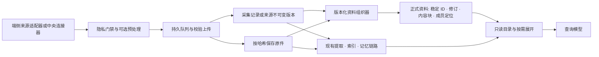

# 接入与正式资料架构

> Coding 接入已切换为 Cordis source pipeline：原始事件只存文件归档，会话发布后才索引和送入模型。此路径不再走下文的原始 capture 整理链；新配置、MVP 切换与验收边界见 [Source pipelines](source-pipelines.md)。普通记录来源保留原链路。

Mote 把来源采集、可靠运输、证据归档、正式资料组织和模型读取分开。新增接入应先复用现有的资料形态与处理步骤；只有数据形态确实不同，才增加新的组织器或读取方式。来源内容始终是数据，不能作为 Agent 指令。程序不根据关键词判断用户意图、主题或洞察。



| 对象 | 身份与用途 | 上传确认后是否已经完成 |
|---|---|---|
| 上传包或分片 | 网络运输单位；用固定 ID、校验和、重试与确认保证送达 | 是，仅代表对应字节或记录已被中央接收 |
| 内容寻址资产 | 图片、录音或文件原件的字节单位；相同内容共享哈希对象 | 文件提交后可存在，但仍可能尚未解析 |
| 采集记录 / 来源版本 | 某次观察或某个上游条目的不可变 revision；保留时间、来源与隐私状态 | 已入归档；尚不代表相关条目已组织完整 |
| 正式资料 | 一份文件、一场编码对话或一段屏幕片段等逻辑对象；有稳定 ID、不可变修订、内容块和成员定位 | 由组织器单独发布，可能晚于上传确认 |
| 索引、摘要、记忆 | 可重建或需要重验的派生视图 | 独立处理状态，不代替原件或正式资料 |

正式资料 ID 由 `sourceId` 与上游逻辑 `externalId` 生成，传输批次和上传时间不参与身份。修订根据资料内容生成；每个修订保存资料类型与格式版本、文本或资产块、成员引用、完整度 `coverage`、保真度 `fidelity` 和原件保留状态 `retention`。块可带时间、行号、会话事件或原件定位，读取时返回精确范围。跨来源的“同一会议/项目”应由显式关系连接多个资料，不能仅因名称相似就合并原件身份。

本版查询 Agent 可通过只读工具查看正式资料；现有文件提取、检索索引和 Memory 任务仍消费原始采集记录或文件片段。正式资料发布不会自动触发记忆提取，Memory 的证据依赖也尚未改为正式资料引用。

## 新增接入的流程

1. **确定来源和资料身份。** 选择稳定的 `sourceId`、上游 `externalId`、不可变 `revision` 与真实观察时间 `observedAt`。优先使用已有资料类型。新来源种类使用有界的点分命名空间，例如 `acme.notes`；单条归档记录仍使用协议支持的 `file`、`message`、`calendar` 等数据形态。
2. **实现适配器。** Mac/Android 适配器读取平台 API，中央连接器读取已授权的外部 API。适配器只做来源特有的获取、身份、游标与字段映射；端侧用户配置的排除、遮挡和权限检查必须在上传前执行。核心负责持久队列、重试、确认、限额、去重和保留策略。新增预处理步骤应有自己的版本与可重试检查点。
3. **声明中央能力。** 内置和可信部署模块都通过版本化 connector manifest 注册来源种类、能力、owner 路由、OAuth 回调、状态和关闭过程。未安装能力声明的新种类不能新建或继续活跃同步；已有资料仍可读取，并显示适配器不可用。
4. **按资料形态组织。** 如果已有组织器能处理新来源，直接复用。新资料形态增加带版本的组织器，选择明确的来源字段形成分组，再发布内容块、原件和成员定位。组织器只依据协议字段、用户配置和可核验的来源 ID 分组，不用关键词推断主题。处理失败保留原始记录与游标，重试后再推进检查点。
5. **提供只读展开。** 为新形态补充目录、分段读取和证据定位；查询模型选择工具并解释证据。OCR、转写和语义处理拥有各自授权与状态，不能因上传成功就标记为完成。用生成的合成资料验证断线、重试、重复版本、部分覆盖、删除和权限边界；真实设备与真实模型另行验收。

当前 Mac 与 Android 的端侧阶段按注册顺序执行；阶段可按输入类型选择处理，并把配置纳入检查点身份。Mac 支持跨批次持有文字和元数据、显式 flush、拆分与合并，输入和输出日志负责重启重放；图片不能跨批次持有。当前版本尚无按单个来源编辑阶段顺序及参数的用户界面，涉及系统能力的新适配器仍随客户端发布。

需要新聚合边界的可信连接器可在 `init` 中调用 `ctx.materialOrganizers.registry.register(organizer)`。`organizer` 声明稳定 `id`、`version`，并实现按来源协议字段选择分组的 `select(record)`、组的稳定资料 ID `identity(group)` 和生成 `MaterialDraft` 的 `build(store, group)`。默认单条来源资料使用 `source-item` 组织槽；若新连接器要替换它，可声明 `slot: 'source-item'`、更高的整数 `priority`，并让 `select` 只匹配自己的 `sourceId`。若此形态必须排除其他槽的匹配组织器，还可声明 `exclusive: true`；同优先级的独占匹配会报错。`register` 返回注销函数，连接器应在 `close` 中调用；常规单条来源资料已由内置组织器覆盖，无需重复注册。新组织器安装或其 `version` 变化后，运行时会持久记录并分批重扫已有采集记录；资料目录在重扫完成前可能仍包含旧修订。

可信连接器也可经 `ctx.processing.registry.register(processor)` 注册新的中央处理器，再由 `ctx.processing.enqueue` 提交包含 `materialInputs` 的步骤。每个输入固定正式资料修订及 UTF-16 页范围；执行器负责分页预算、重试、产物依赖和修订变化后的失效。处理器只收到只读资料页与其他输入，不会取得写入资料库的能力。当前通用处理任务须由接入方显式提交；自动 Memory 提取仍按上一段所述沿用原有证据链路。

中央部署可在私有环境文件中配置可信模块，无需每次修改服务器接线代码：

```dotenv
MOTE_CONNECTOR_PLUGINS='["file:///srv/mote/plugins/acme-notes.mjs"]'
```

模块默认导出 API 版本 1 的 manifest。以下例子展示最小的 owner 授权导入入口；实际外部服务连接器还需自行实现授权、范围选择、游标和错误处理。

```js
export default {
  apiVersion: 1,
  id: 'acme-notes',
  statusKey: 'acme-notes',
  sourceKinds: [{
    kind: 'acme.notes',
    capabilities: {
      lifecycle: 'one-shot',
      discovery: 'explicit-selection',
      listening: 'none',
      readOriginal: 'none',
      synchronization: 'import-only',
      externalWrite: false,
    },
  }],
  create(ctx) {
    const sourceId = 'acme-notes';
    return {
      async init() {
        ctx.sources.register({
          id: sourceId, name: 'Acme Notes', kind: 'acme.notes',
          deviceId: sourceId, platform: 'import',
        });
      },
      status() { return { ready: true }; },
      configure(host) {
        host.ownerRoute({
          method: 'POST', path: '/api/connectors/acme-notes/import',
          handler: request => ctx.sources.upsert(sourceId, request.body),
        });
      },
      async close() {},
    };
  },
};
```

`ownerRoute` 在解析请求体前检查中央 owner Bearer。OAuth 回调通过 `host.oauthCallback` 声明，host 校验 `state`/`code` 的形状并设置禁止缓存、禁止引用和严格 CSP；连接器必须自行校验一次性 state、PKCE、授权范围及账户身份。只有可信安装的部署模块才能加载；模块在中央进程内运行，拥有与连接器相同的资料库能力，不是沙箱，也不能从归档内容或用户提交的 URL 动态加载。模块应实现 `close` 释放后台任务与连接。已有的 Google、Gmail、Lark 和 MCP 都使用同一个 host 注册机制。

## 零散文件如何保存与聚合

网页大文件先按分片写入暂存区，重放时核对分片校验和；提交后成为内容寻址资产和独立文件 ID。设备上传的记录也必须收到对应 ID 的确认，才能从本机队列移除。**文件上传完成、导入任务确认、正式资料发布和模型处理完成是四个不同状态。** 仅提交二进制文件不会凭空产生摘要或完整资料；导入或来源同步把它发布为带出处的记录之后，组织器才会建立正式资料。

中央组织器消费归档变更，先形成分组，再一次性发布正式资料修订，成功后推进持久游标。重复输入不重复发布；新增成员或加工结果生成新修订。现有组织方式如下：

| 输入 | 正式资料与聚合边界 | 保留的定位和限制 |
|---|---|---|
| 单个文件、录音、照片或笔记 | 按来源条目的 `sourceId + externalId` 形成一份资料；正文、转写/提取片段及有原件时的资产分别成块 | 原件哈希、来源 revision、片段 ID 或时间戳；转写不等于音频原件。当前每份最多组织 2,000 个内容块，超过时标记部分覆盖 |
| 编码 Agent 小日志 | 依来源、provider、projectKey、sessionId 汇成一份会话资料，事件按时间与稳定 ID 排序 | 各事件对应的采集记录和事件序号；当前最多 2,000 个事件，超出时标记部分覆盖 |
| 连续屏幕观察 | 使用现有屏幕分组键形成片段，保存 OCR 文本块及仍保留的图片资产块 | 每次观察的成员 ID 与采集时间；当前每组最多 1,000 次观察。分组键不代表语义上的同一任务 |
| 活动、媒体与设备状态 | 保存采样区间中的时间与状态值 | 当前按采集记录保存状态序列；跨记录的更大时间线仍可作为后续组织器扩展 |
| 普通随手记或其他单次采集 | 一条采集记录对应一份资料 | 原始采集 ID 与正文，不凭上传时间推断事件发生时间 |

`coverage=complete/partial/pending` 说明本次资料组织的覆盖范围；`fidelity=lossless/derived/summary-only` 说明内容保真程度；`retention.original` 说明原件是否仍可读。这些状态不能被摘要“补全”。相同图片或文件字节可以共享资产对象，但独立观察和来源版本不会因哈希相同而消失。只保留 OCR 或转写会失去日后重新识别图片/音频所需的信息。

内置资料的正文使用获准字段的投影，不把文件 URI、绝对路径和连接器内部元数据送入问答模型，因此其 `fidelity` 标为 `derived`。原始采集记录和资产仍保留在受控归档中，正式资料的成员定位允许在授权后回溯原件。

目前**不因聚合完成而清理采集记录或来源条目**。上传分片在成功转为内容寻址资产后可以清除暂存副本；正式资料的成员和现有记忆仍引用原始采集 ID。隐私删除原始记录时，依赖它的资料会随之删除。以后要压缩碎片，需先将必要的原文、成员定位与删除语义迁移到可独立存活的资料锚点，并核验导出、恢复与记忆失效路径。不能仅凭“资料已发布”就删除其唯一原件。

完整 SQLite 资料库备份会保留正式资料及其修订。现有便携 JSON 导出不包含正式资料表；若来源记录与相同组织器仍可用，导入后可从最终来源状态重建当前资料，但不会恢复过去已发布资料修订的固定 `ref`。需要保存正式资料的修订历史时应使用完整资料库备份。

## 模型能看到哪一层

普通查询模型先看到有界目录、检索命中、正式资料元数据和已发布记忆，再按需要读取正式资料的固定修订、内容范围与成员定位。中央 Agent 提供 `material_catalog`、`material_read` 等只读入口；外部 MCP 读凭据提供 `mote_materials`、`mote_material`、`mote_material_read`、`mote_material_members`。MCP 写凭据只可写允许的既有来源，不能读取这些资料工具。

由正式资料生成的处理产物只有在全部原始采集成员仍存在且都落在查询范围内时，才会出现在模型的产物视图中。依赖展开超过 1,000 个原始成员时，产物视图会拒绝显示该产物；模型仍可按页读取有权限的正式资料。资料修订或成员删除后，相应处理产物及其下游产物立即失效。

上传包、密钥、游标和二进制原件不会自动放进问答上下文。OCR 或转写处理器可在相应授权下读取图片、音频；普通问答模型默认使用文字与定位信息，需要原图时必须走明确允许的按需读取路径。索引只是查找入口，Memory 是派生陈述；最终结论应回到正式资料块和可核验的原始成员。外部文档、日志、邮件与模型产物都应按不可信证据处理。

正式资料的 owner API 是 `GET /api/materials`、`GET /api/materials/:id`、`GET /api/materials/:id/read` 和 `GET /api/materials/:id/members`；`GET /api/materials/status` 显示组织器游标、待处理变更和回填进度。长正文按偏移分页，成员另行分页，修订引用可固定读取。没有结果时应检查来源上传、导入确认、组织器游标、资料覆盖状态和处理任务状态，而不是把“未找到”解释为设备没有数据。

## 安全与验收边界

- 用户配置的排除、遮挡和权限门禁在采集端或来源入口执行；中央只接受认证的上传和有界数据。默认服务绑定回环，远端部署使用 TLS 与强令牌。
- 连接器私密令牌和游标保存在私有配置中；OAuth 一次性 state 留在运行时内存。它们不写入来源正文、正式资料或模型上下文。MCP 远端导入的资源必须显式选择，网络访问沿用地址与重定向限制。
- 注册的连接器与资料组织器是可信程序代码；归档里的正文、元数据和模型输出不能修改处理流程或调用写工具。查询 Agent 只有只读上下文工具。
- 自动测试只用合成资料；真实个人截图、真实外部账户、实体设备同步和真实模型质量必须分别验收，不能由 fixture 测试推断为已验证。

更细的保留和删除语义见[资料分层](context-layers.md)，来源和 MCP 的具体配置见[中央连接器](connectors.md)。
