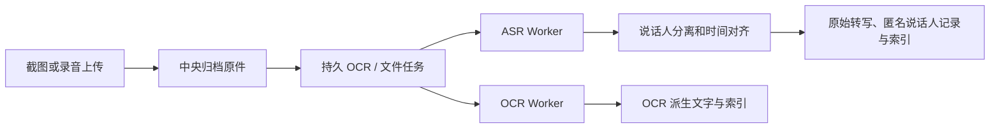

# 中央 OCR 与录音转写：方案与实施

更新：2026-09-24。依据 [原方案讨论](codex://threads/01a0d0e5-6b60-72a2-9873-c609e7e8b086) 和用户本次决定。本文区分代码实现与尚未执行的平台验收。

## 产品决定

| 项目 | 确定值 |
|---|---|
| 中央 OCR | 默认开启；只处理已经允许上传并成功归档的新截图。升级前旧截图不自动回扫。 |
| 新音频 | 默认自动本地转写，默认本地说话人分离并生成匿名说话人记录；模型未装时先归档并等待。旧音频不自动补处理。 |
| 文件时长 | 默认单文件 120 分钟，设置中可改为 1–1440 分钟；不设每日限额。512 MiB 原件上限和处理超时仍独立存在。 |
| 模型与平台 | OCR 用 PP-OCRv5 mobile ONNX CPU；ASR 用 faster-whisper 多语言 small / CPU int8，分离用 sherpa-onnx。首发目标为 Native macOS arm64 和 Docker Linux amd64。 |
| 分发 | Worker 程序和 Python 依赖随 Native profile 或 Docker 镜像安装；大型模型单独下载或从本机导入。默认不转发到云端。 |

上述默认值已经确定，目前无产品决策阻塞。将来如需不同的模型档位、长音频分段策略、更多 CPU 架构或专门的 OCR 坐标高亮，需要再定目标质量和资源预算。

## 运行架构



上传确认仅代表原件已持久保存。识别任务独立运行，失败不会删除原件。中央负责授权、任务检查点、派生版本、索引、只读查询和人工复核；Worker 仅处理当前请求字节并返回受 schema 校验的结果。原图、音频和识别文字都是不可信证据，不能向查询 Agent 提供写入工具。来源和 MIME 的路由使用用户配置的确定性规则，不根据文本关键词推断主题或意图。

Native profile 的 supervisor 启动两个只监听 `127.0.0.1` 的 Python Worker；Docker Compose 用共享 `mote` 网络命名空间连接两个 sidecar，只有中央 API 发布宿主端口。内部请求使用从 profile 主令牌派生的独立 Bearer 令牌。模型放在 Native profile 私有目录或 Docker profile 专属模型卷；Docker Worker 以只读方式挂载该卷。远程服务仍需单独配置 HTTPS 和显式外发权限，不是默认回退路径。

## 模型安装与运行

`apps/server/src/media-assets.ts` 固定模型版本、文件名、大小、SHA-256 与官方/镜像 URL。下载先取国内镜像，失败回退官方；只有全部文件校验通过，才把暂存目录原子切为当前版本。OCR 包同时安装 ONNX 和 `inference.yml`。`GET /api/media-models` 提供模型进度及 Worker 健康；`POST /api/media-models/{ocr|dialogue}/install` 只接受内置模型和来源选项，不接收任意 URL。模型文件通过 `media-import` 从本地目录按相同 SHA-256 校验后导入。

OCR Worker 使用 PaddleX 的 OCR pipeline，显式指定两个本地 PP-OCRv5 mobile 模型和 ONNX Runtime CPU；关闭文档矫正与方向模型，避免隐式下载。请求限制为 8 MiB、12000 像素单边和 4000 万像素总量，单 Worker 同时处理一张图。结果保留按阅读顺序输出的行文本，当前不承诺坐标和置信度。空行集表示成功但无文字。模型版本进入 OCR 任务与结果指纹；旧的成功结果不因升级而自动重算。

音频 Worker 复用 faster-whisper 与 sherpa-onnx，每次录音在隔离子进程中规范化、转写或分离。FFmpeg 规范化时强制单文件时长上限，转写结果也再次校验时长；不会截断后假称完整成功。先保存未校正的时间戳转写，再生成匿名说话人和对齐结果。分离阶段失败时原始转写及检查点保留，允许单独重试。普通自动处理不会调用云端摘要或语义模型。原件、未校正转写、分离和人工确认版本保持分层，文件详情支持回听、复核和导出。

模型缺失时持久任务标为 `model_missing`，不消耗识别重试次数；模型装好后后台调度会重新入队。Worker 暂时不可用按现有执行引擎退避重试，输入损坏和超过资源上限按永久失败处理。新旧任务用 `auto_eligible` 区分：迁移时将既有 OCR 和文件任务标为手动资格，新上传仍自动处理。OCR 设置提供每批最多 100 张旧截图的预览与确认；文件设置沿用已有的范围预览与重处理入口。显式单条重试也可以安排旧任务。

## 部署操作

Native profile 先安装 Python 运行时和系统 FFmpeg，随后在网页分别安装 OCR 与音频模型：

```sh
node scripts/mote.mjs media-runtime --profile dev --python python3
# 然后正常启动该 profile，在中央感知和文件处理设置页点安装模型
```

`media-runtime` 安装 pinned Python 依赖到该 profile 的 `media-venv`，要求先停止该 profile；Python 3.9+ 且具有对应平台 wheel。Docker 镜像构建时安装 FFmpeg 和相同依赖，Compose 同时启动中央、OCR 与 ASR sidecar。模型卷独立于归档卷；恢复资料备份后需重新安装或导入权重。

离线导入先准备固定文件名的目录，再运行：

```sh
node scripts/mote.mjs media-import --profile dev --role ocr --from /absolute/path/ocr-bundle
node scripts/mote.mjs media-import --profile dev --role dialogue --from /absolute/path/dialogue-bundle
```

OCR 目录需有 `det.tar`、`rec.tar`。音频目录需有 `config.json`、`model.bin`、`tokenizer.json`、`vocabulary.txt`、`segmentation.tar.bz2`、`speaker.onnx`。必须与 catalog 哈希完全一致。`media-import` 对 Native 和 Docker profile 都有效。Docker 需本机已安装 Docker，且镜像已经构建；导入时使用无网络容器和只读源目录。任何截图或录音都不参与模型下载或导入。

## 验收边界

自动化 fixture 验证默认策略、旧任务隔离、模型缺失后恢复、预览确认、原件不变、检查点复用、索引和密钥隐藏。Native macOS arm64 上安装了 pinned Python 依赖，用生成图片通过真实 OCR Worker 识别出 `MOTE OCR TEST 123`；系统合成的中文语音经真实 faster-whisper 得到正确转写，sherpa-onnx 返回一个匿名说话人片段。中央归档 → OCR Worker → 索引，以及音频归档 → ASR Worker → 说话人分离 → 对齐产物的生成素材端到端检查也已通过。当前执行环境没有 Docker 命令，因此 Docker 镜像构建和 Linux amd64 运行需在有 Docker 的 CI 或目标主机验收；物理手机同步与真人录音质量也不由 fixture 测试替代。未经明确同意，不使用真实个人截图或录音做测试。

可进一步执行的发布门槛是 Docker Linux amd64 构建与生成素材端到端验收、Native 重启和依赖更新演练、模型下载中断恢复、长音频 CPU/内存测量，以及用户设备的实际同步验证。尚未执行的项在 PR 中如实标注。
