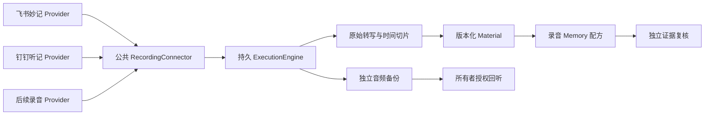

# 智能录音笔接入：用户旅程与插件架构

调研与实现日期：2026-10-01。设备为飞书 × 安克 D3200、钉钉 A1。0.0.76 接入设备上传后的云端产物，不接管蓝牙或重新转写。飞书已用本机授权账号的一个真实样本验证完整链路；钉钉仍为待真实账号验证的适配器。设备按键录音、离线上传和全历史覆盖没有用这次云端样本替代验收。

## 已确定的用户政策

- 首次自行选择历史起点和可选终点；终点留空时持续同步。默认范围是过去 30 天，连接账号不会自行启用采集。
- 逐字稿先归档，原始音频独立在后台备份。模型默认只读转写，已有厂商转写绕过 ASR。
- 厂商删除、暂停同步和断开连接都保留 Mote 中已经归档的副本。列表漏项不视作删除。
- 新录音按来源配方生成有证据的 Memory。匿名说话人不等于账号拥有者；模型把无法确认归属的对话计划、约束和未决事项保存为观察，不冒认个人偏好或承诺。
- 不需要逐条导出、打标签或选日记/会议类型；语义解释和跨来源关联由模型完成。正常同步不逐条推送消息。

## 用户旅程

| 阶段 | 用户动作 | 自动处理与结果 |
| --- | --- | --- |
| 首次授权 | 中央节点安装官方 CLI 并登录；已有授权时直接连接 | 飞书复用本机原生授权；钉钉固定组织与用户 profile。界面说明缺失 CLI、授权和管理员前置条件 |
| 首次导入 | 设置 → 录音归档 → 连接已授权账号 → 选择时间 → 启用并保存 | 按 27 天拆窗、完整分页，把每个阶段保存为可恢复工作 |
| 日常录音 | 照常使用录音笔及厂商 App | 中央节点每 5 分钟内轮询；厂商上传和转写完成后接入。关闭中央节点期间不能采集，重启恢复待处理工作 |
| 查看与洞察 | 查看录音材料、Memory 或提问 | 转写成为完整 Material；模型使用只读证据工具，引用回具体切片 |
| 追溯音频 | 最近归档 → 回听原始录音或下载 | 仅点击后读取中央归档的音频，不把临时厂商链接作为永久备份 |
| 失败处理 | 需要时重新授权、重试或暂停 | 转写和媒体状态独立；媒体失败不挡 Memory，补齐音频不重跑已有提取 |

当前搜索范围是“我创建的云端记录”，没有可靠硬件字段可保证只包含 D3200/A1；可能包含同账号其他妙记/听记。飞书导入时间筛选使用库内创建时间，不能把它等同于原始录制时间。原始录制时间缺失时保持未知。

## 公共插件边界

实现复用现有 `ConnectorRegistry`、`SourceStore`、`FileStore`、`ArchivedFileStore`、`ExecutionEngine`、`MaterialOrganizerRuntime`、`SourcePipelineRuntime` 与 `MemoryStrategies`。没有另建任务引擎、资料库或模型调度器。

| 切片 | 代码 | 职责 |
| --- | --- | --- |
| 公共 Provider 契约 | `connectors/recordings.ts` | `account/discover/metadata/transcript/media/close`；不解释话题或用户意图 |
| 平台传输 | `lark-recordings.ts`、`dingtalk-recordings.ts` | 固定只读 argv、原生账号绑定、平台分页与响应校验 |
| 格式与安全暂存 | `recording-formats.ts`、`recording-staging.ts` | 完整原文、时间段与未知字段；有界读取、目录约束及失败后清理 |
| 可恢复同步 | `RecordingConnector` | discover、metadata、transcript、media 独立步骤；账号/版本/授权 epoch、取消、退避、重试和检查点 |
| 厂商转写入口 | `FileStore.transcriptRevision` | 原始导出与规范转写归档、版本去重、直接写片段、跳过 ASR |
| 原始媒体 | `ArchivedFileStore.putRecordingMedia` | 内容校验与去重、统一资产存储、空间计费、导出/删除规则、版本附件 |
| 正式资料 | `material-organizers.ts` | 细粒度转写 Material；覆盖限制可见；长录音不复制整份转写到每个片段 |
| 洞察配方 | `recording-memory.ts` | 独立提取与复核策略、来源级启用、明确匿名归属、原始证据校验 |
| 通用界面 | `RecordingsSettings.tsx`、`ArchivedAudio.tsx` | 从连接器登记表发现 Provider，通用日期、同步状态、重试和按需回听 |

`recordingManifest(id, create, {label, setup})` 贡献来源能力、所有者路由、设置页元数据及生命周期。受信部署模块可通过 `MOTE_CONNECTOR_PLUGINS` 加载，沿用现有连接器插件机制；新增 Provider 不需要改公共同步、任务、归档、Memory 或设置页。公共契约从 `connectors/index.ts` 导出。插件是受信部署代码，录音正文不会被加载为插件或指令。

每个插件提供平台身份与原文读取。更多实时推送、桥接执行端、厂商摘要、标记/照片和设备级筛选仍需实际消费者及相应契约；本版不把这些未实现能力列为已支持。

## 同步、版本与恢复

来源身份为平台 + 账号哈希，条目身份为厂商稳定 ID。工作输入包含平台适配契约版本、账号哈希和授权 epoch。每个远端操作前复核账号；转写/媒体读取后、发布前再次核对。账号改变必须重新连接并启用范围；暂停或换范围撤销运行工作。

首次历史按 27 天拆窗，最多 240 窗；严格检查页大小、继续游标和游标环，完整发现结束后才提交发现检查点。条目后续失败保留在持久任务中，媒体失败不阻塞下一轮发现。恢复工作由现有引擎处理；每步骤最多 5 次自动尝试，超限后可手动重试。

日常搜索从发现水位回退 7 天以覆盖迟到，每天有界重查整个选中历史，手动同步也全量重查该范围。平台没有已验证的更新时间/删除事件，因此更早的修订依赖日常全范围重查，不能承诺实时修订通知。

原始转写、规范片段和稳定来源字段参与版本去重。观察时间、音频附件后到及重试次数不会自行产生新正文或再次付费提取。文字更正产生新版本并保留原音频关联；同场双笔录音保留各自来源，语义关联由模型提出。

音频最多 512 MiB，转写原始封包最多 16 MiB。规范转写最多 50,000 段；模型可用 Material 最多 20,000 块、16 MiB 字符预算。超出材料预算会标为部分覆盖，不能当作完整输入自动提取。临时媒体下载完成后实施大小检查；当前没有在厂商 CLI 流式下载期间执行磁盘配额监控。片段默认最多 8,000 字符，原文整体保留。

## 厂商契约与证据保真

飞书已验证 Lark CLI 1.0.85 的妙记搜索、基础信息、`+detail --transcript` 产物导出与 `+download` 音频下载。直接 transcript OpenAPI 需要另一组权限，本机现有 `minutes.artifacts:read` 可通过 CLI 产物路径读取；实现使用已经跑通的路径，不自行要求再次授权。已有文档/日历连接仍使用隔离运行配置；录音连接明确复用中央节点原生 CLI 账号。换中央节点仍需在那里授权。

飞书文本导出有说话人标签和起点，段落终点以后一段起点或厂商总时长推导，并标为不确定。`create_time` 是库内时间，未填成 `recordedAt`。说话人标签保留原值，身份未确认。

钉钉适配参考 DWS 1.0.62 release 契约，组织需管理员启用 CLI。固定 `corp_id:user_id`，校验 `taskUuid`、完整分页和下载收据。完整 `paragraphList` 原样保留为结构化文字；在真实账号时间字段验收前使用无时间定位的证据，不制造时间戳。当前没有钉钉 CLI/账号实测，界面明确说明。兼容性依赖上述已研究的版本和响应形状；其他版本需重新验证，解码失败不会静默视为空数据。

凭据留在原生 CLI 凭据设施与受保护的连接设置；仅所有者接口可以连接、改范围、重试和播放。查询 Agent 不获得厂商 CLI、授权或配置写工具。数据进入既有原始证据和 Memory 管线，正文中的指令不被执行。

埋点覆盖发现、信息、转写、解码、发布、媒体各阶段，记录开始/完成/失败、耗时、尝试数、数量或字节。执行收据提供每一步的恢复状态和固定错误码；埋点不写原文、标题、账号、下载链接或凭据。

## Omi 的借鉴

Omi 将原始对话与派生 Memory 分开；对话保留转写片段、说话人、时间及音频引用。Mote 使用已有的 Material、来源版本和证据血缘实现这一分离。[Omi 存储架构](https://docs.omi.me/doc/developer/backend/StoringConversations)

Omi 的音频流与 STT 产生片段；本需求已有厂商转写，因此从转写之后接入，复用厂商识别，不重复构建 BLE 和实时 ASR。[Omi 转写架构](https://docs.omi.me/doc/developer/backend/transcription)

Omi Integration Apps 区分完整对话、实时转写、原始音频和每日回顾；历史/离线补传不会重放实时转写与音频 webhook。因此首次导入和故障补漏仍需要列表读取，事件只能作为将来的提速能力。[Omi Integration Apps](https://docs.omi.me/doc/developer/apps/Integrations)

## 研究依据与后续验收

- [飞书 × 安克产品说明](https://www.feishu.cn/content/article/7597268954498763996)、[官方 Lark CLI](https://github.com/larksuite/cli)、[妙记文字接口](https://open.feishu.cn/document/uAjLw4CM/ukTMukTMukTM/minutes-v1/minute-transcript/get)、[媒体接口](https://open.feishu.cn/document/uAjLw4CM/ukTMukTMukTM/minutes-v1/minute-media/get)。
- [DWS 1.0.62 源码与文档](https://github.com/DingTalk-Real-AI/dingtalk-workspace-cli/tree/v1.0.62)、[DWS 授权说明](https://github.com/DingTalk-Real-AI/dingtalk-workspace-cli/blob/v1.0.62/README_zh.md)、[A1 JSAPI](https://open.dingtalk.com/tools/explorer/jsapi?id=11937)、[闪记事件](https://open.dingtalk.com/document/development/flash-memory-status-change-open-event)。事件是否覆盖硬件按键录音仍未验证。

验证结果见 [0.0.76 验证记录](validation/0.0.76.md)。仍需真实钉钉账号、两款物理录音笔新录音、长期令牌刷新及更大历史库验收。首次授权的终端命令步骤也仍可改进为现有设置流程；本版已授权本机的日常同步无需重复操作。
