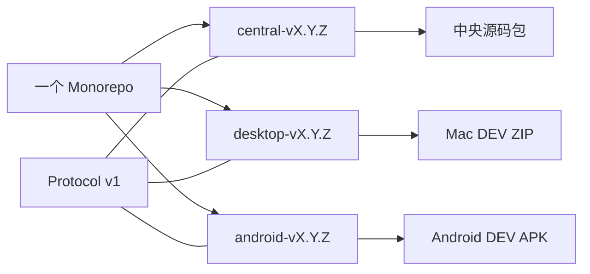

# Monorepo 内独立发布

2026-10-01：源码继续保留在一个 npm Monorepo，版本对应用户实际独立升级的产品。一次协议修改仍能在同一个 PR 中原子调整所有端，但每个发布标签只构建和分发一个产品。

| 发布边界 | 内容 | 何时发版 |
| --- | --- | --- |
| Central | server、web、编入该部署的 agent runtime 与中央插件 | 中央行为、网页或部署依赖变化 |
| Desktop | Electron collector、原生助手和本地依赖 | macOS 客户端需要升级 |
| Android | Kotlin collector、原生库和打包资源 | Android 客户端需要升级 |
| Protocol | 跨平台传输契约及生成 fixture | 契约变化，验证受影响产品 |

Central 的网页由中央部署提供，保留 server/web 的同版本构建检查。桌面与 Android 的已安装版本则可以长期落后或领先中央，不能以三者产品版本相同作为兼容条件。根 package.json 没有产品版本，共享内部 workspace 包保持私有，构建时由产品带入对应提交的实现。

兼容范围由 [protocol/contract.json](../protocol/contract.json) 声明，当前为 `{min:1,max:1}`。Central 的公开健康接口声明协议范围；新客户端在连接自检时主动请求协议元数据，校验范围交集，缺失或错误的元数据会拒绝连接。原有 ingest/ownSources/archiveRead 能力继续反映当前凭据的实际授权，ingressVersion 保留已有的批量接收子协议约束。任何资料内容都不能改变客户端、Agent 或发布器的权限。

当前只接受声明的 wire 1 / Ingress 2 契约，不保留旧字段读写或迁移期接口。破坏契约的修改应同步调整受影响消费者与 fixture。平台 feature inventory 与来源 capability registry 继续描述实际安装能力；产品版本号不能用来猜测设备能做什么。TS、Kotlin 与连接链路共用生成的协议 fixture，真机和真实模型验证另行记录。

三个工作流分别匹配三个标签前缀。版本脚本只递增选中的产品；Android versionCode 仅随 Android 升级单调递增。CI 根据 workspace 依赖图和非 npm 构建输入选择检查范围：共享协议检查全部端，中央插件只检查 Central。根配置、lockfile 或未知构建输入采取保守的全消费者检查。各端发布 workflow 只检查对应组件与发布工具；纯文档（含 AGENTS.md 和各语言 README）不触发应用构建。本地 `npm run check:affected` 与 CI 共用选择规则，额外用户流程验证见[开发指南](development.md#pr-check-scope)。测试范围和发布范围分开，CI 检查通过不会替任何端自动发版。

历史统一标签仍可作为发布记录阅读。当前更新器只读取所属组件标签和明确声明组件的签名清单，拒绝统一旧流及缺失组件。DEV 发布不附签名清单，仍由用户手动安装。签名验证与安装身份校验是当前功能，不能用旧清单兜底。

中央源码发布包含构建所需工作区及锁文件，在独立目录安装依赖、构建 server/web 后，沿用现有 profile 的备份、切换和回退流程。它不把用户配置、密钥、模型权重或归档数据编入产物，不创建新的镜像发布通道。

未来 iOS 或新硬件实现只需新增产品组、安装身份和对应平台的协议测试。中央插件沿用现有 manifest、权限与宿主 capability 契约，在可独立加载升级之前仍随 Central 构建；本次不引入插件市场或承诺插件热更新。外部社区设备、SDK 或插件有独立维护与授权需求时，再考虑单独仓库。

实际操作见 [发布流程](releasing.md)，保留本地配置的升级步骤见 [更新说明](updating.md)。
