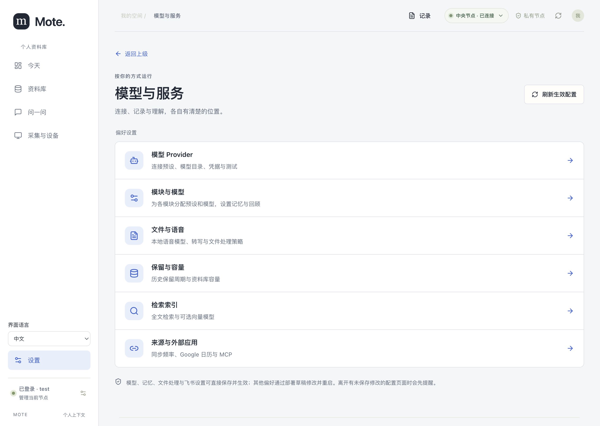
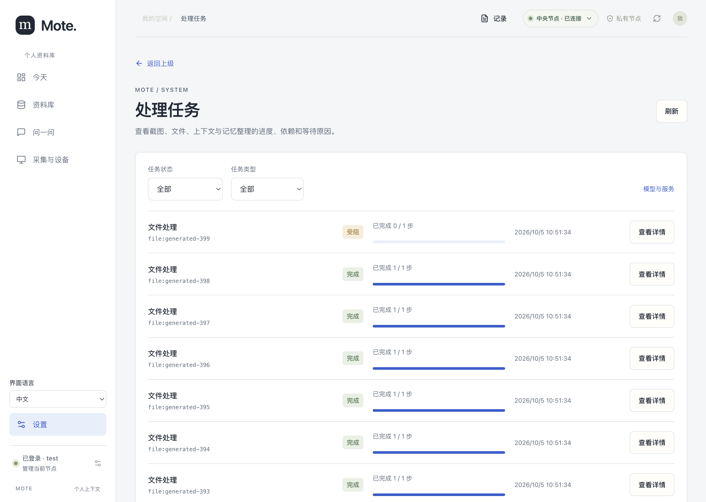
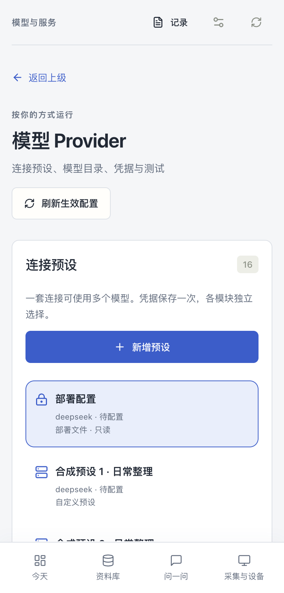
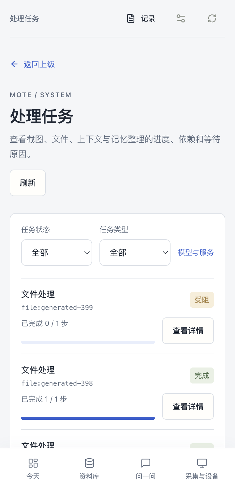
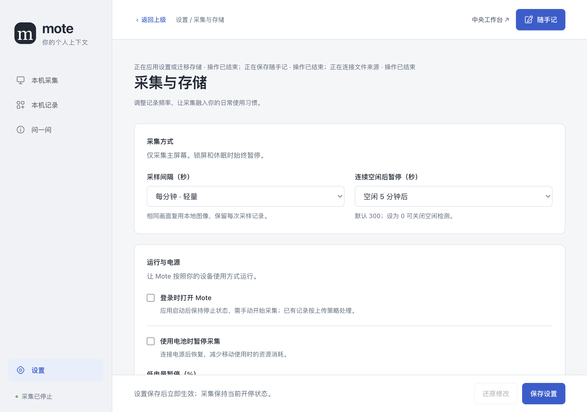
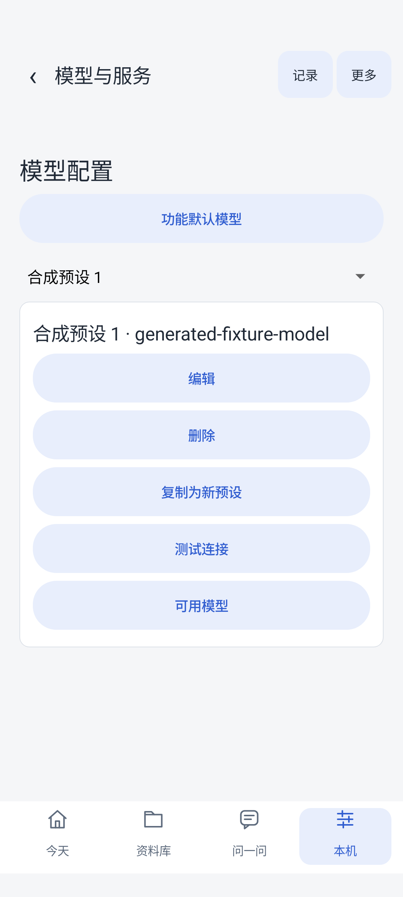
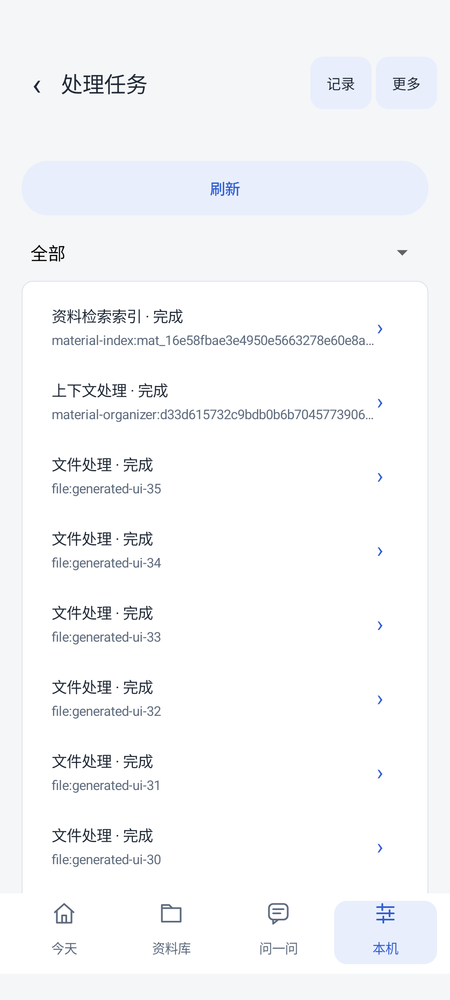

# Settings UI validation · 2026-10-05

All screenshots contain generated fixtures. Web uses an isolated loopback node with 400 tasks and 16 provider presets. Android uses a newly created API 35 emulator, 36 generated file tasks, generated indexing tasks and six presets. The desktop smoke test uses an isolated profile and stubbed capture/permission APIs.

## Audit and changes

| Surface | Changes | Validation |
| --- | --- | --- |
| Web settings and management | Shared slate/blue tokens, neutral form labels, consistent panels and headings; removed duplicate local back controls from storage, diagnostics, Lark and recordings | 11 routes at 1360 and 390 px; one page heading and one parent control on each subpage |
| Web model settings | One parent control at both the model landing page and category level; six categories; administrative links remain at their workspace destinations; bounded provider selector | Six categories at 1360, 390 and 320 px; selected provider uses the workspace tint |
| Web processing | Compact rows; 10 tasks per page, configurable to 20/50; status/type filters reset pagination; Previous retains every cursor boundary; on-demand modal details and lazy advanced steps | 400-task fixture; page three → two; empty results; modal focus, Escape and focus restoration; 200% zoom; English layout |
| macOS collector | One contextual parent control in the workspace toolbar; shared form colors, menu hierarchy and panel radius | Real Electron smoke test with generated data; minimum window size; dirty draft cancellation and discard; heading focus and contextual parent paths |
| Android central settings | One selected provider at a time; collapsed effective configuration groups; shared native cards | API 35 instrumentation; switch between generated presets; one copy/edit action set; single header back control |
| Android processing and upload queue | 10-item pages, translated states, compact identifiable task rows; Previous returns to the preceding page; detail closes back to the same page; bounded step details | API 35 instrumentation: ten rows, page three → two, detail return retaining page two, filter reset and empty state; compile and 262 unit tests |

Web routes audited: `preferences`, `system/models`, `system/processing`, `system`, `system/usage`, `system/storage`, `system/diagnostics`, `system/extensions`, `connections/lark`, `connections/recordings`, `help`.

Model categories audited: providers, module assignments, files/voice, retention/capacity, retrieval index, source connectors. Additional narrow-screen and English screenshots remain in `.mote/settings-ui/` after running the fixture.

Passed checks: `npm run check:local` (translations, library builds, all TypeScript checks and workspace tests), `npm run test:settings-ui`, the macOS Electron `test:ui`, Android development/test APK builds, 262 Android unit tests and the dedicated settings UI instrumented test. The Web workspace contains 245 passing tests, including pagination and existing task retry/source navigation regressions.

## Screenshots

| Web model settings | Web processing |
| --- | --- |
|  |  |
|  |  |

| macOS settings | Android models | Android tasks |
| --- | --- | --- |
|  |  |  |

[All Web pages contact sheet](web-contact-sheet.png) · [Mobile task detail](processing-detail-mobile.png)

## Reproduce

```sh
npm ci
npm run test:settings-ui
MOTE_UI_SCREENSHOT="$PWD/.mote/settings-ui/desktop-fixture.png" npm run test:ui -w @mote/desktop
npm run check:local
```

For Android, start a dedicated generated-only API 35 emulator. Build `:app:assembleDevelopment`, `:app:assembleDevelopmentAndroidTest` and `:app:testDevelopmentUnitTest` with `-Pmote.testBuildType=development`. Start the fixture in a separate terminal:

```sh
MOTE_SETTINGS_UI_FIXTURE=1 node --import tsx scripts/android-central-fixture.ts
```

Then use the dedicated emulator's serial:

```sh
adb -s "$FIXTURE_SERIAL" reverse tcp:47883 tcp:47883
adb -s "$FIXTURE_SERIAL" install -r apps/android/app/build/outputs/apk/development/app-development.apk
adb -s "$FIXTURE_SERIAL" install -r apps/android/app/build/outputs/apk/androidTest/development/app-development-androidTest.apk
adb -s "$FIXTURE_SERIAL" shell am instrument -w \
  -e class 'dev.mote.collector.NativeCentralInstrumentedTest#settingsUiUsesOneSelectedProviderAndTenTaskPages' \
  -e nativeCentralFixture true -e settingsUiFixture true \
  dev.mote.collector.dev.test/androidx.test.runner.AndroidJUnitRunner
```

The instrumented test draws only the fixture app into `cache/settings-ui-{settings,models,processing,detail}.png`; retrieve them with `adb exec-out run-as dev.mote.collector.dev cat ...` before uninstalling the test profile.

## Validation limits

Physical device and live-model checks were not performed. Production screenshots and personal archives were not collected. This PR changes source and provides fixture evidence; it does not deploy the dev site.
